

  

<strong>Universidad Peruana de Ciencias Aplicadas</strong>

<strong>Ingeniería de Software</strong> 
Desarrollo de Aplicaciones Open Source  
<strong>Profesor:</strong> Alberto Wilmer Sanchez Seña 

<h2 align="center">INFORME</h2>

<h3 align="center">Startup: ChabeCode</h3>

<strong>Producto: SplitEasy</strong>

<h3 align="center">Team Members:</h3>

| **Member**                           | **Code**     |
|--------------------------------------|--------------|
|Jorge Luis Díaz Fiestas      |  U20231D534  |
|Paulo Percy Quincho Gamarra         |  U20191E562 |
|Alexander Piero Fernandez Garfias         |  U202019498 |
|       |  |

<strong>Abril 2025</strong>

# Registro de Versiones del Informe
| Versión | Fecha       | Autor(es)                                                              | Descripción                                                                                                                                         |
|---------|-------------|------------------------------------------------------------------------|-----------------------------------------------------------------------------------------------------------------------------------------------------|
| TB1     | 25/03/2025  | Jorge Luis Díaz Fiestas        | Desarrollo del capítulo I: Introducción                                                                                                             |
|         | 29/03/2025  | Ricardo Fernando Cárdenas Minaya                                       | Desarrollo del capítulo II: Competidores                                                                                                            |
|         | 29/03/2025  |  Jhordi Luis Carranza Pérez                                        | Desarrollo del capítulo II: Entrevistas                                                                                                             |
|         | 30/03/2025  | Paulo Percy Quincho Gamarra                                            | Desarrollo del capítulo II: Needfinding                                                                                                             |
|         | 08/04/2025  | Paulo Percy Quincho Gamarra                                            | Desarrollo del capítulo III: To-Be Scenario Mapping y Product Backlog                                                                              |
|         | 10/04/2025  | Paulo Percy Quincho Gamarra, Luis Gustavo Román Pajuelo                | Desarrollo del capítulo III: User stories                                                                                                           |
|         | 12/04/2025  |  Alexander Piero Fernandez Garfias                                         | Desarrollo del capítulo III: Impact Mapping                                                                                                         |
|         | 14/04/2025  | Paulo Percy Quincho Gamarra, Ricardo Fernando Cárdenas Minaya          | Desarrollo del capítulo IV: Style Guidelines, Landing Page UI Design, Web Applications UX/UI Design, Web Application Prototyping y Domain-Driven Software Architecture |
|         | 16/04/2025  | Jorge Luis Díaz Fiestas                                        | Desarrollo del capítulo IV: Software Object-Oriented Design y Database Design                                                                      |
|         | 18/04/2025  | Jhordi Luis Carranza Pérez                                          | Desarrollo del capítulo V: Software Configuration Management                                                                                       |
|         | 20/04/2025  |  Alexander Piero Fernandez Garfias             | Desarrollo del capítulo V: Sprint Planning 1                                                                                                        |

# Project Report Collaboration Insights
Link del repositorio: https://github.com/1ASI0729-2510-4313-G3-SplitEasy/Report.git

Insights TB1 (Todos participaron):

  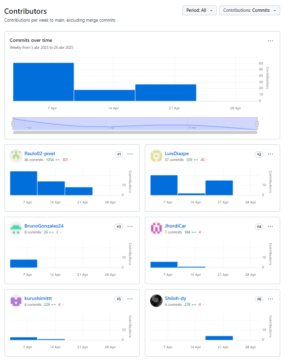

  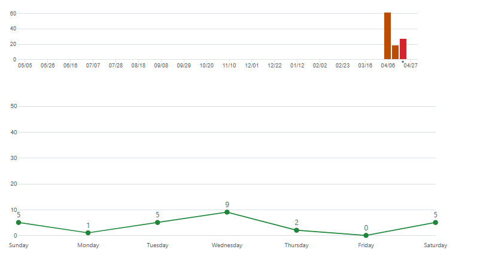

                                                                              
# Contenido

- [Registro de Versiones del Informe](#registro-de-versiones-del-informe)
- [Project Report Collaboration Insights](#project-report-collaboration-insights)
- [Student Outcome](#student-outcome)

## Capítulo I: Introducción
- [1.1. Start-up Profile](#11-start-up-profile)
  - [1.1.1. Descripción de la Startup](#111-descripción-de-la-startup)
  - [1.1.2. Perfiles de integrantes del equipo](#112-perfiles-de-integrantes-del-equipo)
- [1.2. Solution Profile](#12-solution-profile)
  - [1.2.1. Antecedentes y problemática](#121-antecedentes-y-problemática)
  - [1.2.2. Lean UX Process](#122-lean-ux-process)
    - [1.2.2.1. Lean UX Problem Statements](#1221-lean-ux-problem-statements)
    - [1.2.2.2. Lean UX Assumptions](#1222-lean-ux-assumptions)
    - [1.2.2.3. Lean UX Hypothesis Statements](#1223-lean-ux-hypothesis-statements)
    - [1.2.2.4. Lean UX Canvas](#1224-lean-ux-canvas)
- [1.3. Segmentos objetivo](#13-segmentos-objetivo)

## Capítulo II: Requirements Elicitation & Analysis
- [2.1. Competidores](#21-competidores)
  - [2.1.1. Análisis competitivo](#211-análisis-competitivo)
  - [2.1.2. Estrategias y tácticas frente a competidores](#212-estrategias-y-tácticas-frente-a-competidores)
- [2.2. Entrevistas](#22-entrevistas)
  - [2.2.1. Diseño de entrevistas](#221-diseño-de-entrevistas)
  - [2.2.2. Registro de entrevistas](#222-registro-de-entrevistas)
  - [2.2.3. Análisis de entrevistas](#223-análisis-de-entrevistas)
- [2.3. Needfinding](#23-needfinding)
  - [2.3.1. User Personas](#231-user-personas)
  - [2.3.2. User Task Matrix](#232-user-task-matrix)
  - [2.3.3. User Journey Mapping](#233-user-journey-mapping)
  - [2.3.4. Empathy Mapping](#234-empathy-mapping)
  - [2.3.5. As-is Scenario Mapping](#235-as-is-scenario-mapping)
- [2.4. Ubiquitous Language](#24-ubiquitous-language)

## Capítulo III: Requirements Specification
- [3.1. To-Be Scenario Mapping](#31-to-be-scenario-mapping)
- [3.2. User Stories](#32-user-stories)
- [3.3. Impact Mapping](#33-impact-mapping)
- [3.4. Product Backlog](#34-product-backlog)

## Capítulo IV: Product Design
- [4.1. Style Guidelines](#41-style-guidelines)
  - [4.1.1. General Style Guidelines](#411-general-style-guidelines)
  - [4.1.2. Web Style Guidelines](#412-web-style-guidelines)
- [4.2. Information Architecture](#42-information-architecture)
  - [4.2.1. Organization Systems](#421-organization-systems)
  - [4.2.2. Labeling Systems](#422-labeling-systems)
  - [4.2.3. SEO Tags and Meta Tags](#423-seo-tags-and-meta-tags)
  - [4.2.4. Searching Systems](#424-searching-systems)
  - [4.2.5. Navigation Systems](#425-navigation-systems)
- [4.3. Landing Page UI Design](#43-landing-page-ui-design)
  - [4.3.1. Landing Page Wireframe](#431-landing-page-wireframe)
  - [4.3.2. Landing Page Mock-up](#432-landing-page-mock-up)
- [4.4. Web Applications UX/UI Design](#44-web-applications-uxui-design)
  - [4.4.1. Web Applications Wireframes](#441-web-applications-wireframes)
  - [4.4.2. Web Applications Wireflow Diagrams](#442-web-applications-wireflow-diagrams)
  - [4.4.3. Web Applications Mock-ups](#443-web-applications-mock-ups)
  - [4.4.4. Web Applications User Flow Diagrams](#444-web-applications-user-flow-diagrams)
- [4.5. Web Applications Prototyping](#45-web-applications-prototyping)
- [4.6. Domain-Driven Software Architecture](#46-domain-driven-software-architecture)
  - [4.6.1. Software Architecture Context Diagram](#461-software-architecture-context-diagram)
  - [4.6.2. Software Architecture Container Diagrams](#462-software-architecture-container-diagrams)
  - [4.6.3. Software Architecture Components Diagrams](#463-software-architecture-components-diagrams)
- [4.7. Software Object-Oriented Design](#47-software-object-oriented-design)
  - [4.7.1. Class Diagrams](#471-class-diagrams)
  - [4.7.2. Class Dictionary](#472-class-dictionary)
- [4.8. Database Design](#48-database-design)
  - [4.8.1. Database Diagram](#481-database-diagram)

## Capítulo V: Product Implementation, Validation & Deployment
- [5.1. Software Configuration Management](#51-software-configuration-management)
  - [5.1.1. Software Development Environment Configuration](#511-software-development-environment-configuration)
  - [5.1.2. Source Code Management](#512-source-code-management)
  - [5.1.3. Source Code Style Guide & Conventions](#513-source-code-style-guide--conventions)
  - [5.1.4. Software Deployment Configuration](#514-software-deployment-configuration)
- [5.2. Landing Page, Services & Applications Implementation](#52-landing-page-services--applications-implementation)
  - [5.2.1. Sprint](#521-sprint)
    - [5.2.1.1. Sprint Planning](#5211-sprint-planning)
    - [5.2.1.2. Sprint Backlog](#5212-sprint-backlog)
    - [5.2.1.3. Development Evidence for Sprint Review](#5213-development-evidence-for-sprint-review)
    - [5.2.1.4. Testing Suite Evidence for Sprint Review](#5214-testing-suite-evidence-for-sprint-review)
    - [5.2.1.5. Execution Evidence for Sprint Review](#5215-execution-evidence-for-sprint-review)
    - [5.2.1.6. Services Documentation Evidence for Sprint Review](#5216-services-documentation-evidence-for-sprint-review)
    - [5.2.1.7. Software Deployment Evidence for Sprint Review](#5217-software-deployment-evidence-for-sprint-review)
    - [5.2.1.8. Team Collaboration Insights during Sprint](#5218-team-collaboration-insights-during-sprint)

# Student Outcome
| **Criterio específico** | **Acciones realizadas** | **Conclusiones** |
|-------------------------|--------------------------|------------------|
| Comunica oralmente con efectividad a diferentes rangos de audiencia. | **Jorge Luis Díaz Fiestas (TB1):** Ayudé en la organización y grabación del video de presentación del equipo, coordinando qué comunicar y cómo expresarlo.  **Paulo Percy Quincho Gamarra (TB1):** Participé en entrevistas, expuse los diagramas C4 al equipo y presenté mi perspectiva en reuniones grupales sobre cómo debía estructurarse el diseño del sistema.  **Alexander Piero Fernandez Garfias (TB1):** Participé en entrevistas con usuarios para validar necesidades y comunicarles nuestra propuesta de valor. Colaboré en la presentación oral del “About the Team”.  **Jhordi Luis Carranza Pérez (TB1):** Apoyé en la grabación del video grupal “About the Team” explicando funciones clave del equipo. También comuniqué ideas durante reuniones internas de planeación. | El proceso me enseñó a sintetizar ideas y estructurarlas para facilitar su comprensión en un formato audiovisual.  La experiencia me permitió mejorar mi claridad para explicar conceptos técnicos a personas sin experiencia en ingeniería.  La interacción directa con usuarios fortaleció mi habilidad para expresar ideas de forma clara según el perfil del oyente.  La práctica de comunicación oral me permitió adaptar mi forma de hablar según el público: equipo interno o usuarios externos. |
| Comunica por escrito con efectividad a diferentes rangos de audiencia. | **Jorge Luis Díaz Fiestas (TB1):** Revisé ortográficamente y sintácticamente partes del informe, especialmente las conclusiones y descripciones funcionales.  **Paulo Percy Quincho Gamarra (TB1):** Redacté el Needfinding, el To-Be Scenario Mapping y los diagramas C4. Me aseguré de que el contenido fuera comprensible tanto para el equipo como para los docentes.  **Alexander Piero Fernandez Garfias (TB1):** Redacté y revisé el contenido del Impact Map, el Product Backlog y el informe de entrevistas. Colaboré en la escritura del informe final.  **Jhordi Luis Carranza Pérez (TB1):** Escribí parte del capítulo de conclusiones del informe, así como varias historias de usuario. Revisé la redacción de documentos clave del proyecto. | Mejoré mi capacidad para detectar errores y ajustar la redacción para que sea clara, coherente y adecuada a los estándares académicos.  La redacción técnica me ayudó a transmitir ideas complejas de forma accesible para distintas audiencias.  Aprendí a comunicarme de forma precisa y estructurada en documentos escritos dirigidos tanto a profesores como a usuarios.  Desarrollé una mejor comprensión sobre cómo adaptar mi lenguaje para distintos propósitos: técnicos, organizativos o reflexivos. |

# Project: SplitEasy
# Chapter 1: Introduction
# Startup Profile

##  Descripción de la Startup

SplitEasy es una startup tecnológica enfocada en brindar soluciones financieras equitativas dentro del entorno familiar o de convivencia. Nuestra plataforma permite a los miembros del hogar gestionar de forma justa y proporcional los gastos compartidos, basándose en los ingresos individuales de cada persona. A través de un sistema automatizado, transparente y fácil de usar, SplitEasy promueve la responsabilidad financiera, la buena comunicación y la organización del presupuesto colectivo, ayudando a evitar conflictos y fomentar una cultura de colaboración dentro del hogar.

- **Nombre:** SplitEasy  
- **Misión:** Nuestra misión es facilitar la gestión financiera del hogar mediante una herramienta digital que distribuye los gastos comunes de manera proporcional a los ingresos de cada miembro, promoviendo la equidad, la transparencia y la armonía en la convivencia.  
- **Visión:** Nuestra visión es convertirnos en la plataforma líder en gestión financiera compartida para hogares en América Latina, siendo reconocidos por empoderar a las personas a tomar decisiones económicas justas, responsables y colaborativas.  
- **Valores:** Transparencia, simplicidad y colaboración.  

##  Perfiles de Integrantes del Grupo

|                             |                                      |
|-----------------------------|--------------------------------------|
|     |  
**Nombre:** Jorge Luis Díaz Fiestas  
**Código de estudiante:** U20231D534  
**Carrera:** Ingeniería de Software  
**Rol:** Team Leader  
**Descripción:**  
Soy Jorge Díaz, estudiante de Ing. de Software, del 5° ciclo. Destacado en el trabajo en grupo y apto para dar retroalimentación. Con conocimientos básicos en Arduino, programación web (HTML, CSS, JS, React, TypeScript, Firebase), bases de datos (SQL, Firebase, Supabase, MongoDB, MariaDB) y lenguajes C/C++.   |
|  | 
**Nombre:** Paulo Percy Quincho Gamarra  
**Código de estudiante:** U20191E562  
**Carrera:** Ingeniería de Software  
**Descripción:**  
Soy puntual, lo que me permite realizar todos los trabajos a tiempo. Me gusta tener buena comunicación con el equipo. |
|  | 
**Nombre:** Jhordi Luis Carranza Pérez  
**Código de estudiante:** U20191835  
**Carrera:** Ingeniería de Software  
**Descripción:**  
Soy una persona que me gusta cumplir con mis obligaciones de manera efectiva, aunque muchas veces me descuide un poco. Mis conocimientos técnicos van en torno a programación web, bases de datos, lenguajes de alto y bajo nivel como C++, Python y JavaScript. |
|  | 
**Nombre:** Alexander Piero Fernandez Garfias 
**Código de estudiante:** U202019498  
**Carrera:** Ingeniería de Software  
**Descripción:**  
Me llamo Alexander Piero Fernandez Garfias, estudio  la carrera de Ing. de Software en la UPC. Mis conocimientos técnicos van en torno a Programación en lenguajes como C++, Dart, Java |

##  Solution Profile

SplitEasy es una plataforma digital diseñada para facilitar la distribución equitativa de los gastos del hogar entre sus miembros, teniendo en cuenta los ingresos individuales de cada uno. El sistema calcula automáticamente el porcentaje que cada miembro debe aportar en función de su capacidad económica, lo que asegura una distribución justa de los gastos comunes, como alquiler, servicios y alimentos. Los usuarios pueden registrar sus ingresos, ver cuánto deben pagar y cuánto han pagado, y el representante del hogar tiene una visión general de todo el proceso. Además, la plataforma ofrece un seguimiento en tiempo real, reportes mensuales detallados y alertas automáticas sobre pagos pendientes. Con una interfaz intuitiva y fácil de usar, SplitEasy no solo optimiza la gestión financiera, sino que también promueve la transparencia y la confianza entre los miembros del hogar, reduciendo los posibles conflictos relacionados con el dinero y asegurando una gestión financiera eficiente y justa.

##  Antecedentes y Problemática

La metodología 5W y 2H es un enfoque utilizado para identificar la causa raíz de problemas, errores o no conformidades en sistemas. Desarrollada por Toyota, esta herramienta es fundamental dentro del Sistema de Producción Toyota (TPS), ya que, según Taichii Ohno, clarifica problemas y facilita la implementación de acciones correctivas o preventivas (Palko et al., 2015). Además, esta metodología es adaptable a cualquier tipo de organización, lo que la convierte en una herramienta versátil para la resolución de problemas.

### What

#### ¿Cuál es el problema?

El problema es la distribución inadecuada de los gastos en hogares donde las personas tienen diferentes ingresos, lo que genera desigualdad en las contribuciones y posibles conflictos. Esto puede ocurrir cuando las parejas o compañeros de hogar intentan dividir los gastos de manera equitativa sin tener en cuenta las diferencias en sus salarios.

#### ¿Cuál es la relación con la persona en cuestión?

El sistema está diseñado para que cada miembro del hogar pueda visualizar y aportar su parte justa según su capacidad económica. El representante del hogar gestiona el seguimiento y asegura que todos contribuyan de manera justa.

### When

#### ¿Cuándo sucede el problema?

El problema ocurre a menudo cuando llega el momento de pagar las facturas del hogar (mensualmente, por ejemplo). Los miembros del hogar se enfrentan a la dificultad de repartir los gastos de manera justa, especialmente si hay variaciones significativas en sus ingresos.

#### ¿Cuándo utiliza el cliente el producto?

El cliente utilizará el producto cada vez que se registre un gasto común (alquiler, luz, agua, supermercado, etc.) o cuando quiera conocer su contribución justa según su ingreso. También lo usarán al final de cada mes para realizar un seguimiento de pagos y deudas pendientes.

### Where

#### ¿Dónde está el cliente cuando usa el producto?

El cliente generalmente estará en su hogar o en un lugar donde tenga acceso a Internet, como en su teléfono móvil o computadora. Es un producto digital, por lo que se accede a través de una aplicación web o móvil.

#### ¿A dónde se dirige?

El cliente se dirige al panel de control del sistema para consultar los gastos, los montos que debe aportar y el saldo pendiente.

#### ¿Dónde surge el problema?

El problema surge en el hogar, cuando los gastos comunes (como luz, agua, comida, etc.) deben ser repartidos de forma proporcional entre los miembros, teniendo en cuenta sus diferentes ingresos.

### Why

#### ¿Cuál es la causa principal del problema?

La causa principal es la falta de un sistema claro y equitativo para distribuir los gastos entre personas con ingresos diferentes. Las contribuciones desiguales pueden generar malestar o conflictos dentro del hogar, ya que no se refleja la capacidad de cada uno para aportar.

### Who

#### ¿Quiénes están involucrados?

Los principales involucrados son los miembros del hogar y el representante del hogar.

#### ¿A quiénes les sucede el problema?

Les sucede a las personas que viven juntas y comparten gastos, como parejas, familias o compañeros de cuarto que tienen ingresos distintos.

#### ¿Quién lo utilizará?

- **Los miembros del hogar**, quienes podrán ver cuánto deben pagar según su capacidad económica.  
- **El representante del hogar**, quien gestiona y supervisa el proceso de reparto de los gastos.

### How

#### ¿Cómo ocurre el problema?

El problema ocurre cuando se intenta dividir los gastos comunes (como el alquiler, la electricidad, el agua, la comida, etc.) sin un cálculo equitativo basado en los ingresos de cada persona, lo que genera desigualdad en las contribuciones.

#### ¿En qué condiciones los clientes usan nuestro producto?

Los clientes usarán el producto cuando necesiten calcular su contribución proporcional a los gastos del hogar o cuando quieran verificar qué tanto han pagado y cuánto les queda por pagar según su ingreso. También lo usarán si quieren tener un control más organizado sobre las finanzas compartidas.

#### ¿Qué llevará a la persona a usar nuestro producto?

La necesidad de un reparto equitativo de los gastos del hogar, la falta de transparencia en las contribuciones o la búsqueda de soluciones para evitar conflictos financieros en el hogar llevará a la persona a usar el producto. Además, si desean ver los montos a pagar de forma clara y en tiempo real, el sistema será una herramienta útil para ello.

<strong>Representación de costo promedio de errores en cálculos manuales - 2020</strong>

  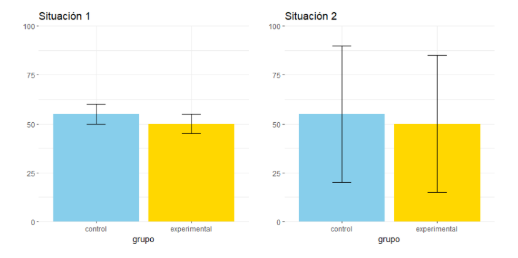

Fernando Blanco P. (2020). Gráfico de LDL – ESTADÍSTICA VISUAL (VIII). Gráficos con barras de error: manual de usuario – Lima, 2020

<em>Figura: Representación visual del costo promedio de errores manuales.</em>

## Lean UX Process

Lean UX se define como un proceso iterativo y colaborativo que prioriza la experimentación y el aprendizaje continuo sobre la creación de documentación exhaustiva. En lugar de centrarse en entregar un producto final completamente detallado, este enfoque permite a los equipos de diseño y desarrollo trabajar en conjunto para construir prototipos y realizar pruebas rápidas. Estas pruebas se realizan con usuarios reales y en contextos reales, lo que permite validar hipótesis y ajustar el producto en función de los resultados obtenidos. El objetivo principal de Lean UX es reducir el desperdicio y aumentar la eficiencia en el desarrollo del producto, permitiendo a los equipos responder de manera más ágil a las necesidades y expectativas de los usuarios (Gothelf & Seiden, 2013).

## Lean UX Problem Statements

**¿Cómo podemos crear una herramienta innovadora que motive a los miembros del hogar a gestionar sus finanzas compartidas de manera justa, permitiendo una distribución proporcional de los gastos según sus ingresos individuales?**  
Muchas personas que comparten un hogar enfrentan dificultades al dividir los gastos de manera equitativa. La falta de un sistema justo puede generar conflictos, resentimientos y desorganización financiera. Las herramientas actuales son muy básicas o se limitan a simples divisiones matemáticas que no consideran la capacidad económica de cada persona.

**¿Cómo podemos diseñar una solución que promueva la transparencia, el compromiso y la responsabilidad financiera entre los miembros del hogar?**  
Hemos observado que cuando no existe un registro claro de lo que cada persona debe o ha pagado, surgen confusiones y desconfianza. La ausencia de una herramienta que brinde visibilidad y control compartido dificulta una convivencia armoniosa en el aspecto económico.

**¿Cómo podemos integrar reportes automáticos y alertas que ayuden a los usuarios a cumplir con sus pagos, y que al mismo tiempo den control al representante del hogar para monitorear el estado financiero del grupo?**  
En muchos hogares, una persona se encarga de la administración, pero no siempre tiene los medios para realizar un seguimiento claro. Los recordatorios manuales y el control informal suelen ser ineficientes y pueden causar fricciones innecesarias.

**¿Cómo podemos facilitar una herramienta intuitiva que se adapte tanto a personas con conocimientos básicos de finanzas como a quienes desean un control más detallado de los gastos familiares?**  
Los usuarios necesitan una plataforma sencilla, pero también lo suficientemente flexible para mostrar datos relevantes y personalizables. Muchas soluciones actuales son complejas o no abordan este enfoque colectivo y equitativo.

**¿Cómo podemos fomentar una cultura de ahorro y planificación financiera conjunta dentro del hogar, basada en metas comunes y acuerdos colaborativos?**  
La mayoría de los hogares no tienen metas financieras compartidas ni hábitos de ahorro establecidos en grupo. La falta de planificación colectiva limita el crecimiento económico del hogar y genera dependencia o desigualdad en las contribuciones.

## Lean UX Assumptions

### Business Outcomes

- Creemos que nuestros usuarios necesitan una herramienta digital para gestionar los gastos del hogar de forma justa y proporcional.  
- Esta necesidad se resuelve con una plataforma que calcula automáticamente cuánto debe aportar cada persona en función de sus ingresos.  
- Nuestros clientes iniciales serán parejas, familias o grupos de convivencia que desean organizar sus finanzas colectivas de forma equitativa.  
- El valor principal que los usuarios esperan es la distribución justa de los gastos según ingresos y la visibilidad de los pagos.  
- Otros beneficios clave incluyen: reportes automáticos, recordatorios de pagos, control centralizado por parte del representante del hogar, y sugerencias para ahorro grupal.  
- Generamos ingresos a través de versiones premium que ofrecen funciones avanzadas como análisis históricos, exportación de datos, y personalización de reglas de reparto.  
- Nuestra principal competencia serán apps de finanzas personales y hojas de cálculo compartidas, pero SplitEasy se destaca por su enfoque colaborativo y equitativo.  
- Superaremos a la competencia ofreciendo personalización basada en ingresos, visibilidad colectiva y herramientas de colaboración.  
- Nuestro mayor riesgo es que los usuarios no confíen en los cálculos o no se adapten al uso de una plataforma compartida.  
- Lo resolveremos con una interfaz intuitiva, algoritmos claros y explicativos, y soporte personalizado.  
- Creemos que al automatizar y transparentar la distribución de gastos, mejoraremos la convivencia, la confianza y la organización financiera del hogar. Si esta hipótesis es incorrecta, podríamos tener baja retención de usuarios.

### User Outcomes

- **¿Quién será nuestro usuario?**  
  Personas que viven en un mismo hogar (parejas, familias, compañeros de piso) y desean organizar los gastos de forma justa.

- **¿Dónde encaja nuestro producto en su vida?**  
  En la planificación y gestión de los gastos mensuales compartidos, desde cualquier lugar, especialmente al momento de dividir pagos importantes como alquiler, luz, agua, comida, etc.

- **¿Qué problemas tiene nuestro producto y cómo se pueden resolver?**  
  Puede haber falta de compromiso o datos erróneos al registrar ingresos. Se resolverá con validación simple, incentivos y recordatorios automáticos.

- **¿Cómo y cuándo es usado nuestro producto?**  
  Es utilizado regularmente al inicio y final de cada mes, y también al hacer pagos importantes o para revisar el estado financiero compartido.

- **¿Qué problemas tiene nuestro producto?**  
  Podría haber resistencia al cambio en hogares con dinámicas ya establecidas. Lo abordaremos facilitando la migración y ofreciendo beneficios visibles desde el primer uso.

- **¿Qué características son importantes?**
  - Cálculo automático proporcional según ingresos  
  - Reportes visuales del estado de aportes  
  - Panel para el representante del hogar  
  - Historial de pagos y contribuciones  
  - Alertas de vencimiento  
  - Objetivos y metas compartidas  
  - Seguridad de datos  
  - Experiencia simple y colaborativa  

## Lean UX Hypothesis Statements

**Hipótesis 1: Distribución proporcional de gastos**  
Creemos que una herramienta que calcule automáticamente cuánto debe aportar cada miembro del hogar según sus ingresos fomentará una convivencia más justa y organizada.  
_Sabremos que estamos bien cuando al menos el 70% de los usuarios reporten una disminución de conflictos por dinero y una mayor satisfacción con el reparto de gastos en los primeros tres meses de uso._

**Hipótesis 2: Supervisión por el representante del hogar**  
Creemos que permitir que un representante tenga una visión general del estado financiero del grupo y reciba alertas mejorará la gestión y cumplimiento de los pagos.  
_Sabremos que estamos bien cuando veamos una reducción en pagos atrasados y un uso activo del panel de control por parte del representante en al menos el 60% de los hogares registrados._

## Lean UX Canvas

  

## Segmentos Objetivos

### Segmento objetivo 1: Personas del hogar

**Aspectos demográficos:**
- Sexo: Masculino y femenino  
- Edades: 18 - 65 años  
- Nivel socioeconómico: Clases A, B y C (alta, media-alta y media)  
- Estado civil: Solteros, casados, convivientes, parejas, compañeros de cuarto  

**Aspectos geográficos:**
- Nacionalidad: Peruana  
- Zona geográfica en la que vive: Urbana y suburbana  
- Departamento: Lima Metropolitana y otras ciudades principales  

**Aspectos psicográficos:**
- Buscan una forma equitativa de compartir los gastos del hogar, como la renta, los servicios, y otros gastos comunes.  
- Están interesados en herramientas que les ayuden a gestionar sus finanzas de manera transparente y justa.  
- Se preocupan por mantener un equilibrio financiero entre los miembros del hogar, asegurándose de que cada uno aporte según sus ingresos.  
- Tienen un estilo de vida que involucra la convivencia con otros y comparten responsabilidades, por lo que buscan facilitar el proceso de distribución de gastos. 

### Segmento objetivo 2: Representante del hogar

**Aspectos demográficos:**
- Sexo: Masculino y femenino  
- Edades: 25 - 50 años  
- Nivel socioeconómico: Clases A, B y C (alta, media-alta y media)  
- Estado civil: Casados, convivientes, parejas con hijos, o personas responsables del control de finanzas familiares  

**Aspectos geográficos:**
- Nacionalidad: Peruana  
- Zona geográfica en la que vive: Urbana y suburbana  
- Departamento: Lima Metropolitana y otras ciudades principales  

**Aspectos psicográficos:**
- Se encargan de la planificación y distribución de los gastos del hogar, buscando equidad entre los miembros del hogar.  
- Están interesados en herramientas tecnológicas que faciliten la gestión de las finanzas del hogar y el monitoreo de los gastos de manera sencilla.  
- Les preocupa el bienestar financiero de su hogar y buscan evitar conflictos económicos entre los miembros al asegurarse de que cada uno pague lo que le corresponde.  
- Están comprometidos con la gestión eficiente de los recursos del hogar, buscando que todos los gastos se distribuyan de manera proporcional a los ingresos de cada miembro.

# Chapter 2: Requirements Elicitation & Analysis

## Competidores
### Analisis Competitivo

## Competitive Analysis Landscape
### ¿Por qué llevar a cabo este análisis?
Analizar la competencia en el mercado de gestión energética para hogares inteligentes.  
Comparar fortalezas, debilidades y estrategias para identificar oportunidades y amenazas.

| Categoría                  | SplitEasy (Tu startup)                                                                                         | Splitwise                                                                                       | Tricount                                                                                        | SettleUp                                                                                       |
|---------------------------|----------------------------------------------------------------------------------------------------------------|--------------------------------------------------------------------------------------------------|-------------------------------------------------------------------------------------------------|------------------------------------------------------------------------------------------------|
| **Perfil - Overview**     | Aplicación de gestión financiera del hogar. Divide los gastos tomando en cuenta los ingresos.                 | Plataforma para dividir gastos entre amigos o grupos.                                           | App para dividir fácilmente gastos en grupo, ideal para eventos o viajes.                     | App para registrar deudas compartidas en contextos no permanentes como viajes o salidas.     |
| **Ventaja competitiva**   | Reparto justo y automatizado según ingresos. Fomenta equidad y transparencia.                                  | División rápida y sencilla. Reduce fricción para saldar deudas.                                | Registro ágil y claro para gastos grupales.                                                    | Claridad visual del seguimiento de pagos en grupo.                                            |
| **Perfil de Marketing**   |                                                                                                                |                                                                                                  |                                                                                                 |                                                                                                |
| Mercado objetivo          | Familias, parejas y roommates con economías compartidas y distintos niveles de ingreso.                        | Grupos de amigos o compañeros que comparten gastos ocasionalmente.                             | Grupos pequeños que hacen actividades conjuntas.                                               | Grupos de amigos jóvenes que comparten actividades.                                           |
| Estrategias de marketing  | Enfocado en la equidad financiera y automatización. Redes sociales, foros y comunidades financieras.            | Comunicación clara, fuerte presencia en redes sociales, marketing de conveniencia.             | Promoción basada en simplicidad, interfaz amigable.                                            | Publicidad a grupos sociales, organización visual como ventaja clave.                         |
| **Perfil de Producto**    |                                                                                                                |                                                                                                  |                                                                                                 |                                                                                                |
| Productos y servicios     | Plataforma para dividir gastos del hogar según ingresos. Incluye reportes, historial, metas y seguimiento.     | Registro y división de gastos compartidos. Incluye recordatorios y sincronización.             | División rápida de cuentas grupales, interfaz sencilla.                                        | Gestión visual de gastos compartidos con gráficas.                                            |
| Precios y costos          | Freemium: versión gratuita con funciones básicas. Premium: reportes, metas, recordatorios, exportación.        | Freemium: básica gratis, Pro con extras como exportación.                                       | Gratuita, opción a donaciones. Publicidad como ingreso.                                        | Gratis con opción de pago para quitar anuncios o funciones extra.                             |
| Canales de distribución   | App móvil (Google Play y App Store), redes sociales, foros, influencers de finanzas personales.                | App Store, Google Play, redes sociales, recomendaciones orgánicas.                             | App Store, Google Play, SEO en búsquedas de dividir gastos.                                   | App Store, Google Play, marketing boca a boca, redes sociales.                                |
| **Análisis SWOT**         |                                                                                                                |                                                                                                  |                                                                                                 |                                                                                                |
| Fortalezas                | Equidad proporcional basada en ingresos. Automatización. Foco en convivencia y economía compartida.            | Base de usuarios sólida. Interfaz amigable. Integraciones.                                      | Fácil de usar. Rápida. Sin registro en muchos casos.                                           | Diseño visual atractivo. Funciones colaborativas.                                             |
| Debilidades               | Proyecto en etapa inicial. Requiere datos sensibles (ingresos).                                                | Limitado a divisiones iguales o manuales. No considera ingresos.                               | Funciones limitadas. Sin seguimiento histórico.                                                | Funciones avanzadas tras muro de pago.                                                        |
| Oportunidades             | Más hogares con economías compartidas. Creciente interés en equidad y herramientas de finanzas personales.     | Posibilidad de añadir personalización o justicia financiera.                                   | Expandir mercado o integrar con fintech.                                                       | Alianzas con bancos o billeteras digitales.                                                   |
| Amenazas                  | Competencia consolidada. Preferencia por métodos tradicionales (Excel, notas, billeteras físicas).             | Lo mismo: herramientas tradicionales siguen siendo usadas.                                      | Puede quedar rezagada frente a apps con más recursos.                                          | Entrada de bancos o apps de pago con funciones similares.                                     |

### Estrategias y tácticas frente a competidores

SplitEasy se diferencia de sus competidores mediante una propuesta de valor centrada en la equidad real, considerando los ingresos de cada persona en la distribución de gastos compartidos. Esta estrategia permite posicionarse en un nicho aún poco explorado por aplicaciones como Splitwise, Tricount o SettleUp, las cuales se enfocan en divisiones igualitarias o personalizadas manualmente, pero no abordan el concepto de proporcionalidad basada en capacidad económica.

#### Estrategia de diferenciación por valor social
SplitEasy enfatiza la justicia financiera dentro del hogar, reduciendo conflictos y mejorando la convivencia. Esto lo distingue de aplicaciones que solo calculan deudas sin contexto social o económico.

**Táctica:** Enfoque educativo y emocional en el marketing. Se utilizarán campañas que destaquen cómo la equidad mejora relaciones personales, apoyándose en testimonios, ejemplos reales y visuales que generen empatía.

#### Estrategia de funcionalidad avanzada desde el inicio
A diferencia de apps que limitan sus funciones en versiones gratuitas, SplitEasy ofrecerá desde el principio características como:

- Cálculo proporcional según ingresos  
- Reportes automáticos mensuales  
- Gestión de metas financieras comunes  

**Táctica:** Modelo freemium con funciones realmente diferenciadoras. Se ofrecerá una versión gratuita funcional y una versión premium con proyecciones financieras, integración bancaria y recordatorios automáticos.

#### Estrategia de comunidad y crecimiento orgánico
Incentivar la recomendación entre roommates, parejas y familias, priorizando experiencias compartidas y simplicidad.

**Táctica:** Sistema de referidos y uso colaborativo. Cada nuevo usuario puede invitar fácilmente a su grupo de convivencia, con beneficios pequeños como más espacio de historial o funciones extra por cada referido activo.

## Competidores

### Diseño de Entrevistas

**Propósito de la entrevista:**  
SplitEasy busca ofrecer una solución digital que permita distribuir los gastos del hogar de forma equitativa, basándose en los ingresos de cada miembro. Esta entrevista tiene como objetivo comprender las necesidades, hábitos y expectativas de las personas que comparten gastos del hogar, así como de quienes asumen la responsabilidad de administrarlos. Esta información nos permitirá diseñar una herramienta que promueva la transparencia, evite conflictos financieros y se ajuste a las realidades de los hogares peruanos actuales.

**¿Está usted dispuesto(a) a participar en una breve entrevista que nos ayude a crear una aplicación que facilite la gestión justa de los gastos en el hogar?**

### Segmento objetivo 1: Personas del hogar

**Aspectos demográficos y psicográficos clave**

- Sexo: Masculino y femenino  
- Edad: 18 a 65 años  
- Nivel socioeconómico: A, B, y C  
- Estado civil: Solteros, casados, convivientes, parejas, roommates  
- Zona: Urbana y suburbana (Perú)

**Preguntas:**

1. ¿Con quién vive actualmente y cómo reparten los gastos del hogar?  
2. ¿Considera justo el sistema que usan para dividir los pagos? ¿Por qué?  
3. ¿Cuáles son los mayores retos al organizar los gastos compartidos?  
4. ¿Han tenido desacuerdos por temas de dinero o pagos en el hogar?  
5. ¿Han considerado dividir los gastos en función de los ingresos de cada persona?  
6. ¿Utilizan alguna app para anotar los pagos del hogar? ¿Cuál y qué tan útil les resulta?  
7. ¿Qué funcionalidades cree que debería tener una app ideal para gestionar gastos entre varias personas?  
8. ¿Cómo le gustaría visualizar lo que le toca pagar, lo que ya pagó y lo que está pendiente?  
9. ¿Cree que una aplicación como SplitEasy podría ayudar a mejorar la convivencia y la organización en su hogar?

### Segmento objetivo 2: Representante del hogar

**Aspectos demográficos y psicográficos clave**

- Sexo: Masculino y femenino  
- Edad: 25 a 50 años  
- Nivel socioeconómico: A, B, y C  
- Estado civil: Casados, convivientes, parejas con hijos, personas responsables de las finanzas del hogar  
- Zona: Urbana y suburbana (Perú)

**Preguntas:**

1. ¿Cuál es su rol dentro de su hogar en cuanto a la administración del dinero?  
2. ¿Cómo organiza actualmente los ingresos y gastos del hogar?  
3. ¿Considera que el reparto de los gastos es equitativo para todos los miembros?  
4. ¿Qué dificultades enfrenta para lograr un reparto justo de los gastos?  
5. ¿Cómo controla que cada miembro cumpla con su parte financiera?  
6. ¿Qué herramientas (apps, cuadernos, Excel, etc.) usa actualmente para llevar este control?  
7. ¿Qué funcionalidades le gustaría que tenga una app como SplitEasy?  
8. ¿Qué tan importante considera la transparencia financiera dentro del hogar?  
9. ¿Estaría dispuesto(a) a registrar los ingresos de cada miembro para que la aplicación calcule automáticamente cuánto debe aportar cada uno?  
10. ¿Qué beneficios cree que traería una solución como SplitEasy en la convivencia familiar?

### Registro de entrevistas

**Entrevista a usuaria del primer segmento**
**Entrevistada:** Marjorie Luna Victoria  
**Edad:** 18 años  
**Ocupación:** Estudiante  
**Medio:** Meet  
**Entrevistador:** Jorge Díaz  

**Inicio del video:** 0:04  
 **Duración:** 3 minutos y 51 segundos

  <a href="https://upcedupe-my.sharepoint.com/:v:/g/personal/u20231d534_upc_edu_pe/Eb5FlqZR0V5Lp7-xxXjuCJoB5YvtofbTZmi38i7a2z4fdA?e=x4XGYU&nav=eyJyZWZlcnJhbEluZm8iOnsicmVmZXJyYWxBcHAiOiJTdHJlYW1XZWJBcHAiLCJyZWZlcnJhbFZpZXciOiJTaGFyZURpYWxvZy1MaW5rIiwicmVmZXJyYWxBcHBQbGF0Zm9ybSI6IldlYiIsInJlZmVycmFsTW9kZSI6InZpZXcifX0%3D" target="_blank">
    
     
    Ver entrevista completa
  </a>

**Primer Segmento - Entrevista a Jesus Casana - Por Bruno Gonzales:**

  

https://upcedupe-my.sharepoint.com/:v:/g/personal/u201820037_upc_edu_pe/EWJDafd3jKJLgx_GVN7SawEBxb_W9KY5TQt5WBRD2DQHvw?nav=eyJyZWZlcnJhbEluZm8iOnsicmVmZXJyYWxBcHAiOiJTdHJlYW1XZWJBcHAiLCJyZWZlcnJhbFZpZXciOiJTaGFyZURpYWxvZy1MaW5rIiwicmVmZXJyYWxBcHBQbGF0Zm9ybSI6IldlYiIsInJlZmVycmFsTW9kZSI6InZpZXcifX0%3D&e=NthxHb

**Primer Segmento - Entrevista a Erick Heredia - Por Bruno Gonzales:**

  

https://upcedupe-my.sharepoint.com/:v:/g/personal/u201820037_upc_edu_pe/EfGMD0WYMSZLpqKu7hcnU9ABMWYYGrtOXIznD7sj9x8c5g?nav=eyJyZWZlcnJhbEluZm8iOnsicmVmZXJyYWxBcHAiOiJTdHJlYW1XZWJBcHAiLCJyZWZlcnJhbFZpZXciOiJTaGFyZURpYWxvZy1MaW5rIiwicmVmZXJyYWxBcHBQbGF0Zm9ybSI6IldlYiIsInJlZmVycmFsTW9kZSI6InZpZXcifX0%3D&e=ZgasbR

**Primer Segmento - Entrevista a Denis Monsalve - Por Jhordi Carranza:**

  

https://upcedupe-my.sharepoint.com/personal/u20191e835_upc_edu_pe/_layouts/15/stream.aspx?id=%2Fpersonal%2Fu20191e835%5Fupc%5Fedu%5Fpe%2FDocuments%2FEntrevista%20%2D%20S1%20%2D%20Open%2Emp4&referrer=StreamWebApp%2EWeb&referrerScenario=AddressBarCopied%2Eview%2E52f02c77%2D8b1d%2D4af0%2D9a00%2D5c66d9216998&isDarkMode=false

**Segundo Segmento - Entrevista a José Carranza - Por Jhordi Carranza:**

  

https://upcedupe-my.sharepoint.com/personal/u20191e835_upc_edu_pe/_layouts/15/stream.aspx?id=%2Fpersonal%2Fu20191e835%5Fupc%5Fedu%5Fpe%2FDocuments%2FEntrevista%20de%20Jhordi%20Carranza%20%2D%20Segmento%202%2Emp4&referrer=StreamWebApp%2EWeb&referrerScenario=AddressBarCopied%2Eview%2E5cb064bd%2Dde25%2D4cd9%2D971f%2De0eb6e0cdf7d&isDarkMode=false

### Análisis de entrevistas

## 2.3 Needfinding

Las necesidades principales que hemos encontrado en nuestros segmentos objetivos son las siguientes:

### Segmento #1: Personas del hogar
- Distribuir los gastos del hogar de manera equitativa según ingresos  
- Tener visibilidad clara de los aportes y gastos compartidos  
- Evitar conflictos financieros dentro de la convivencia  
- Usar herramientas digitales que simplifiquen la organización de pagos  

### Segmento #2: Representante del hogar
- Gestionar y supervisar los pagos del hogar de forma centralizada  
- Recibir recordatorios automáticos y reportes financieros claros  
- Asegurar la equidad y transparencia en la distribución de los gastos  
- Ahorrar tiempo en la planificación financiera y evitar malentendidos  

### User Persona

**Segmento #1: Personas del hogar / User Persona: Camila Torres**

  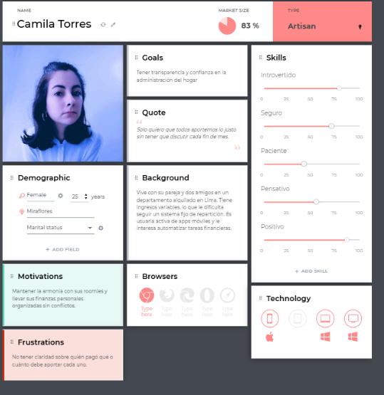

**Segmento #2: Representante del hogar / User Persona: Javier Morales**

  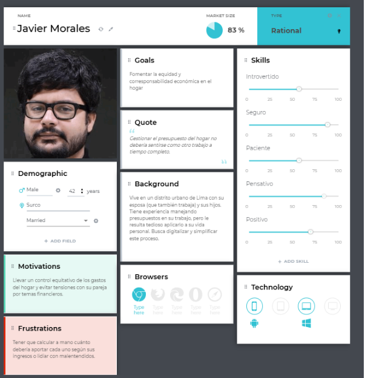

### User Task Matrix

### Camila Torres

| Actividades                                       | Frecuencia     | Importancia |
|--------------------------------------------------|----------------|-------------|
| Registrar y dividir los gastos del hogar         | Con frecuencia | Alta        |
| Revisar cuánto debe aportar cada integrante      | Con frecuencia | Alta        |
| Usar aplicaciones móviles de finanzas compartidas| A veces        | Media       |
| Hablar con los demás sobre gastos y responsabilidades | A veces    | Alta        |
| Verificar si los pagos del mes ya se realizaron  | Con frecuencia | Alta        |

### Javier Morales

| Actividades                                        | Frecuencia     | Importancia |
|---------------------------------------------------|----------------|-------------|
| Planificar y distribuir el presupuesto del hogar  | Con frecuencia | Alta        |
| Supervisar que los pagos mensuales estén cubiertos| Con frecuencia | Alta        |
| Calcular cuánto debería aportar cada miembro      | A veces        | Alta        |
| Buscar herramientas para facilitar la gestión financiera | A veces  | Media       |
| Resolver conflictos por dinero entre miembros     | Rara vez       | Alta        |

### User Journey Mapping

### Segmento 1: Personas del hogar

El journey de este segmento refleja a un miembro del hogar que busca una forma justa y equitativa de distribuir los gastos del hogar entre los diferentes miembros. Actualmente, el proceso de distribución de gastos es manual y genera conflictos debido a la falta de claridad y transparencia.

  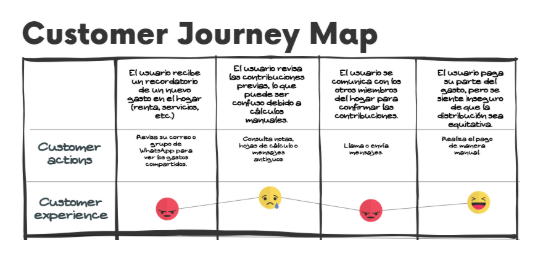

**Emoción final:** Inseguridad y frustración, ya que el proceso es manual, desorganizado y genera confusión.

### Segmento 2: Representante del hogar

El journey de este segmento refleja a una persona encargada de la planificación financiera del hogar. Aunque tiene la intención de distribuir los gastos de manera equitativa, actualmente carece de una herramienta eficiente para llevar un control claro y justo, lo que provoca estrés y desconfianza entre los miembros del hogar.

**Emoción final:** Estrés y desconcierto, ya que la distribución de gastos es confusa y la comunicación no es eficiente.

  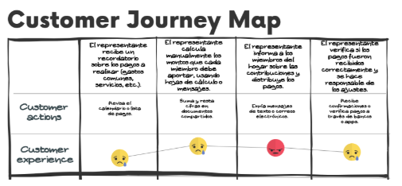

### Empathy Mapping

### Segmento 1: Personas del hogar

  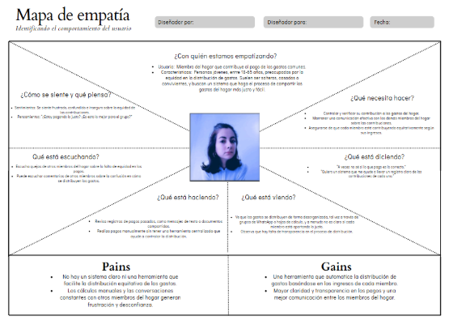

### Segmento 2: Representante del hogar

  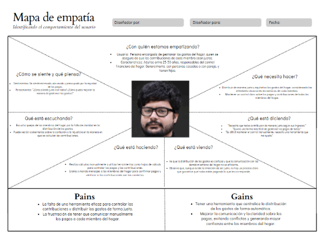

### As-is Scenario Mapping

### Segmento #1: Personas del Hogar

| Fase                                      | Doing | Thinking | Feeling |
|-------------------------------------------|--------|----------|---------|
| **Seguimiento y revisión de gastos compartidos** | Revisa conversaciones de WhatsApp o notas personales para rastrear quién pagó qué, pero muchas veces la información está incompleta o es confusa. | Pienso que llevar un registro de los gastos compartidos debería ser más sencillo y automático, pero hasta ahora no hemos encontrado una forma clara de hacerlo. | Me siento confundido al intentar recordar todos los pagos realizados sin un registro claro ni apoyo visual. |
|                                           | Intenta hacer una lista manual de gastos en papel o Excel, aunque no siempre recuerda todos los detalles y los registros se vuelven difíciles de actualizar. | Me pregunto si estoy olvidando anotar algún gasto importante y si eso puede afectar el cálculo que hacemos a fin de mes. | Siento frustración porque la falta de organización financiera genera dudas constantes y conversaciones repetitivas con mis convivientes. |
|                                           | Consulta su cuenta bancaria para verificar pagos recientes, pero no puede identificar fácilmente cuáles fueron gastos personales y cuáles del hogar. | Pienso que sería mucho más justo si tuviéramos un sistema centralizado donde todos podamos registrar los gastos en tiempo real y con transparencia. | Me siento inseguro sobre si todos estamos aportando lo que realmente corresponde, lo que crea una tensión silenciosa. |
| **Distribución informal de los pagos**    | Coordina a través de mensajes con los demás miembros para acordar quién pagará ciertos gastos, pero muchas veces esto se hace sobre la marcha sin una lógica clara. | Pienso que terminó asumiendo más gastos que los demás simplemente porque suelo tener el dinero a la mano o reaccionó más rápido. | Me siento agotado de tener que estar detrás de todos para que paguen su parte o al menos registren lo que compraron. |
|                                           | Suma rápidamente los montos estimados para dividirlos entre todos, aunque no considera factores como los ingresos individuales ni el consumo real. | Me pregunto si realmente todos entienden cuánto deben aportar o si lo hacen "a ojo", sin preocuparse por la equidad. | Siento cierta incomodidad al tener que hablar de dinero constantemente, ya que se vuelve un tema delicado en el hogar. |
|                                           | Realiza pagos de manera voluntaria por necesidad o urgencia, esperando que luego los demás le transfieran su parte, aunque no siempre lo hacen. | Pienso que esta forma de dividir gastos es muy improvisada y, a la larga, puede generar malentendidos o conflictos. | Me siento abrumado porque sé que no estamos manejando bien nuestras finanzas compartidas, y eso me preocupa. |
| **Ajustes reactivos y búsqueda de equidad** | Analiza los ingresos aproximados de cada integrante para proponer una distribución más justa, pero sin datos concretos se vuelve una conversación complicada. | Pienso que deberíamos dividir los gastos de forma proporcional a lo que gana cada persona, para que todos puedan contribuir sin ahogarse. | Me siento decepcionado porque, a pesar de nuestras buenas intenciones, seguimos teniendo los mismos problemas de organización mes tras mes. |
|                                           | Propone reuniones improvisadas para revisar los gastos y buscar un mejor método de control, pero las decisiones no se mantienen en el tiempo. | Me pregunto si existe una aplicación que nos ayude a hacer esto automáticamente, sin tener que hacer cálculos manuales o discutir todo el tiempo. | Siento tensión al hablar del tema con mis convivientes, porque a veces se malinterpretan las intenciones de quienes intentamos ordenar. |
|                                           | Investiga apps o soluciones digitales para la gestión de gastos, pero ninguna se ajusta realmente al contexto del hogar ni considera la proporcionalidad de ingresos. | Pienso que necesitamos una herramienta que se adapte a nuestra dinámica como hogar, con funcionalidades claras, accesibles y compartidas. | Me siento con esperanza de que encontremos una solución adecuada, pero también con ansiedad porque el problema aún persiste y genera incomodidad. |

### Segmento #2: Representante del Hogar

| Fase                                      | Doing | Thinking | Feeling |
|-------------------------------------------|--------|----------|---------|
| **Recolección y validación de información financiera del hogar** | Recolecta los comprobantes y detalles de gastos realizados por todos los integrantes del hogar, usando notas, mensajes o capturas, pero no siempre recibe la información completa. | Pienso que estoy cargando con toda la responsabilidad de organizar los gastos, y eso no es sostenible sin un sistema de apoyo claro. | Me siento abrumado por la cantidad de información que debe manejar y organizar cada mes sin tener herramientas que me faciliten la tarea. |
|                                           | Revisa manualmente los estados de cuenta y movimientos bancarios para identificar los pagos relacionados al hogar, lo cual le toma mucho tiempo. | Me pregunto si realmente estoy considerando todos los gastos y si hay algún egreso que se me está escapando por falta de comunicación. | Siento frustración porque muchas veces debo insistir para que los demás cooperen con los datos que necesito, y no siempre responden. |
|                                           | Pregunta constantemente a los miembros del hogar por gastos olvidados o no registrados, lo que genera demoras y posibles olvidos importantes. | Pienso que necesito una manera más estructurada y automática para recolectar la información financiera del hogar sin depender de tantos recordatorios. | Me siento solo en esta tarea, como si fuera una obligación exclusiva mía, cuando debería ser una responsabilidad compartida. |
| **Coordinación y comunicación de pagos pendientes** | Informa a cada miembro cuánto debe pagar y por qué, a través de mensajes o reuniones, pero muchas veces hay confusión o falta de claridad en los montos. | Pienso que debería haber un sistema que envíe recordatorios automáticos y calcule de forma clara lo que cada uno debe pagar según lo que gana o consume. | Me siento estresado por tener que estar al tanto de todos los pagos y al mismo tiempo mantener una buena relación con todos. |
|                                           | Envía recordatorios de pagos pendientes o fechas límites, lo cual consume tiempo y no siempre garantiza una respuesta inmediata. | Me pregunto si estoy siendo justo al dividir los gastos de forma igual cuando algunos ganan más o usan más recursos del hogar. | Siento incomodidad cuando debo insistir o corregir a alguien por un pago pendiente, porque no quiero generar conflictos. |
|                                           | Negocia casos especiales (como pagos fraccionados o postergaciones) sin contar con reglas claras, lo que puede ser percibido como injusto. | Pienso que esta dinámica constante de perseguir a todos por los pagos desgasta mi relación con los demás y crea una tensión innecesaria. | Me siento responsable de que todo funcione correctamente, pero a la vez cansado de que no todos valoren el esfuerzo que conlleva. |
| **Evaluación y propuesta de mejoras en la gestión de gastos** | Revisa lo que funcionó o falló en el mes anterior, anotando observaciones sobre los pagos tardíos, malentendidos o desequilibrios financieros. | Pienso que debemos cambiar el sistema actual por uno más justo, donde todos entiendan y acepten cómo se calcula cada gasto. | Me siento motivado cuando encuentro posibles soluciones o herramientas que podrían facilitar nuestra gestión como hogar. |
|                                           | Busca herramientas como hojas de Excel, apps móviles o plantillas para organizar mejor los datos y proponer un sistema más claro. | Me pregunto si los demás estarán dispuestos a adoptar una nueva herramienta o si seguirán resistiéndose a cambiar su forma de actuar. | Siento ansiedad al pensar que los cambios propuestos no sean bien recibidos o que no logren resolver los problemas actuales. |
|                                           | Presenta nuevas ideas o métodos para mejorar la distribución de gastos en las reuniones familiares o del hogar, con argumentos basados en experiencias previas. | Pienso que si no logramos organizar mejor nuestras finanzas ahora, más adelante tendremos conflictos más serios que afectarán la convivencia. | Me siento determinado a encontrar una forma más equitativa de administrar los gastos del hogar, porque sé que es necesario para todos. |

## Ubiquitous Language

| **Término en Inglés**          | **Término en Español**       | **Definición**                                                                                                                                           |
|--------------------------------|-----------------------------|----------------------------------------------------------------------------------------------------------------------------------------------------------|
| Household Representative      | Representante del hogar     | Usuario responsable de administrar el hogar dentro del sistema. Tiene permisos especiales para registrar nuevos miembros, ingresar gastos comunes y visualizar los aportes de todos. |
| Household Member              | Miembro del hogar           | Usuario que forma parte de un hogar registrado. Aporta según su capacidad económica y puede visualizar su historial de gastos y contribuciones.              |
| Income-Based Contribution     | Contribución basada en ingresos | Mecanismo mediante el cual se calcula la cantidad que debe aportar cada miembro del hogar, según el ingreso personal declarado. Busca que el reparto sea justo y equitativo. |
| Shared Expense                | Gasto compartido             | Gasto que afecta a todo el hogar y que debe dividirse proporcionalmente entre sus miembros (por ejemplo, alquiler, servicios, compras comunes).              |
| Spending Record               | Registro de gastos          | Documento digital o entrada dentro del sistema que detalla la fecha, el monto, la categoría y quién ingresó el gasto.                                       |
| Contribution Percentage       | Porcentaje de contribución  | Valor en porcentaje que representa la participación proporcional de cada miembro en los gastos comunes del hogar, calculado con base en su ingreso.         |
| Financial Overview            | Resumen financiero          | Vista general de los ingresos, aportes y gastos de un hogar, accesible para sus miembros y con mayor detalle para el representante.                       |
| Pending Contribution          | Contribución pendiente      | Monto que un miembro del hogar aún no ha cubierto con respecto a los gastos registrados. Puede generar recordatorios o alertas.                             |
| Expense Category              | Categoría de gasto          | Clasificación usada para organizar los gastos ingresados (por ejemplo: alimentación, servicios, alquiler, entretenimiento). Facilita el análisis y el seguimiento. |
| Adjustment Report             | Reporte de ajustes          | Documento generado automáticamente por el sistema cuando hay una variación significativa en los ingresos de un miembro, sugiriendo una nueva distribución de aportes. |

# Capítulo 3: Requirements Specification

## 3.1 To-Be Scenario Mapping

### Segmento 1: Miembros del hogar

| Fase                                      | Doing | Thinking | Feeling |
|-------------------------------------------|--------|----------|---------|
| **Seguimiento y revisión de gastos compartidos** | Los miembros del hogar ingresan automáticamente todos los gastos en la aplicación, ya sea al momento del gasto o mediante sincronización con sus cuentas bancarias. | Es mucho más fácil y preciso llevar un registro ahora que todos los pagos se registran automáticamente sin tener que buscar en WhatsApp ni revisar bancos manualmente. | Me siento mucho más organizado porque tengo todo el registro claro y accesible en mi teléfono sin perder tiempo. |
|                                           | La app organiza y categoriza los pagos (gastos comunes vs personales) automáticamente, sin necesidad de búsquedas manuales. | Ahora sé exactamente lo que gasté y lo que debo, sin necesidad de adivinar ni calcular de memoria. | Es un alivio saber que no tengo que revisar cientos de mensajes o comprobantes para recordar lo que cada quien debe. |
|                                           | El sistema envía notificaciones automáticas con un resumen semanal de los gastos compartidos. | Este sistema me ahorra mucho tiempo y esfuerzo. Ya no tengo que preocuparme por mantener un control constante. | Ahora tengo la seguridad de que todos los gastos están bien registrados y no me siento confundido ni preocupado por olvidar algo importante. |
| **Distribución informal de los pagos**    | La aplicación realiza automáticamente la distribución de los pagos según el consumo de cada miembro y sus ingresos. | No tengo que calcular manualmente cuánto me toca pagar. La app lo hace automáticamente con base en mis ingresos y el consumo real. | Me siento más tranquilo porque la distribución es automática y justa. |
|                                           | Los usuarios visualizan la distribución con gráficos claros que muestran la proporción correspondiente a cada miembro. | Ahora cada uno paga lo que le corresponde de forma justa, sin discusiones ni estimaciones imprecisas. | Es un alivio saber que ya no hay malentendidos ni tensiones por quién paga qué. |
|                                           | La app permite el pago directo dentro de la plataforma, con transferencias instantáneas. | Este sistema es más equilibrado y sencillo que el método anterior, donde uno a veces asumía más de lo que debía. | Me siento más seguro porque la app ajusta la contribución según lo que cada uno gana y consume. |
| **Ajustes reactivos y búsqueda de equidad** | La app ajusta automáticamente las contribuciones si hay cambios en ingresos o gastos. | La app se adapta automáticamente a los cambios, haciendo ajustes sin que tengamos que discutir o calcular nada. | Me siento tranquilo porque ya no hay necesidad de hacer ajustes complicados o debatir sobre la división. |
|                                           | La aplicación muestra comparaciones visuales para facilitar la toma de decisiones si hay dudas o ajustes. | Si algo cambia, puedo ver en tiempo real cómo se ajusta la distribución, lo que me da claridad y confianza. | Es muy cómodo saber que los ajustes se hacen solos y de forma justa, sin necesidad de confrontaciones. |
|                                           | Hay un sistema de comentarios y notas en cada gasto para que los miembros discutan o justifiquen ajustes de forma ordenada. | Antes era complicado ajustar, pero ahora la app lo maneja de forma eficiente y justa. | Ahora me siento menos preocupado y más satisfecho con cómo se gestionan los pagos: es más justo y transparente. |

### Segmento 2: Representante del hogar

| Fase                                         | Doing | Thinking | Feeling |
|----------------------------------------------|--------|----------|---------|
| **Recolección y validación de información financiera del hogar** | La aplicación recopila automáticamente todos los gastos realizados, sincronizando las cuentas bancarias de todos los miembros del hogar, para asegurar que no falte ningún gasto registrado. | Ahora la app recolecta toda la información automáticamente, lo que me permite ahorrar tiempo y no preocuparme por pedir detalles constantemente. | Me siento mucho más relajado sabiendo que toda la información financiera está organizada y no tengo que buscarla en varias partes. |
|                                              | Los usuarios reciben notificaciones en tiempo real sobre nuevos gastos o pagos realizados, sin tener que pedir información adicional. | Me siento más tranquilo porque sé que no se me está escapando ningún gasto importante, ya que todo se registra en la aplicación de forma inmediata. | Es un alivio no tener que insistir a cada persona para que me envíe los comprobantes o detalles, todo se gestiona de forma automática. |
|                                              | Los comprobantes y detalles de los gastos se almacenan de forma centralizada y organizada en la app, lo que evita perder información o tener que buscar en múltiples fuentes. | Este sistema es más eficiente y evita los errores humanos. Ya no tengo que validar manualmente cada gasto o estar pendiente de recordar los pagos. | Me siento más en control, porque tengo toda la información al alcance de mi mano sin el estrés de pedir detalles a los demás. |
| **Coordinación y comunicación de pagos pendientes** | La aplicación muestra el monto exacto que cada miembro debe pagar, basado en su consumo y los ingresos de todos, eliminando cálculos manuales y posibles malentendidos. | Ahora puedo ver claramente cuánto debo pagar y cuándo, sin necesidad de estar preguntando o calculando manualmente. | Me siento más tranquilo porque todo está automatizado, y ya no tengo que enviar recordatorios ni correos repetitivos. |
|                                              | Los usuarios reciben notificaciones automáticas de los pagos pendientes, con un recordatorio claro sobre la fecha límite y las cantidades exactas que deben abonar. | Las notificaciones automáticas me aseguran que no voy a olvidar hacer un pago ni que alguien más lo olvide. Todo está claro y organizado. | Es muy cómodo saber que todos los pagos están claramente definidos y que no tengo que resolver conflictos sobre qué monto le corresponde a cada uno. |
|                                              | La app facilita la comunicación entre los miembros del hogar a través de un chat o tablero de discusión para resolver cualquier duda o negociación de pagos. | La app ha hecho que todo sea mucho más fácil de coordinar, ya no es necesario tener largas conversaciones sobre lo que debe cada uno. | Siento que la gestión de pagos es mucho más eficiente, y todos tienen la misma información sin malentendidos ni tensiones. |
| **Evaluación y propuesta de mejoras en la gestión de gastos** | Los usuarios pueden ver informes mensuales de los gastos compartidos, con análisis visuales que permiten identificar patrones de consumo y detectar áreas de mejora. | Es más fácil evaluar cómo estamos manejando los gastos, ya que los informes me dan una visión clara y detallada de todo lo que está sucediendo. | Me siento satisfecho porque puedo ver cómo mejorar continuamente la gestión de los gastos, y no tengo que adivinar si estoy haciendo bien las cosas. |
|                                              | La aplicación genera sugerencias automáticas sobre cómo ajustar la distribución de los gastos o cómo optimizar los pagos, en base a los ingresos y el consumo de cada miembro. | Ahora sé exactamente qué ajustes hacer, si alguien ha pagado más de lo que le correspondía o si necesitamos redistribuir algunos gastos para que sea más equitativo. | Es muy reconfortante saber que tengo herramientas que me permiten hacer ajustes fácilmente sin generar conflictos o malentendidos. |
|                                              | Los miembros pueden proponer mejoras o ajustes de manera transparente dentro de la plataforma, donde todos los integrantes pueden votar o dar su opinión. | Me siento más confiado en que el sistema está tomando en cuenta todas las variables, lo que facilita el proceso de mejorar nuestra gestión financiera. | Me siento apoyado por un sistema que ayuda a hacer que nuestras decisiones sean más equitativas, transparentes y justas. |

## User Stories
### Epic

| EPIC ID | Nombre del Epic                  | Descripción |
|---------|----------------------------------|-------------|
| EP01    | Registro y Gestión de Perfil     | Como usuario, quiero registrarme y gestionar mi perfil de forma segura y personalizada, para acceder a SplitEasy desde cualquier dispositivo. |
| EP02    | Panel del Representante del Hogar| Como representante del hogar, quiero gestionar y supervisar las finanzas del hogar de forma centralizada y transparente. |
| EP03    | Panel del Miembro del Hogar      | Como miembro del hogar, quiero registrar mis ingresos, ver mis responsabilidades y mantenerme al día con mis pagos. |
| EP04    | Gestión de Gastos Compartidos    | Como usuario, quiero registrar, clasificar y gestionar gastos para mantener el control financiero del hogar. |
| EP05    | Seguimiento y Recordatorios      | Como usuario, quiero recibir recordatorios y alertas automáticas para no olvidar mis responsabilidades financieras. |
| EP06    | Soporte y Comunidad              | Como usuario, quiero acceder a soporte técnico y a recursos para mejorar mi uso de la plataforma y resolver dudas. |
| EP07    | Exploración como Visitante       | Como visitante, quiero conocer la funcionalidad, beneficios y casos de uso de SplitEasy desde la landing page para evaluar si la plataforma es útil para mi hogar antes de registrarme. |

### EP01 - Registro y Gestión de Perfil

| User Story ID | Título                          |
|---------------|----------------------------------|
| US01          | Registro de usuario              |
| US02          | Inicio de sesión seguro          |
| US03          | Edición de información personal  |
| US04          | Cierre de sesión desde todos los dispositivos |
| US05          | Configuración de notificaciones personales |

### EP02 - Panel del Representante del Hogar

| User Story ID | Título                          |
|---------------|----------------------------------|
| US06          | Crear hogar                      |
| US07          | Aprobar gastos                   |
| US08          | Ajustar porcentajes de aportes   |
| US09          | Visualizar reportes mensuales    |
| US10          | Configurar métodos de pago aceptados |

### EP03 - Panel del Miembro del Hogar

| User Story ID | Título                          |
|---------------|----------------------------------|
| US11          | Ingresar ingresos personales     |
| US12          | Ver monto a pagar                |
| US13          | Registrar pagos realizados       |
| US14          | Ver historial de pagos           |
| US15          | Ver distribución de gastos del hogar |

### EP04 - Gestión de Gastos Compartidos

| User Story ID | Título                          |
|---------------|----------------------------------|
| US16          | Registrar nuevo gasto            |
| US17          | Adjuntar comprobantes de gasto   |
| US18          | Clasificar gastos por categoría  |
| US19          | Comentar o justificar un gasto   |
| US20          | Visualizar gráficos de gastos    |

### EP05 - Seguimiento y Recordatorios

| User Story ID | Título                          |
|---------------|----------------------------------|
| US21          | Recordatorios de pago            |
| US22          | Alertas de pagos pendientes      |
| US23          | Recordatorio de actualización de ingresos |
| US24          | Confirmación de aportes          |
| US25          | Notificación de cambios en el hogar |

### EP06 - Soporte y Comunidad

| User Story ID | Título                          |
|---------------|----------------------------------|
| US26          | Acceso a ayuda en línea          |
| US27          | Chat con soporte técnico         |
| US28          | Reportar un problema             |
| US29          | Sugerencias de mejora            |
| US30          | Foro comunitario                 |

### EP07 - Exploración como Visitante

| User Story ID | Título                          |
|---------------|----------------------------------|
| US31          | Visualizar información general sobre SplitEasy desde la landing page              |
| US32          | Conocer las funciones principales para representantes y miembros del hogar         |
| US33          | Explorar beneficios del sistema de aportes proporcionales  |
| US34          | Ver ejemplos o simulaciones de cómo funciona la plataforma |
| US35          | 	Acceder fácilmente al registro o login desde botones destacados |

| ID Épica | Épica                             | ID HU | Título HU                         | Descripción HU                                                                 | Criterios de Aceptación                                                                                                                                                                   |
|----------|-----------------------------------|-------|------------------------------------|--------------------------------------------------------------------------------|--------------------------------------------------------------------------------------------------------------------------------------------------------------------------------------------|
| EP01     | Registro y Gestión de Perfil      | US01  | Registro de usuario                | Como visitante, quiero registrarme en la plataforma para comenzar a usar SplitEasy.                              | - Escenario 1: Acceso a la página de registro Dado que el usuario está en la pantalla principal, Cuando haga clic en el botón de "Registrarse", Entonces será dirigido al formulario de registro.  - Escenario 2: Registro exitoso Dado que el usuario completó el formulario correctamente, Cuando haga clic en "Enviar", Entonces recibirá una confirmación y será redirigido al panel inicial. |
| EP01     | Registro y Gestión de Perfil      | US02  | Inicio de sesión seguro            | Como usuario registrado, quiero iniciar sesión de forma segura para acceder a mis datos personales.              | - Escenario 1: Ingreso de credenciales correctas Dado que el usuario introduce sus datos, Cuando sean correctos, Entonces accederá al sistema.  - Escenario 2: Datos incorrectos Dado que el usuario introduce datos erróneos, Cuando intente iniciar sesión, Entonces recibirá un mensaje de error.                                      |
| EP01     | Registro y Gestión de Perfil      | US03  | Edición de información personal    | Como usuario, quiero editar mi información personal para mantenerla actualizada.                                 | - Escenario 1: Acceso al perfil Dado que el usuario ya está logueado, Cuando entre a la sección "Perfil", Entonces podrá ver su información editable.  - Escenario 2: Guardar cambios Dado que el usuario edite su nombre, Cuando haga clic en "Guardar", Entonces la información se actualizará.                                      |
| EP01     | Registro y Gestión de Perfil      | US04  | Cierre de sesión desde todos los dispositivos | Como usuario, quiero cerrar sesión desde todos mis dispositivos para mayor seguridad.                     | - Escenario 1: Cerrar sesión global Dado que el usuario se encuentra en su cuenta, Cuando presione el botón "Cerrar sesión en todos los dispositivos", Entonces todas las sesiones activas se cerrarán. |
| EP01     | Registro y Gestión de Perfil      | US05  | Configuración de notificaciones personales | Como usuario, quiero configurar mis notificaciones para recibir alertas relevantes.                        | - Escenario 1: Acceder a notificaciones Dado que el usuario accede a su perfil, Cuando haga clic en "Notificaciones", Entonces verá las opciones para activar o desactivar alertas.  - Escenario 2: Guardar configuración Dado que el usuario seleccione sus preferencias, Cuando haga clic en "Guardar", Entonces la configuración será aplicada. |
| EP02     | Panel del Representante del Hogar | US06  | Crear hogar                        | Como representante del hogar, quiero crear un hogar en la app para empezar a gestionar sus finanzas.             | - Escenario 1: Ingreso a creación de hogar Dado que el usuario haya iniciado sesión, Cuando haga clic en “Crear hogar”, Entonces podrá ingresar un nombre e ID para el hogar.  - Escenario 2: Confirmación de creación Dado que el usuario complete los campos requeridos, Cuando presione "Confirmar", Entonces se creará el hogar y se mostrará en su panel. |
| EP02     | Panel del Representante del Hogar | US07  | Aprobar gastos                     | Como representante, quiero aprobar gastos para tener control sobre lo que se gasta en el hogar.                  | - Escenario 1: Visualizar gastos pendientes Dado que haya gastos sin aprobar, Cuando el representante acceda al panel, Entonces verá una lista de gastos para revisar.  - Escenario 2: Aprobación Dado que el representante seleccione un gasto, Cuando presione "Aprobar", Entonces el gasto pasará a estado "Aprobado".               |
| EP02     | Panel del Representante del Hogar | US08  | Ajustar porcentajes de aportes     | Como representante, quiero modificar los porcentajes de contribución de cada miembro según sus ingresos.         | - Escenario 1: Acceder a ajustes de aportes Dado que el representante esté en el panel, Cuando seleccione la opción "Ajustar porcentajes", Entonces verá una lista editable de miembros.  - Escenario 2: Guardar ajustes Dado que se realicen cambios, Cuando presione "Guardar", Entonces se actualizarán los porcentajes automáticamente. |
| EP02     | Panel del Representante del Hogar | US09  | Visualizar reportes mensuales      | Como representante, quiero ver reportes de ingresos y gastos mensuales para tomar decisiones informadas.        | - Escenario 1: Acceso al panel de reportes Dado que el representante esté en su dashboard, Cuando seleccione “Reportes mensuales”, Entonces se mostrarán gráficos y resúmenes.  - Escenario 2: Descargar reporte Dado que el representante lo desee, Cuando haga clic en “Descargar PDF”, Entonces se descargará el informe correspondiente. |
| EP02     | Panel del Representante del Hogar | US10  | Configurar métodos de pago aceptados | Como representante, quiero configurar qué métodos de pago están habilitados en el hogar.                         | - Escenario 1: Ver métodos disponibles Dado que el usuario acceda a configuración, Cuando seleccione "Métodos de pago", Entonces verá una lista de métodos disponibles.  - Escenario 2: Activar métodos Dado que seleccione métodos específicos, Cuando presione “Guardar”, Entonces esos métodos quedarán habilitados para el hogar. |
| EP03     | Panel del Miembro del Hogar   | US11  | Ingresar ingresos personales | Como miembro del hogar, quiero registrar mis ingresos para que el sistema calcule mi aporte.         | - Escenario 1: Acceso al formulario de ingresos Dado que el miembro haya iniciado sesión, Cuando seleccione "Ingresos", Entonces se mostrará el formulario de ingreso de datos.  - Escenario 2: Confirmación de ingreso Dado que complete los datos, Cuando presione "Guardar", Entonces su ingreso quedará registrado en el sistema.                     |
| EP03     | Panel del Miembro del Hogar   | US12  | Ver monto a pagar          | Como miembro, quiero visualizar cuánto debo aportar al hogar basado en mis ingresos.                | - Escenario 1: Acceso al panel de pagos Dado que el usuario haya ingresado sus ingresos, Cuando acceda a "Mis aportes", Entonces verá el monto que le corresponde pagar este mes.                                                  |
| EP03     | Panel del Miembro del Hogar   | US13  | Registrar pagos realizados | Como miembro, quiero registrar que realicé un pago para que el sistema lleve un seguimiento.        | - Escenario 1: Ingreso de pago Dado que el miembro haya realizado un pago, Cuando acceda a "Registrar pago", Entonces podrá indicar el monto, la fecha y el método usado.  - Escenario 2: Confirmación Dado que ingrese los datos, Cuando presione “Guardar”, Entonces el pago quedará registrado correctamente.         |
| EP03     | Panel del Miembro del Hogar   | US14  | Ver historial de pagos     | Como miembro, quiero revisar mi historial de pagos para mantenerme al día con mis contribuciones.   | - Escenario 1: Visualización Dado que el usuario acceda a su panel, Cuando seleccione "Historial de pagos", Entonces se mostrará una lista con todos los pagos realizados ordenados por fecha.                                      |
| EP03     | Panel del Miembro del Hogar   | US15  | Ver distribución de gastos del hogar | Como miembro, quiero ver cómo se distribuyen los gastos para entender en qué se usa el dinero.       | - Escenario 1: Acceso al desglose de gastos Dado que el usuario esté en el panel, Cuando haga clic en “Distribución de gastos”, Entonces se mostrarán gráficos y listas categorizadas.  - Escenario 2: Detalles por categoría Dado que seleccione una categoría, Cuando haga clic en ella, Entonces se desplegarán los gastos específicos asociados. |
| EP04     | Gestión de Gastos Compartidos | US16  | Registrar nuevo gasto        | Como usuario, quiero registrar un nuevo gasto para mantener actualizados los movimientos financieros.   | - Escenario 1: Acceso al formulario Dado que el usuario haya iniciado sesión, Cuando acceda a "Registrar gasto", Entonces verá un formulario con campos de monto, categoría y descripción.  - Escenario 2: Guardado del gasto Dado que complete el formulario, Cuando presione “Guardar”, Entonces el nuevo gasto se almacenará en el sistema. |
| EP04     | Gestión de Gastos Compartidos | US17  | Adjuntar comprobantes de gasto | Como usuario, quiero subir comprobantes para respaldar los gastos registrados.                          | - Escenario 1: Carga de comprobante Dado que el usuario registre un gasto, Cuando presione “Adjuntar archivo”, Entonces podrá subir una imagen o PDF como comprobante.  - Escenario 2: Visualización Dado que se haya adjuntado un comprobante, Cuando acceda al gasto, Entonces podrá ver o descargar el archivo.                         |
| EP04     | Gestión de Gastos Compartidos | US18  | Clasificar gastos por categoría | Como usuario, quiero categorizar los gastos para facilitar su análisis y visualización.                 | - Escenario 1: Selección de categoría Dado que el usuario registre un gasto, Cuando acceda a la lista de categorías, Entonces podrá seleccionar entre alimentación, servicios, mantenimiento, etc.  - Escenario 2: Filtro Dado que seleccione una categoría, Cuando aplique el filtro, Entonces se mostrarán solo los gastos correspondientes.       |
| EP04     | Gestión de Gastos Compartidos | US19  | Comentar o justificar un gasto | Como usuario, quiero añadir comentarios para explicar el motivo de un gasto compartido.                | - Escenario 1: Comentario en gasto Dado que el usuario haya registrado un gasto, Cuando seleccione “Añadir comentario”, Entonces podrá escribir y guardar una nota explicativa visible a los miembros del hogar.                                  |
| EP04     | Gestión de Gastos Compartidos | US20  | Visualizar gráficos de gastos | Como usuario, quiero ver gráficos de gastos para entender en qué se gasta más.                          | - Escenario 1: Acceso a visualizaciones Dado que el usuario esté en el panel de gastos, Cuando acceda a “Ver gráficos”, Entonces podrá ver gráficos circulares o de barras agrupados por categoría, fecha o usuario.                                    |
| EP05     | Seguimiento y Recordatorios | US21  | Recordatorios de pago               | Como usuario, quiero recibir recordatorios automáticos de pago para no retrasarme en mis aportes.| - Escenario 1: Activación del recordatorio Dado que el usuario tenga una fecha límite de pago, Cuando se acerque esa fecha, Entonces recibirá una notificación automática por correo o en la app.  - Escenario 2: Configuración Dado que acceda a ajustes, Cuando edite preferencias, Entonces podrá activar o desactivar los recordatorios. |
| EP05     | Seguimiento y Recordatorios | US22  | Alertas de pagos pendientes         | Como usuario, quiero ser alertado si tengo pagos atrasados para regularizar mi situación.         | - Escenario 1: Detección automática Dado que el usuario no haya pagado después de la fecha límite, Cuando acceda al sistema, Entonces verá una alerta destacada en su panel.  - Escenario 2: Alerta múltiple Dado que haya varios pagos pendientes, Cuando abra la alerta, Entonces podrá ver el detalle de cada uno. |
| EP05     | Seguimiento y Recordatorios | US23  | Recordatorio de actualización de ingresos | Como usuario, quiero ser recordado de actualizar mis ingresos para mantener la equidad del sistema.| - Escenario 1: Periodicidad Dado que haya pasado un mes sin actualización, Cuando el usuario inicie sesión, Entonces verá un mensaje solicitando revisar su ingreso.  - Escenario 2: Confirmación Dado que actualice el ingreso, Cuando guarde los cambios, Entonces se reiniciará el periodo de espera. |
| EP05     | Seguimiento y Recordatorios | US24  | Confirmación de aportes              | Como usuario, quiero recibir confirmación cada vez que realizo un aporte para mayor seguridad.     | - Escenario 1: Notificación inmediata Dado que el usuario registre un pago, Cuando el sistema lo procese, Entonces recibirá una confirmación por correo o notificación dentro de la app.  - Escenario 2: Registro visible Dado que quiera revisar sus confirmaciones, Cuando acceda al historial, Entonces verá las confirmaciones pasadas. |
| EP05     | Seguimiento y Recordatorios | US25  | Notificación de cambios en el hogar | Como usuario, quiero ser notificado si hay cambios en el hogar para estar informado.               | - Escenario 1: Nuevo miembro Dado que un nuevo miembro se una, Cuando sea aprobado por el representante, Entonces se notificará a todos los miembros.  - Escenario 2: Cambios administrativos Dado que el representante edite los porcentajes de aporte, Cuando se guarde el cambio, Entonces se notificará a los afectados. |
| EP06     | Soporte y Comunidad | US26  | Acceso a ayuda en línea | Como usuario, quiero acceder a una sección de ayuda en línea para resolver mis dudas básicas. | - Escenario 1: Acceso desde el menú Dado que el usuario esté en cualquier vista, Cuando haga clic en “Ayuda” en el menú principal, Entonces será redirigido a la sección de preguntas frecuentes.  - Escenario 2: Búsqueda rápida Dado que use el buscador, Cuando escriba su duda, Entonces obtendrá respuestas relacionadas. |
| EP06     | Soporte y Comunidad | US27  | Chat con soporte técnico | Como usuario, quiero chatear con un agente de soporte para resolver problemas técnicos específicos. | - Escenario 1: Inicio de chat Dado que el usuario esté en la sección de ayuda, Cuando seleccione “Chatear con soporte”, Entonces se abrirá una ventana de conversación con el agente disponible.  - Escenario 2: Horario de atención Dado que acceda fuera de horario, Cuando intente iniciar chat, Entonces verá un mensaje informativo con horarios. |
| EP06     | Soporte y Comunidad | US28  | Reportar un problema     | Como usuario, quiero poder reportar errores o fallas para que el equipo técnico las solucione. | - Escenario 1: Formulario de reporte Dado que haya experimentado un problema, Cuando acceda al formulario de reporte, Entonces podrá describir el incidente y enviarlo.  - Escenario 2: Confirmación de envío Dado que complete el formulario, Cuando lo envíe, Entonces recibirá una confirmación con número de ticket. |
| EP06     | Soporte y Comunidad | US29  | Sugerencias de mejora    | Como usuario, quiero dejar sugerencias para mejorar la plataforma de manera colaborativa.       | - Escenario 1: Ingreso de sugerencia Dado que tenga una idea, Cuando acceda a la sección “Sugerencias”, Entonces podrá llenar un formulario y enviarla.  - Escenario 2: Visualización de estado Dado que envíe una sugerencia, Cuando acceda a su perfil, Entonces podrá ver si está en evaluación o implementada. |
| EP06     | Soporte y Comunidad | US30  | Foro comunitario         | Como usuario, quiero participar en un foro donde pueda compartir experiencias y resolver dudas. | - Escenario 1: Navegación general Dado que el usuario entre al foro, Cuando seleccione una categoría, Entonces verá los temas y respuestas más recientes.  - Escenario 2: Crear publicación Dado que quiera iniciar un nuevo tema, Cuando publique, Entonces su mensaje se mostrará en el hilo correspondiente. |
| EP07     | Exploración como Visitante | US31   | Visualizar información general sobre SplitEasy desde la landing page | Como visitante, quiero ver información clara sobre SplitEasy desde la página principal para entender su propósito. | - Escenario 1: Acceso inicial Dado que el visitante acceda a la landing page, Cuando cargue la vista, Entonces verá un resumen claro de qué es SplitEasy y cómo funciona.  - Escenario 2: Responsive design Dado que acceda desde móvil o PC, Entonces la información debe estar adecuadamente adaptada. |
| EP07     | Exploración como Visitante | US32   | Conocer las funciones principales para representantes y miembros del hogar | Como visitante, quiero conocer las funcionalidades para cada tipo de usuario para decidir si me interesa. | - Escenario 1: Sección de funciones Dado que esté en la landing, Cuando haga scroll o clic en “Funciones”, Entonces verá tarjetas explicativas para representantes y miembros.  - Escenario 2: Enlaces internos Dado que seleccione una función, Entonces será redirigido a más detalles en la misma página. |
| EP07     | Exploración como Visitante | US33   | Explorar beneficios del sistema de aportes proporcionales | Como visitante, quiero entender cómo funciona el sistema proporcional de aportes para saber si me conviene. | - Escenario 1: Sección explicativa Dado que acceda a la landing, Cuando llegue a la sección de “Sistema proporcional”, Entonces verá un texto y/o animación que explica con claridad su funcionamiento.  - Escenario 2: Comprensión clara Dado que lea el contenido, Entonces entenderá con ejemplos simples los beneficios del sistema. |
| EP07     | Exploración como Visitante | US34   | Ver ejemplos o simulaciones de cómo funciona la plataforma | Como visitante, quiero ver ejemplos o simulaciones para imaginarme cómo sería usar la plataforma. | - Escenario 1: Acceso a simulaciones Dado que esté en la sección “¿Cómo funciona?”, Cuando haga clic en “Ver ejemplo”, Entonces se mostrará una simulación o demo visual del flujo de uso.  - Escenario 2: Casos ilustrativos Dado que revise los ejemplos, Entonces identificará casos similares a su situación real. |
| EP07     | Exploración como Visitante | US35   | Acceder fácilmente al registro o login desde botones destacados | Como visitante, quiero tener botones claros para registrarme o iniciar sesión desde cualquier parte de la landing. | - Escenario 1: Botón fijo en el header Dado que navegue por la landing, Cuando quiera registrarse, Entonces podrá hacer clic en un botón visible en la parte superior.  - Escenario 2: Llamados a la acción Dado que lea una sección que le interese, Entonces verá un botón que lo invita a registrarse o iniciar sesión. |

## Impact Mapping

### Segmento 1: Miembros del hogar

  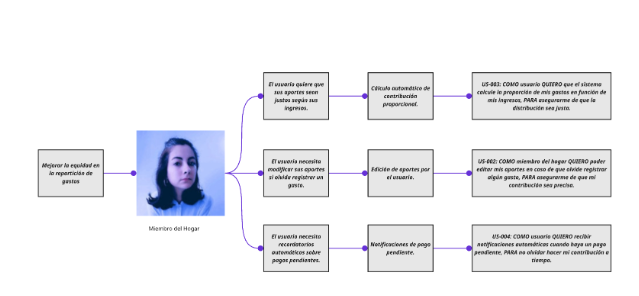

### Segmento 2: Representante del hogar

  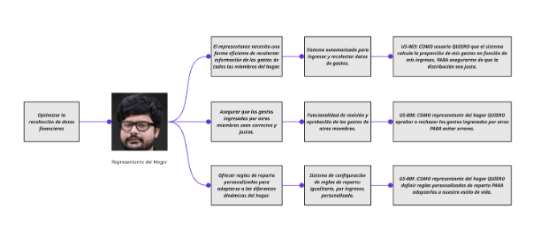

## Product Backlog

| Orden | User Story ID | Título HU                                               | Descripción HU                                                                                   | Prioridad | Story Points |
|--------|----------------|----------------------------------------------------------|--------------------------------------------------------------------------------------------------|-----------|---------------|
| 1      | US01           | Registro de usuario                                     | Como usuario, quiero registrarme de forma segura y rápida para empezar a usar la plataforma.     | Media      | 3             |
| 2      | US02           | Inicio de sesión seguro                                 | Como usuario, quiero iniciar sesión con seguridad para acceder a mi cuenta desde cualquier lugar.| Baja      | 2             |
| 3      | US03           | Edición de información personal                         | Como usuario, quiero poder editar mi información para mantenerla actualizada.                    | Baja     | 2             |
| 4      | US04           | Cierre de sesión desde todos los dispositivos           | Como usuario, quiero cerrar sesión desde todos mis dispositivos por seguridad.                   | Baja     | 2             |
| 5      | US05           | Configuración de notificaciones personales              | Como usuario, quiero personalizar las notificaciones que recibo.                                 | Media     | 3             |
| 6      | US06           | Crear hogar                                             | Como representante, quiero crear un hogar para gestionar las finanzas familiares.                | Media      | 3             |
| 7      | US07           | Aprobar gastos                                          | Como representante, quiero aprobar gastos para mantener el control de las finanzas.              | Baja      | 2             |
| 8      | US08           | Ajustar porcentajes de aportes                          | Como representante, quiero ajustar los aportes de cada miembro según sus ingresos.               | Alta      | 5             |
| 9      | US09           | Visualizar reportes mensuales                           | Como representante, quiero ver reportes mensuales para analizar los gastos y aportes.            | Alta     | 5             |
| 10     | US10           | Configurar métodos de pago aceptados                    | Como representante, quiero definir los métodos de pago permitidos.                               | Baja     | 2             |
| 11     | US11           | Ingresar ingresos personales                            | Como miembro, quiero ingresar mis ingresos para calcular mi aporte.                              | Media      | 3             |
| 12     | US12           | Ver monto a pagar                                       | Como miembro, quiero ver cuánto me corresponde pagar según mis ingresos.                         | Baja      | 2             |
| 13     | US13           | Registrar pagos realizados                              | Como miembro, quiero registrar mis pagos para mantenerme al día.                                 | Baja      | 2             |
| 14     | US14           | Ver historial de pagos                                  | Como miembro, quiero consultar mis pagos pasados para tener un control.                          | Baja     | 2             |
| 15     | US15           | Ver distribución de gastos del hogar                    | Como miembro, quiero ver cómo se distribuyen los gastos en el hogar.                             | Baja     | 2             |
| 16     | US16           | Registrar nuevo gasto                                   | Como usuario, quiero registrar un nuevo gasto del hogar para llevar un mejor control.            | Media      | 3             |
| 17     | US17           | Adjuntar comprobantes de gasto                          | Como usuario, quiero adjuntar imágenes de comprobantes para validar los gastos.                  | Baja     | 2             |
| 18     | US18           | Clasificar gastos por categoría                         | Como usuario, quiero clasificar los gastos para analizarlos mejor.                               | Media      | 3             |
| 19     | US19           | Comentar o justificar un gasto                          | Como usuario, quiero justificar los gastos ingresados.                                            | Baja      | 2             |
| 20     | US20           | Visualizar gráficos de gastos                           | Como usuario, quiero ver gráficos para entender mejor los gastos del hogar.                      | Media      | 3             |
| 21     | US21           | Recordatorios de pago                                   | Como usuario, quiero recibir recordatorios para no olvidar mis pagos.                            | Media      | 3             |
| 22     | US22           | Alertas de pagos pendientes                             | Como usuario, quiero recibir alertas cuando tenga pagos pendientes.                              | Baja      | 2             |
| 23     | US23           | Recordatorio de actualización de ingresos               | Como usuario, quiero que me recuerden actualizar mis ingresos periódicamente.                    | Baja     | 2             |
| 24     | US24           | Confirmación de aportes                                 | Como usuario, quiero recibir confirmaciones cuando mis aportes sean procesados.                  | Muy Baja      | 1             |
| 25     | US25           | Notificación de cambios en el hogar                     | Como usuario, quiero ser notificado cuando haya cambios importantes en el hogar.                 | Muy Baja      | 1             |
| 26     | US26           | Acceso a ayuda en línea                                 | Como usuario, quiero tener acceso a documentación y ayuda sobre el uso de la plataforma.         | Baja     | 2             |
| 27     | US27           | Chat con soporte técnico                                | Como usuario, quiero tener un chat para comunicarme con soporte técnico.                         | Media      | 3             |
| 28     | US28           | Reportar un problema                                    | Como usuario, quiero reportar errores para que sean solucionados rápidamente.                    | Baja     | 2             |
| 29     | US29           | Sugerencias de mejora                                   | Como usuario, quiero enviar sugerencias para ayudar a mejorar la plataforma.                     | Muy Baja      | 1             |
| 30     | US30           | Foro comunitario                                        | Como usuario, quiero participar en un foro donde intercambiar ideas con otros usuarios.          | Media     | 3             |
| 31     | US31           | Visualizar información general desde la landing page    | Como visitante, quiero ver información clara sobre SplitEasy desde la landing.                   | Baja      | 2             |
| 32     | US32           | Conocer las funciones principales de los usuarios       | Como visitante, quiero conocer las funciones para decidir si me interesa registrarme.            | Baja      | 2             |
| 33     | US33           | Explorar beneficios del sistema de aportes proporcionales| Como visitante, quiero entender cómo funciona el sistema proporcional de aportes.                | Media      | 3             |
| 34     | US34           | Ver ejemplos o simulaciones de cómo funciona la plataforma | Como visitante, quiero ver simulaciones para imaginar cómo sería usar la plataforma.             | Media      | 3             |
| 35     | US35           | Acceder fácilmente al registro o login desde botones    | Como visitante, quiero ver botones destacados para iniciar sesión o registrarme rápidamente.     | Muy Baja     | 1             |

# Capítulo IV: Product Design

## Style Guidelines

**SplitEasy** es una plataforma digital creada para simplificar y equilibrar la gestión financiera dentro del hogar. Mediante un sistema de cálculo proporcional según ingresos, permite distribuir gastos de forma justa, promoviendo la transparencia, la colaboración y el control financiero compartido. Con una interfaz moderna y directa, SplitEasy responde a las necesidades de hogares contemporáneos que buscan soluciones simples, efectivas y accesibles.

Esta sección presenta una guía estructurada que consolida todos los elementos visuales y de diseño utilizados en la interfaz de SplitEasy. Se incluyen recursos gráficos como tipografías, paleta cromática —con predominancia de negros, blancos y azul celeste—, íconos y componentes de interfaz. El objetivo es mantener una identidad visual coherente, sobria y tecnológica que refleje el enfoque funcional y equitativo de la marca.

Las guías de estilo están divididas en tres bloques —**General Style Guidelines**, **Web Style Guidelines** y **Mobile Style Guidelines**—, lo cual garantiza una experiencia uniforme, accesible y atractiva tanto en dispositivos móviles como en la web. Esta consistencia estética mejora la navegación, refuerza la confianza del usuario y comunica visualmente los valores de la plataforma: claridad, equilibrio y control.

### General Style Guidelines

SplitEasy busca transmitir una identidad visual moderna y clara, enfocada en la transparencia, la colaboración y la equidad financiera. La marca utiliza colores oscuros como base para dar una sensación de profesionalismo y seriedad, mientras que el azul celeste funciona como color de acento para resaltar acciones importantes y darle un toque fresco y tecnológico.

El logotipo es simple pero distintivo, pensado para ser fácilmente reconocible en cualquier dispositivo. La tipografía es limpia y legible, lo que facilita la navegación y mantiene una experiencia visual coherente.

Todo el diseño está orientado a que los usuarios se sientan en control de sus finanzas compartidas sin complicaciones. Con este estilo, SplitEasy busca representar su propósito: ayudar a los hogares a organizar sus gastos de forma justa, práctica y accesible.

#### Tipografía

SplitEasy utiliza la tipografía **Roboto**, elegida por su estilo limpio, moderno y excelente legibilidad en interfaces digitales oscuras. Se aplican sus variantes **Regular**, **Medium**, **Bold** y **Black** para diferenciar jerarquías de contenido de forma clara y visualmente equilibrada.

Los tamaños de fuente empleados son:

- `h1` → 3em (48px)  
- `h2` → 2em (32px)  
- `h3` → 1em (16px)  
- **Texto general** → 1em (16px)

Esta estructura asegura una experiencia coherente y cómoda de lectura en todos los dispositivos.

#### Colores

La identidad visual de SplitEasy se construye sobre una paleta cromática moderna y profesional que se proyecta sobre un fondo negro, utilizado como color de fondo principal `#000000`. Esta base oscura permite que los demás colores resalten con claridad y armonía, reforzando la estética tecnológica de la plataforma.

- **Color primario**: `#1565C0` (azul oscuro), utilizado en elementos clave para transmitir solidez y confianza.  
- **Color secundario**: `#42A5F5` (celeste), aplicado en botones, íconos o enlaces activos, aportando dinamismo y frescura.  
- **Color de apoyo**: `#E3F2FD` (azul muy claro), usado para crear contrastes suaves o resaltar secciones sin romper la armonía.  
- **Texto general**: `#FFFFFF` (blanco), seleccionado para garantizar máxima legibilidad sobre el fondo oscuro.

Esta combinación asegura una experiencia visual clara, accesible y coherente con los valores del proyecto: orden, transparencia y modernidad.

  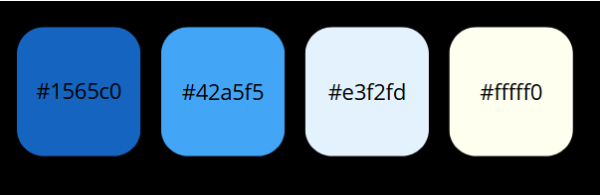

#### Espaciado

- **Botones**: Padding de `1rem` vertical y `2rem` horizontal.  
- **Margin entre texto**: `margin-bottom: 1rem` para elementos como `h1`, `h2`, `p`, etc.  
- **Margin entre elementos**: `margin-bottom: 1.5rem` (ej. `.precio-card`).  
- **Margin entre secciones**: Padding de `2rem` en el contenedor general (ajustable a `6rem` si es necesario).

#### Iconografía

La iconografía utilizada en SplitEasy mejora la experiencia del usuario, facilita la navegación y representa visualmente las funcionalidades clave. Se emplea la biblioteca **Bootstrap Icons**, que asegura una estética moderna, coherente y responsiva.

**Íconos principales y su propósito**:

- `bi-house-door-fill` (Home): Página principal / hogar.  
- `bi-info-circle-fill` (About): Información del proyecto.  
- `bi-gear-fill` (Services): Funcionalidades del sistema.  
- `bi-question-circle-fill` (How does it work?): Guía del flujo de uso.  
- `bi-currency-dollar` (Prices): Planes de suscripción.  
- `bi-chat-left-quote-fill` (Reviews): Opiniones de usuarios.  
- `bi-envelope-fill` (Contact us): Correo de contacto.

**Iconos en servicios**:

- `bi-calculator`: Cálculo Proporcional.  
- `bi-pie-chart-fill`: Seguimiento de Gastos.  
- `bi-people-fill`: Transparencia y Colaboración.

**Iconos en How does it work?**:

- `bi-person-plus-fill`: Registro de usuarios.  
- `bi-house-fill`: Crear hogar.  
- `bi-cash-coin`: Asignar aportes.  
- `bi-bar-chart-fill`: Control financiero.

**Íconos en el Footer**:

- `bi-facebook`, `bi-instagram`, `bi-twitter`, `bi-linkedin`: Enlaces a redes sociales.  
- `bi-envelope-fill`: Correo electrónico (`mailto:contacto@spliteasy.com`).

El uso constante de una misma familia de íconos asegura coherencia visual y contribuye a una experiencia de usuario fluida e intuitiva.

#### Tono de Comunicación y Lenguaje Aplicado

El tono de comunicación en la landing page es **claro, cercano y accesible**, diseñado para todos los usuarios.

**Aspectos clave**:

- **Tono amigable y cercano**: Lenguaje directo, inclusivo y motivador.  
- **Claridad en las opciones**:
  - **Representante**: Puede crear y administrar el hogar.  
  - **Miembro**: Puede ingresar al hogar con un ID.  
- **Simplificación del proceso**: Instrucciones breves y claras.  
- **Empatía con las necesidades**: Refleja comprensión de desafíos financieros.  
- **Invitación a la acción**: Frases proactivas como “Crea tu hogar” o “Ingresa a tu hogar”.  
- **Accesibilidad**: Lenguaje fácil de entender sin barreras.

Este enfoque garantiza una experiencia funcional, adaptada a las necesidades de todos los usuarios, haciendo que tanto representantes como miembros se sientan cómodos y seguros.

### Web Style Guidelines

Se utilizó la tendencia web de **funcionalismo minimalista** con un esquema de colores oscuros predominante (negro y gris oscuro) como fondo. Esto proporciona una experiencia visual suave, favoreciendo el contraste con elementos interactivos y textos claros.

  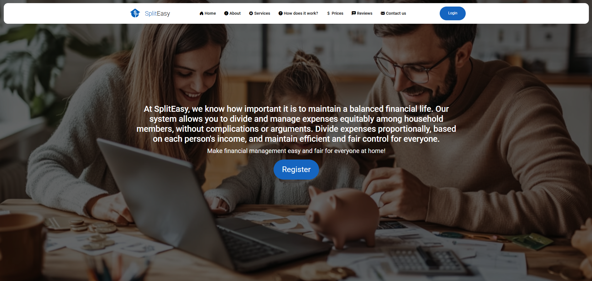

Para enriquecer la estética y agregar dinamismo:

- Se emplearon íconos blancos con moderación.  
- El diseño se mantiene minimalista pero atractivo.  
- Los íconos, claramente visibles sobre el fondo oscuro, refuerzan una experiencia visual limpia y ordenada.

Este equilibrio entre funcionalidad y diseño moderno garantiza una interfaz eficaz y atractiva.

  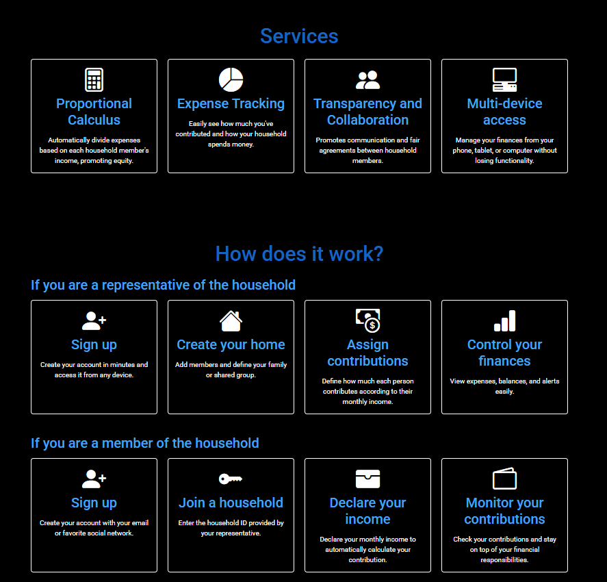

# Information Architecture

## Organization Systems

En la plataforma **SplitEasy**, se emplean diferentes sistemas de organización del contenido para mejorar la accesibilidad y experiencia de los usuarios, dependiendo del tipo de información que se presenta. Estos sistemas aseguran que los usuarios puedan navegar de manera intuitiva y eficiente por la aplicación. A continuación, se detallan los enfoques utilizados:

### Organización Visual del Contenido

**Jerárquica (Visual Hierarchy):**  
La organización jerárquica se aplica en secciones donde es fundamental mostrar una estructura clara de importancia y relevancia, como en los formularios de creación de hogar o de asignación de aportes. Se emplean tamaños de texto diferenciados y un orden lógico de presentación, destacando los elementos más importantes (como los botones de acción o los campos requeridos) para guiar al usuario de forma natural a través de la plataforma.

**Secuencial (Step-by-Step to Accomplish):**  
En tareas que requieren la realización de pasos secuenciales, como el proceso de registro de usuario o creación de hogar, se utiliza un enfoque paso a paso. Los usuarios avanzan de una pantalla a otra de manera clara y ordenada, asegurando que comprendan el flujo de trabajo y puedan completar cada acción antes de pasar a la siguiente, minimizando la confusión.

### Esquemas de Categorización de Contenido

**Por Audiencia (Grupos de Usuarios):**  
Dado que la plataforma tiene dos tipos de usuarios (representantes del hogar y miembros del hogar), el contenido se organiza de manera distinta para cada grupo. Los representantes tienen acceso a herramientas para gestionar los aportes y la creación de hogar, mientras que los miembros solo pueden consultar sus aportes y realizar seguimiento a los gastos. La categorización se adapta a las necesidades específicas de cada tipo de usuario, con una navegación clara que les lleva a las secciones correspondientes.

**Por Tópicos:**  
Además, la categorización por tópicos se utiliza en las secciones de ayuda y soporte. Los usuarios pueden acceder a diferentes categorías de contenido, como "Preguntas Frecuentes", "Política de Privacidad" y "Centro de Ayuda", lo que facilita la búsqueda de información relevante para resolver problemas específicos.

### Implementación en la Interfaz

La organización jerárquica y secuencial se ve reflejada en el diseño de la interfaz, utilizando una estructura de navegación clara que incluye menús desplegables, botones con texto explicativo y pasos visibles para guiar al usuario en cada proceso.

Los esquemas de categorización por audiencia y por tópicos están integrados en las pantallas de inicio y las secciones de soporte, donde los usuarios pueden acceder rápidamente a la información que más les interesa, con un diseño que hace uso de íconos y texto, manteniendo el estilo visual minimalista y accesible.

Este enfoque asegura que la experiencia de navegación en SplitEasy sea intuitiva, eficiente y adaptada a las necesidades específicas de cada tipo de usuario, mejorando la funcionalidad y la experiencia general de la plataforma.

## Labeling Systems

La landing page de SplitEasy emplea un sistema de etiquetado directo, simple y orientado a la acción, con el fin de facilitar la comprensión rápida de los contenidos y la navegación fluida para distintos tipos de usuarios. Se prioriza la claridad en la presentación textual de las secciones, utilizando el menor número de palabras posible y apoyándose en íconos visuales para reforzar los mensajes clave.

### Menú de navegación

En el menú de navegación superior de la landing page, se emplean etiquetas simples, directas y acompañadas de íconos de Bootstrap Icons:

- "Home" (`bi-house-door-fill`)
- "About" (`bi-info-circle-fill`)
- "Services" (`bi-tools`)
- "How does it work?" (`bi-lightbulb-fill`)
- "Prices" (`bi-currency-dollar`)
- "Reviews" (`bi-chat-dots-fill`)
- "Contact us" (`bi-envelope-fill`)

  

### Botón principal

- **"Register"**: principal llamada a la acción (CTA), funciona tanto para miembros como representantes.

  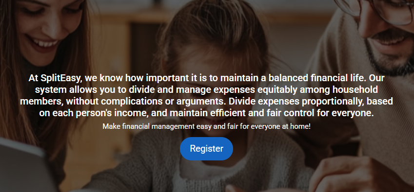

### Sección "How does it work?" para Representantes

- **"Sign up"** (`bi-person-plus-fill`)
- **"Create your home"** (`bi-house-fill`)
- **"Assign contributions"** (`bi-cash-coin`)
- **"Control your finances"** (`bi-bar-chart-fill`)

  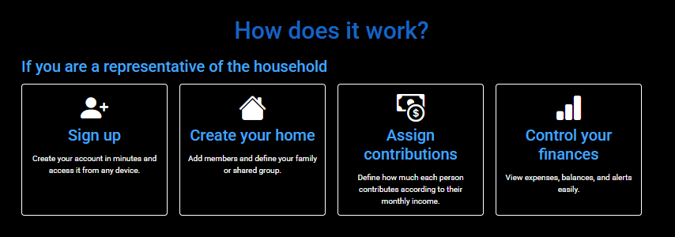

### Sección "How does it work?" para Miembros

- **"Sign up"** (`bi-person-plus-fill`)
- **"Join a household"** (`bi-key-fill`)
- **"Declare your income"** (`bi-wallet-fill`)
- **"Monitor your contributions"** (`bi-graph-up-arrow`)

  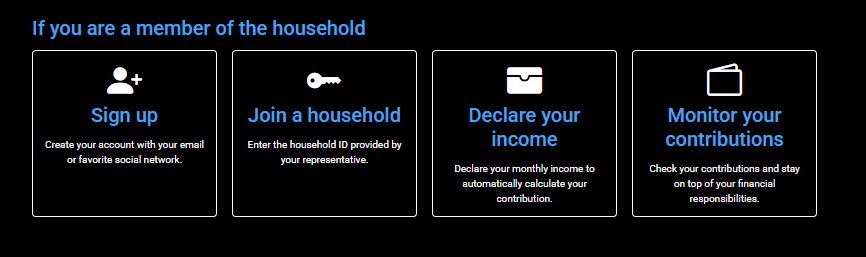

### Footer

- **Legal notice**
- **Privacy Policy**
- **Cookies Policy**

En la sección de soporte:

- **Contact Support**
- **Help Center**

También se incorporan íconos de redes sociales: Facebook, Instagram, Twitter, LinkedIn.

  

## SEO Tags and Meta Tags

### Landing Page

html
<head>
    <meta charset="utf-8">
    <meta name="viewport" content="width=device-width, initial-scale=1">

    <title>SplitEasy - Control financiero justo para tu hogar</title>
    <meta name="description" content="SplitEasy te ayuda a dividir los gastos del hogar de forma proporcional según los ingresos de cada miembro. Fácil, justo y transparente.">
    <meta name="keywords" content="SplitEasy, finanzas compartidas, gastos del hogar, app de finanzas, control de gastos, división de pagos">
    <meta name="author" content="Equipo SplitEasy">

    <!-- CSS & Icons -->
    <link href="https://cdn.jsdelivr.net/npm/bootstrap@5.3.3/dist/css/bootstrap.min.css" rel="stylesheet">
    <link rel="stylesheet" href="https://cdn.jsdelivr.net/npm/bootstrap-icons@1.11.3/font/bootstrap-icons.min.css">
    <link rel="preconnect" href="https://fonts.googleapis.com">
    <link rel="preconnect" href="https://fonts.gstatic.com" crossorigin>
    <link href="https://fonts.googleapis.com/css2?family=Roboto&display=swap" rel="stylesheet">
    <link rel="stylesheet" href="css/style.css">
    <link rel="icon" href="/images/logo.PNG" alt="Logo">
</head>

### Web Application

<!-- SEO tags para la Web Application de SplitEasy -->
<title>SplitEasy App - Gestiona tus aportes y gastos familiares</title>
<meta name="description" content="Ingresa o crea un hogar, asigna aportes según ingresos y mantén el control de los gastos de tu familia de forma sencilla y equitativa.">
<meta name="keywords" content="SplitEasy app, control de finanzas, ingresos familiares, aportes proporcionales, gastos en el hogar, economía familiar">
<meta name="author" content="Equipo SplitEasy">

## 4.2.4. Searching Systems

En el caso de SplitEasy, se implementará un sistema de búsqueda y filtros que permita a los miembros y representantes del hogar encontrar información relevante rápidamente y facilitar su navegación dentro de la aplicación. El sistema de búsqueda y filtros estará estructurado de manera que cada tipo de usuario (miembro o representante) tenga acceso a las herramientas más útiles para su rol específico.

### Filtros de búsqueda por entradas

**Miembros del hogar:**
- **Buscar por ID de hogar:** Los miembros podrán buscar e ingresar el ID de hogar proporcionado por el representante para unirse a un hogar ya creado.
- **Filtrar por fecha de contribución:** Ver un historial de aportes por fechas (mensual, semanal).
- **Estado de los aportes:** Filtrar contribuciones por estado: `"Aportado"`, `"Pendiente"`, `"Excedente"`.
- **Filtrar por tipo de gasto:** Clasificación de gastos por categorías como `"Alimentos"`, `"Servicios"`, etc.

**Representantes del hogar:**
- **Filtrar por estado de los aportes:** Ver contribuciones por fecha o estado.
- **Filtrar por miembros:** Buscar por nombre o ID de miembro para revisar su historial.
- **Estado del balance financiero:** Filtrar el balance general del hogar por fecha o tipo de gasto.

### Filtros de búsqueda por tabs

Para mejorar la experiencia de usuario, se incluirán tabs interactivos que faciliten el acceso a información específica de forma ordenada.

**Miembros:**
- **Tab de historial de aportes:** Resumen de aportes con filtros por fecha, monto y estado.
- **Tab de estado de gastos:** Visualización de cómo se distribuyen los gastos del hogar.
- **Tab de búsqueda por ID de hogar:** Asociar ID de hogar para ingresar al perfil vinculado.

**Representantes:**
- **Tab de gestión de aportes:** Vista de aportes de todos los miembros con filtros por estado y fecha.
- **Tab de balance general:** Balance general filtrado por categorías y periodo.

### Flujo de búsqueda y filtros

El flujo será simple y eficiente. En cada sección relevante (aportaciones, balances, gastos), se mostrará un campo de búsqueda o filtros configurables. Los filtros serán fáciles de aplicar y remover, asegurando una experiencia de navegación fluida.

## 4.2.5. Navigation Systems

En SplitEasy, la navegación debe ser fluida, intuitiva y accesible tanto en la **Landing Page** como en la **Web Application**.

### 1. Navegación en la Landing Page

La página principal guía a nuevos usuarios hacia el registro o la información clave de forma clara y atractiva.

**Elementos de navegación:**
- **Menú de navegación superior** (con iconos):  
  - *Home*  
  - *About*  
  - *Services*  
  - *How does it work?*  
  - *Prices*  
  - *Reviews*  
  - *Contact us*
- **Llamadas a la acción (CTAs):**  
  Ejemplos: *"Sign up"*.
- **Desplazamiento fluido:**  
  Scroll natural por secciones de la página sin salir de ella.

### 2. Navegación en la Web Application

La navegación se adapta al tipo de usuario y sus necesidades específicas.

#### Para Representantes del Hogar:

**Menú lateral fijo con opciones:**
- Dashboard
- Miembros del hogar
- Gastos
- Aportes
- Configuración de hogar

**Breadcrumbs:**  
Navegación jerárquica para volver a secciones anteriores o más generales.

#### Para Miembros del Hogar:

**Menú superior simplificado con opciones:**
- Dashboard
- Aportes
- Estado del hogar
- Buscar ID de hogar

**Accesos rápidos (botones flotantes):**
- Agregar aporte
- Ver detalles del gasto

### Interacción con el sistema

- **Accesibilidad:** Navegación clara y visible con etiquetas comprensibles.
- **Navegación de búsqueda:** Filtros rápidos para búsqueda por ID de hogar o estado de aportes.
- **Ayuda y tutoriales:** Sección de asistencia con guía paso a paso para cada sección.

## Landing Page UI Design

### Landing Page Wireframe

  

  

  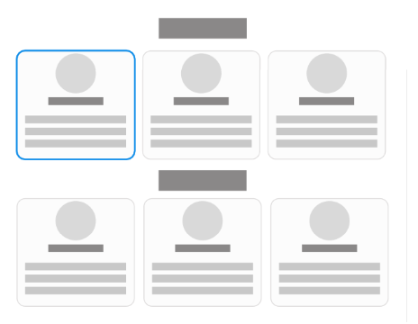

  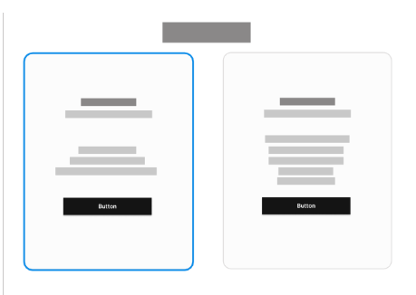

  

### Landing Page Mock-up

  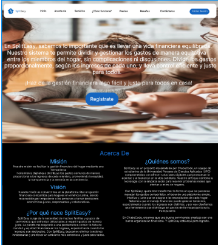

  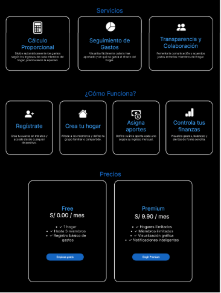

  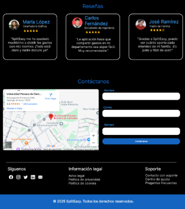

## Web Applications UX/UI Design

### Web Applications Wireframes

  

### Web Applications Wireflow Diagrams

  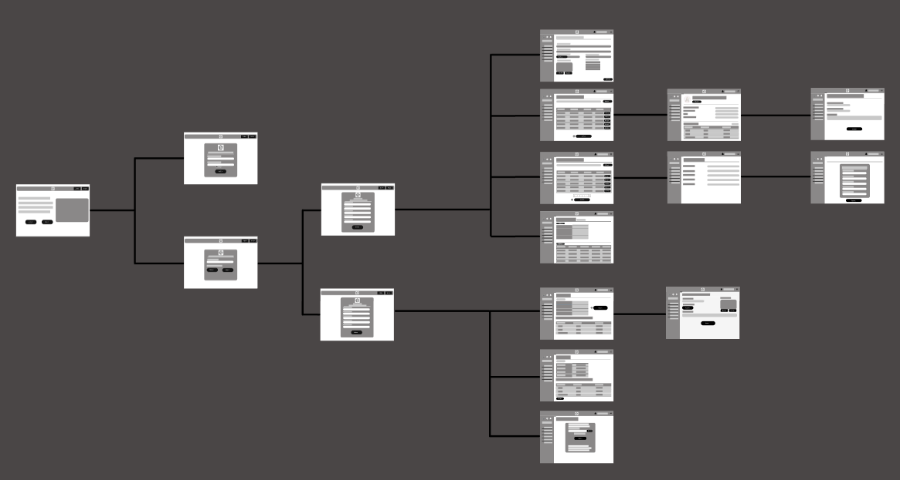

### Web Applications Mock-ups

  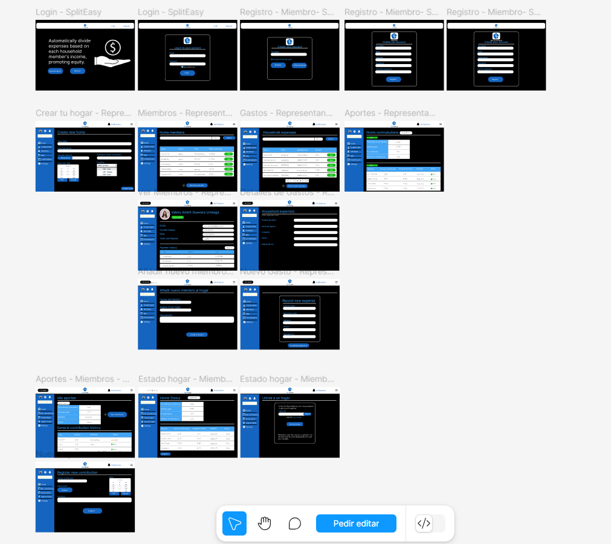

### Web Applications User Flow Diagrams
A continuación, se muestra el User Flow Diagram estructurado en base a los objetivos principales del usuario. Cada sección del flujo corresponde a una meta funcional específica, mostrando los recorridos posibles mediante mockups de alta fidelidad.

  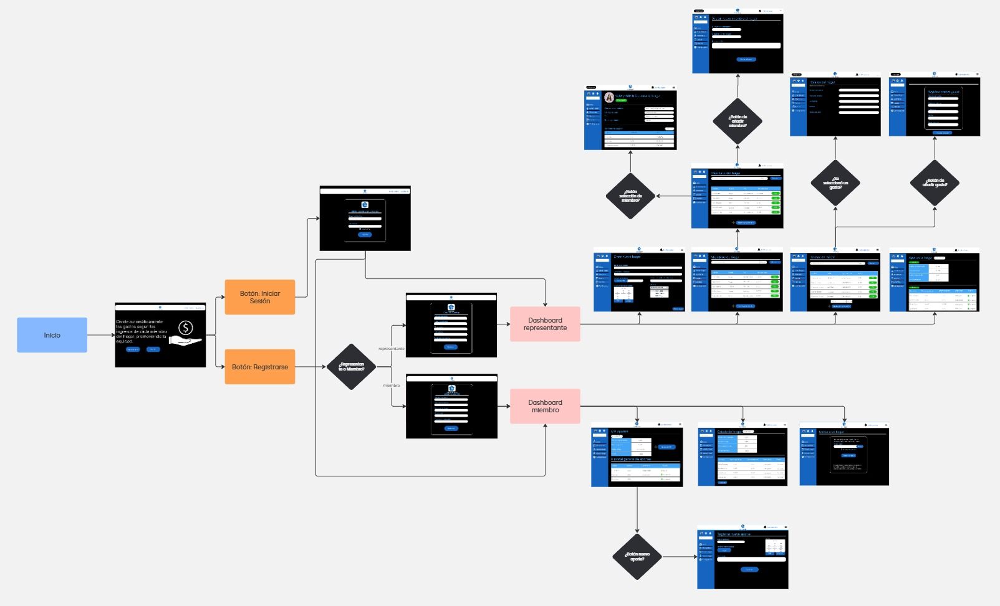

## Web Applications Prototyping 

Se desarrolló un prototipo interactivo enfocado en la navegación web para evaluar y mejorar la accesibilidad y la experiencia de usuario antes del lanzamiento final. Este modelo simula fielmente el recorrido dentro del sitio, permitiendo explorar secciones y flujos como en la versión definitiva. Diseñado con una arquitectura clara, jerarquía visual coherente y principios de diseño inclusivo, garantiza una navegación intuitiva y accesible. Gracias a sus maquetas de alta fidelidad, el prototipo permite validar decisiones de diseño, detectar fricciones y asegurar una experiencia de uso consistente.

Link al prototipo: https://www.figma.com/proto/KpblxTexy8JiWceW2N9VmM/Open-Source?node-id=61-17&p=f&t=a23KEfa4RMPAJZLS-1&scaling=min-zoom&content-scaling=fixed&page-id=33%3A9&starting-point-node-id=61%3A17&show-proto-sidebar=1

Link del video explicativo: https://upcedupe-my.sharepoint.com/:v:/g/personal/u20231d534_upc_edu_pe/EeExTohQK7VDrZmrG2Ze3j8BWq2i0RG-r1I8l03WIW7eZg?e=3VCooB&nav=eyJyZWZlcnJhbEluZm8iOnsicmVmZXJyYWxBcHAiOiJTdHJlYW1XZWJBcHAiLCJyZWZlcnJhbFZpZXciOiJTaGFyZURpYWxvZy1MaW5rIiwicmVmZXJyYWxBcHBQbGF0Zm9ybSI6IldlYiIsInJlZmVycmFsTW9kZSI6InZpZXcifX0%3D

## Domain-Driven Software Architecture

### Software Architecture Context Diagram

  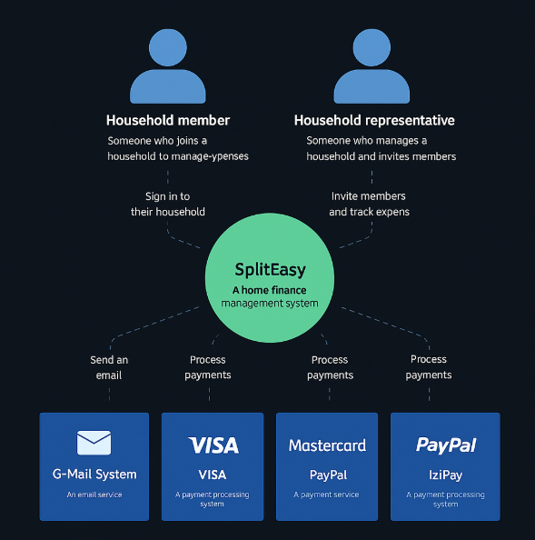

### Software Architecture Container Diagrams

  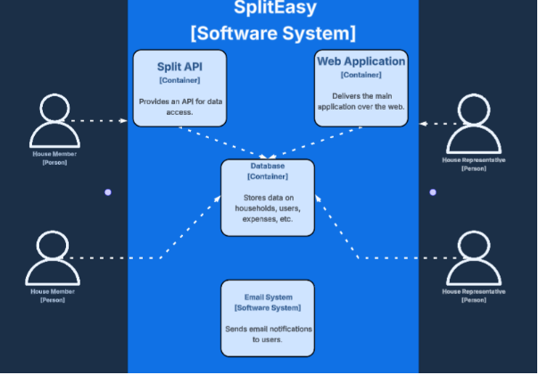

### Software Architecture Components Diagrams

  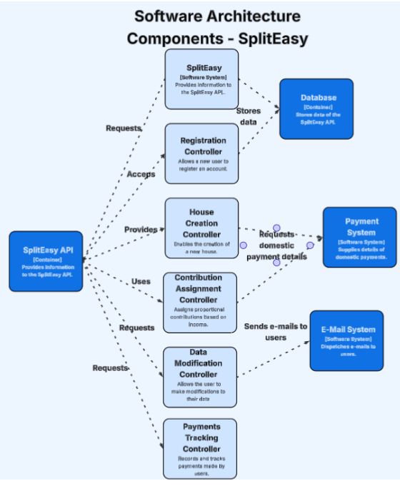

## Software Object-Oriented Design

### Class Diagrams

  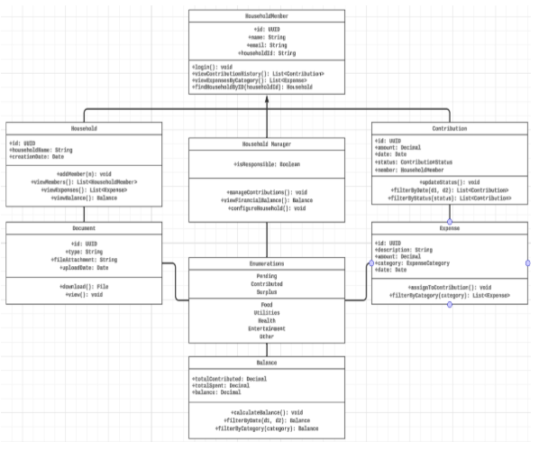

### Class Dictionary

#### Class: HouseholdMember

**Attributes:**
- `id: UUID` — Identificador único para el miembro.
- `name: String` — Nombre completo del miembro.
- `email: String` — Dirección de correo electrónico del miembro.
- `householdId: String` — ID del hogar al que pertenece el miembro.

**Methods:**
- `login(): void` — Autentica al usuario y le da acceso al sistema.
- `viewContributionHistory(): List<Contribution>` — Devuelve una lista del historial de aportes del miembro.
- `viewExpensesByCategory(): List<Expense>` — Muestra los gastos del hogar categorizados.
- `findHouseholdByID(householdId): Household` — Recupera la información del hogar usando su ID.

#### Class: HouseholdManager

**Additional Attributes:**
- `isResponsible: Boolean` — Indica si el miembro es el representante del hogar.

**Additional Methods:**
- `manageContributions(): void` — Permite al representante ver y ajustar los aportes del hogar.
- `viewFinancialBalance(): Balance` — Recupera el balance financiero general del hogar.
- `configureHousehold(): void` — Permite modificar la configuración del hogar y gestionar a los miembros.
- `createHousehold(householdName: String): Household` — Permite al representante crear un nuevo hogar con un nombre especificado.

#### Class: Household

**Attributes:**
- `id: UUID` — Identificador único del hogar.
- `householdName: String` — Nombre del hogar.
- `creationDate: Date` — Fecha de creación del hogar.

**Methods:**
- `addMember(m: HouseholdMember): void` — Añade un nuevo miembro al hogar.
- `viewMembers(): List<HouseholdMember>` — Muestra todos los miembros actuales del hogar.
- `viewExpenses(): List<Expense>` — Lista todos los gastos registrados en el hogar.
- `viewBalance(): Balance` — Muestra el balance financiero actual del hogar.

#### Class: Contribution

**Attributes:**
- `id: UUID` — Identificador único del aporte.
- `amount: Decimal` — Monto del aporte.
- `date: Date` — Fecha en la que se realizó el aporte.
- `status: ContributionStatus` — Estado actual del aporte (Pending, Contributed, Surplus).
- `member: HouseholdMember` — Miembro que realizó el aporte.

**Methods:**
- `updateStatus(): void` — Cambia el estado del aporte.
- `filterByDate(d1, d2): List<Contribution>` — Devuelve los aportes dentro de un rango de fechas específico.
- `filterByStatus(status): List<Contribution>` — Filtra los aportes según su estado.

#### Class: Expense

**Attributes:**
- `id: UUID` — Identificador único del gasto.
- `description: String` — Descripción del gasto.
- `amount: Decimal` — Costo del gasto.
- `category: ExpenseCategory` — Categoría del gasto (ej. Food, Utilities, etc.).
- `date: Date` — Fecha en la que se registró el gasto.

**Methods:**
- `assignToContribution(): void` — Asocia el gasto a un aporte existente.
- `filterByCategory(category): List<Expense>` — Filtra los gastos por su categoría.

#### Class: Document

**Attributes:**
- `id: UUID` — Identificador único del documento.
- `type: String` — Tipo de documento (ej. Invoice, Receipt).
- `fileAttachment: String` — Ruta o enlace del archivo adjunto.
- `uploadDate: Date` — Fecha en la que se subió el documento.

**Methods:**
- `download(): File` — Permite descargar el documento.
- `view(): void` — Muestra el contenido del documento.
  
#### Class: Balance

**Attributes:**
- `totalContributed: Decimal` — Total de dinero aportado por los miembros del hogar.
- `totalSpent: Decimal` — Total de dinero gastado por el hogar.
- `balance: Decimal` — Balance restante (aportado - gastado).

**Methods:**
- `calculateBalance(): void` — Calcula el balance financiero actual.
- `filterByDate(d1, d2): Balance` — Filtra los datos del balance por un rango de fechas.
- `filterByCategory(category): Balance` — Filtra el balance por categoría de gasto.

#### Enumerations

##### ContributionStatus
- `Pending` — El aporte ha sido programado pero aún no se ha realizado.
- `Contributed` — El aporte ha sido completado con éxito.
- `Surplus` — El aporte excede el monto requerido.

##### ExpenseCategory
- `Food` — Gastos relacionados con alimentación.
- `Utilities` — Gastos de servicios como agua, luz, gas, etc.
- `Health` — Gastos médicos y de salud.
- `Entertainment` — Gastos de ocio y recreación.
- `Other` — Otros tipos de gastos no especificados.

# SplitEasy - Database Design

## Descripción General

La base de datos de **SplitEasy** ha sido diseñada bajo un enfoque relacional, orientado a la gestión financiera colaborativa dentro del hogar. Su estructura busca garantizar integridad referencial, equidad en la distribución de gastos y transparencia entre los miembros. Soporta funcionalidades clave como el cálculo proporcional de contribuciones, seguimiento de pagos, notificaciones automáticas, metas financieras compartidas, entre otras.

---

## Diagrama Entidad-Relación

A continuación se describen las principales entidades y sus atributos:

---

### Household
Entidad principal que representa un hogar.

- `id`: INT (PK)
- `householdName`: VARCHAR
- `creationDate`: DATE

---

### HouseholdMember
Miembros que viven en un hogar determinado.

- `id`: INT (PK)
- `userId`: INT (FK → UserAccount.id)
- `name`: VARCHAR
- `householdId`: INT (FK → Household.id)
- `isManager`: BIT

---

### UserAccount
Representa las credenciales de acceso del usuario.

- `id`: INT (PK)
- `email`: VARCHAR (único)
- `passwordHash`: VARCHAR

---

### Income
Registra los ingresos individuales de cada miembro del hogar.

- `id`: INT (PK)
- `memberId`: INT (FK → HouseholdMember.id)
- `amount`: DECIMAL
- `incomeDate`: DATE

---

### Contribution
Aportes financieros registrados por cada miembro.

- `id`: INT (PK)
- `amount`: DECIMAL
- `date`: DATE
- `description`: VARCHAR
- `memberId`: INT (FK → HouseholdMember.id)
- `householdId`: INT (FK → Household.id)

---

### ContributionShare
Define el porcentaje proporcional de responsabilidad financiera de cada miembro, calculado en función de sus ingresos.

- `id`: INT (PK)
- `memberId`: INT (FK → HouseholdMember.id)
- `householdId`: INT (FK → Household.id)
- `sharePercentage`: DECIMAL(5,2)
- `calculatedOn`: DATE

---

### Expense
Representa los gastos comunes del hogar.

- `id`: INT (PK)
- `description`: VARCHAR
- `amount`: DECIMAL
- `category`: VARCHAR (Food, Utilities, Health, etc.)
- `date`: DATE
- `createdBy`: INT (FK → HouseholdMember.id)
- `householdId`: INT (FK → Household.id)

---

### Payment
Registra los pagos realizados por los miembros para cubrir los gastos.

- `id`: INT (PK)
- `expenseId`: INT (FK → Expense.id)
- `memberId`: INT (FK → HouseholdMember.id)
- `amountPaid`: DECIMAL
- `paymentDate`: DATE

---

### Notification
Alertas automáticas enviadas a los miembros del hogar.

- `id`: INT (PK)
- `memberId`: INT (FK → HouseholdMember.id)
- `message`: VARCHAR
- `isRead`: BIT
- `createdAt`: DATETIME

---

### Goal
Metas financieras definidas por el hogar.

- `id`: INT (PK)
- `householdId`: INT (FK → Household.id)
- `description`: VARCHAR
- `targetAmount`: DECIMAL
- `dueDate`: DATE

---

## Vista: `vw_MemberBalance`

Consulta resumen del balance individual por miembro del hogar:

- `memberId`
- `name`
- `householdName`
- `totalIncome`
- `totalContributed`
- `totalPaidExpenses`

---

## Índices

Se incluyen índices adicionales para mejorar el rendimiento de consultas:

- `Income.memberId`
- `Contribution.memberId`
- `Expense.householdId`
- `Payment.expenseId`
- `Notification.memberId`

---

## Objetivos del Diseño

- Transparencia: cada miembro puede ver su historial y estado financiero.
- Equidad: los gastos se distribuyen proporcionalmente en función de los ingresos.
- Escalabilidad: permite añadir nuevas funcionalidades sin alterar el núcleo del sistema.
- Mantenimiento: una estructura clara y bien normalizada facilita la administración y evolución del sistema.

  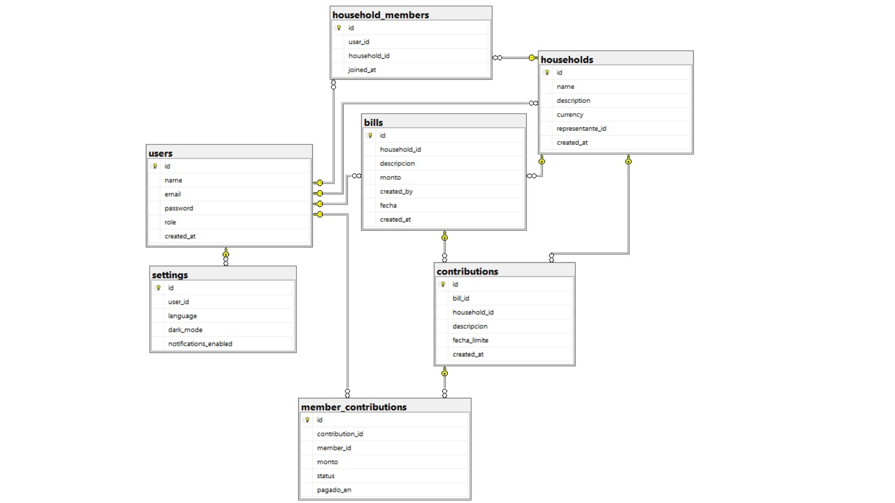

# Capítulo V: Product Implementation, Validation & Deployment

## 5.1. Software Configuration Management

### 5.1.1. Software Development Environment Configuration

A continuación, se describen los productos de software empleados en el desarrollo del proyecto. Esta sección tiene como objetivo facilitar la comprensión y continuidad del trabajo a los actuales y futuros desarrolladores, asegurando una colaboración efectiva a lo largo del ciclo de vida del producto digital.

#### Project Management
- **Trello** – [https://trello.com/](https://trello.com/)  
Se ha utilizado Trello como herramienta principal de gestión de tareas. Esta plataforma permite visualizar el progreso de cada etapa del proyecto mediante tableros personalizables, facilitando la organización de pendientes, tareas en desarrollo y actividades finalizadas. Además, su interfaz intuitiva y accesibilidad desde cualquier navegador con una cuenta registrada la convierten en una solución ágil para el seguimiento de proyectos en equipo.

#### Requirements Management
- **Google Docs** – [https://docs.google.com/](https://docs.google.com/)  
Para la redacción, gestión y revisión de los requisitos del sistema se ha empleado Google Docs. Su funcionalidad de edición colaborativa en tiempo real ha permitido que todos los integrantes del equipo puedan aportar, comentar y revisar los documentos desde cualquier dispositivo.

#### Product UX/UI Design
- **Figma** – [https://www.figma.com/](https://www.figma.com/)  
Figma ha sido fundamental para el diseño de interfaces y la creación de prototipos interactivos. Permite que varios usuarios trabajen simultáneamente en los wireframes y mockups, lo que ha facilitado una comunicación más eficiente entre el equipo de diseño y desarrollo.

#### Software Development
- **Landing Page (HTML, CSS, JS)** – [https://www.jetbrains.com/idea/](https://www.jetbrains.com/idea/)  
Desarrollada con HTML5, CSS3, JavaScript y Tailwind CSS. El entorno de desarrollo fue IntelliJ IDEA Ultimate por sus herramientas avanzadas de depuración y control de versiones.

- **Frontend Web Application (Angular)** – [https://www.jetbrains.com/webstorm/](https://www.jetbrains.com/webstorm/)  
Desarrollada en Angular utilizando JetBrains WebStorm, que ofrece refactorización inteligente, integración con Git y herramientas de testing.

- **Web Services (.NET Core)** – [https://www.jetbrains.com/rider/](https://www.jetbrains.com/rider/)  
Desarrollado en ASP.NET Core con C#, usando JetBrains Rider. Se requiere el SDK de .NET disponible en [https://dotnet.microsoft.com/en-us/download](https://dotnet.microsoft.com/en-us/download).

#### Software Documentation
- **Google Docs y GitHub README**  
La documentación del software se ha centralizado en Google Docs. El archivo `README` en GitHub incluye instrucciones de despliegue, estructura del repositorio y requerimientos técnicos.

### 5.1.2. Source Code Management

El equipo utiliza Git y GitHub para el control de versiones y colaboración:

**Repositorios**:
- Report: [https://github.com/1ASI0729-2510-4313-G3-SplitEasy/Report.git](https://github.com/1ASI0729-2510-4313-G3-SplitEasy/Report.git)  
- LandingPage: [https://github.com/1ASI0729-2510-4313-G3-SplitEasy/Split-landing.git](https://github.com/1ASI0729-2510-4313-G3-SplitEasy/Split-landing.git)

**Modelo de ramas - GitFlow**:
- Rama principal: `main`
- Rama de desarrollo: `develop`
- Ramas de funcionalidades: `feature/{nombre-funcionalidad}`
- Ramas de lanzamiento: `release/{version}`
- Ramas de corrección urgente: `hotfix/{descripcion}`

**Convenciones**:
- Versionado semántico: `MAJOR.MINOR.PATCH` (ej. 1.0.0)
- Mensajes de commit bajo estándar *Conventional Commits*:
  - `feat:` agregar nueva funcionalidad
  - `fix:` corrección de bug
  - `docs:` cambios en documentación
  - `style:` cambios de estilo sin afectar funcionalidad
  - `refactor:` mejoras internas sin cambios funcionales
  - `test:` añadir pruebas

### 5.1.3. Source Code Style Guide & Conventions

Para asegurar un código limpio y fácil de mantener, se siguen las siguientes convenciones:

#### HTML
- Todas las etiquetas deben cerrarse correctamente  
  Ejemplo: `
Bienvenido a SplitEasy
`
- Uso exclusivo de minúsculas para etiquetas y atributos  
  Ejemplo: ``
- Valores de atributos entre comillas dobles  
  Ejemplo: `<a href="#services" class="nav-link">Services</a>`
- Uso de `alt`, `width` y `height` en imágenes  
  Ejemplo: ``

#### CSS
- Nombres de clase descriptivos y breves  
  Ejemplo: `.hero-section`, `.login-button`
- Separación con guiones  
  Ejemplo: `.precio-card`, `#form-contacto`
- Omisión de unidades para cero  
  Ejemplo: `margin: 0;`
- Código limpio: un selector y propiedad por línea

#### JavaScript
- Uso de `DOMContentLoaded` para ejecutar funciones al cargar el DOM
- Nombres de variables representativos  
  Ejemplo: `formContacto`, `correo`, `numero`
- Modularización del código, evitando funciones anidadas innecesarias

#### Angular
Se siguen las directrices oficiales de [Angular Style Guide](https://v17.angular.io/guide/styleguide):
- Estructura modular
- Archivos y carpetas en `kebab-case`  
  Ejemplo: `user-profile.component.ts`
- Clases en `PascalCase`  
  Ejemplo: `UserProfileComponent`, `GastoService`
- Tipado estricto y uso de interfaces

#### C# / ASP.NET Core
Se siguen las [convenciones de Microsoft](https://learn.microsoft.com/en-us/dotnet/csharp/fundamentals/coding-style/coding-conventions):
- `PascalCase` para clases, métodos y propiedades  
  Ejemplo: `class HouseholdManager`, `void AddMember()`
- `camelCase` para variables locales y parámetros  
  Ejemplo: `string memberName`, `int memberId`
- Separación de responsabilidades: Controllers, Services, Models
- Inyección de dependencias mediante el constructor

### 5.1.4. Software Deployment Configuration

**Landing Page**
- Plataforma: **Vercel**
- Proceso: Despliegue automático al hacer push a `main` (GitHub conectado)

**Frontend Web Application (Angular)**
- Plataforma: **Vercel**
- Proceso: Uso de `vercel.json` para rutas personalizadas. Despliegue automático en `main`

**Web Services (.NET Core API)**
- Plataforma: **Railway**
- Proceso: Uso de `Dockerfile` para empaquetado. Railway realiza CI/CD al detectar cambios en `main`

> Esta configuración asegura un ciclo de integración y despliegue continuo (CI/CD) alineado con buenas prácticas del desarrollo moderno.

# 5.2. Landing Page, Services & Applications Implementation

## 5.2.1. Sprint 1

### 5.2.1.1. Sprint Planning 1

A continuación, se presenta el Sprint Planning 1, donde se incluyen las evidencias de planificación e implementación del Landing Page. También se registran los avances del proyecto e insights de colaboración del equipo a través de GitHub.

---

### Sprint Overview

- **Sprint #:** Sprint 1  
- **Fecha:** 15 de abril del 2025  
- **Hora:** 15:00 horas (GMT -5)  
- **Lugar:** Modalidad remota por Google Meet  
- **Preparado por:** Testigos de SplitEasy  
- **Asistentes:** Todos los miembros del grupo Testigos de SplitEasy  

---

### Sprint n – 0 Review Summary

Este es el primer sprint, por lo tanto, no existe un resumen de revisión de un sprint anterior.

---

###  Sprint n – 1 Retrospective Summary

En este sprint se planea desarrollar el **Landing Page** utilizando un framework de estilos CSS, herramienta nueva para algunos miembros del equipo.  
Además, se discutió:

- El contenido de los textos del landing page.
- El diseño previamente elaborado en Figma.

 Al finalizar este sprint, el Landing Page debe estar desplegado en GitHub, y cualquier usuario debería poder visualizarlo a través de un enlace público.

---

### Sprint Goal & User Stories

- **Sprint 1 Velocity:** 2  
- **Suma de Story Points:** 2  

---

>  _Objetivo del Sprint:_ Desplegar un Landing Page funcional con diseño responsive y estructura definida, accesible desde GitHub Pages.

### 5.2.1.2. Sprint Backlog 1 – SplitEasy

Este documento corresponde al punto **5.2.1.2** del informe y resume las tareas realizadas durante el **Sprint 1** del proyecto **SplitEasy**, centrado en el desarrollo de la **landing page** de la aplicación.

---

## Sprint 1 - Objetivo

Desarrollar la landing page funcional de SplitEasy que permita a los visitantes conocer la plataforma, sus beneficios y acceder fácilmente al registro o login.

---

## Historias de Usuario Abordadas (EP07 - Exploración como Visitante)

| ID     | Título                                                                 |
|--------|------------------------------------------------------------------------|
| US31   | Visualizar información general desde la landing page                  |
| US32   | Conocer las funciones principales para representantes y miembros      |
| US33   | Explorar beneficios del sistema de aportes proporcionales             |
| US34   | Ver ejemplos o simulaciones de cómo funciona la plataforma            |
| US35   | Acceder fácilmente al registro o login desde botones destacados       |

---

## Tasks del Sprint

| Task ID | Título                           | Descripción                                                                                     | Estimación (h) | Asignado a                                 | Estado  |
|---------|----------------------------------|--------------------------------------------------------------------------------------------------|----------------|----------------------------------------------|---------|
| W01     | Navbar section                   | Implementar barra de navegación con botones a login y registro.                                | 1              | Jorge Luis Díaz Fiestas                      | ✅ Done |
| W02     | Responsive navbar section        | Hacer la navbar adaptable a móviles y escritorio.                                               | 0.5            | Jorge Luis Díaz Fiestas                      | ✅ Done |
| W03     | Hero section                     | Crear sección principal con mensaje atractivo.                                                  | 2              | Paulo Percy Quincho Gamarra                 | ✅ Done |
| W04     | Responsive hero section          | Adaptar hero section a todos los dispositivos.                                                  | 0.5            | Paulo Percy Quincho Gamarra                 | ✅ Done |
| W05     | Features section                 | Mostrar funciones clave para representantes y miembros del hogar.                              | 2              | Jhordi Luis Carranza Pérez                   | ✅ Done |
| W06     | Responsive features section      | Asegurar que la sección features sea responsive.                                                | 0.5            | Jhordi Luis Carranza Pérez                   | ✅ Done |
| W07     | Proportional system section      | Explicar con gráficos o texto claro el sistema proporcional.                                   | 1.5            | Alexander Piero Fernandez Garfias           | ✅ Done |
| W08     | Simulation section               | Mostrar ejemplos o flujos del uso de la app.                                                    | 1.5            | Alexander Piero Fernandez Garfias           | ✅ Done |
| W09     | Call-to-action section           | Crear sección final con botón destacado de registro.                                            | 1              | Paulo Percy Quincho Gamarra              | ✅ Done |
| W10     | Footer with links                | Añadir footer con enlaces informativos y legales.                                               | 1              | Jorge Luis Díaz Fiestas            | ✅ Done |
| W11     | Responsive footer section        | Adaptar visualmente el footer a todos los dispositivos.                                         | 0.5            | Jorge Luis Díaz Fiestas            | ✅ Done |

---

## Integrantes del Equipo

- Jorge Luis Díaz Fiestas  
- Paulo Percy Quincho Gamarra  
- Jhordi Luis Carranza Pérez  
- Alexander Piero Fernandez Garfias  

---

 **Estado del Sprint:** COMPLETADO

## 5.2.1.3. Deployment Evidence for Sprint Review

A continuación, se presentan los commits más representativos realizados en el repositorio del proyecto **SplitEasy** en GitHub.

| Repository | Branch | Commit Id | Commit Message | Commit Message Body | Committed on (Date) |
|------------|--------|-----------|----------------|----------------------|----------------------|
| SplitEasy  | develop | #66 | Merge pull request #66 from develop | Integración general de funcionalidades recientes a `develop`. | 22/04/2025 |
| SplitEasy  | develop | #68 | Merge pull request #68 from develop | Consolidación final para revisión del Sprint 1. | 23/04/2025 |
| SplitEasy  | feature/chapter1-resume | #70 | Merge pull request #70 from chapter1-resume | Consolidación del capítulo 1 del informe del proyecto. | 23/04/2025 |
| SplitEasy  | develop | *(sin hash)* | docs(report): document Sprint 1 planning, retrospective, and goals for Landing Page deployment | Documentación formal del Sprint 1 para el informe. | 23/04/2025 |
| SplitEasy  | develop | *(sin hash)* | docs(sprint): document Sprint 1 backlog and tasks for SplitEasy | Registro de tareas y backlog para cierre del sprint. | 24/04/2025 |
| SplitEasy  | develop | *(sin hash)* | docs: add interview analysis on shared household expense management for Split Easy | Inclusión de análisis de entrevista de usuario clave. | 21/04/2025 |
| SplitEasy  | develop | *(sin hash)* | docs: add metadata for first-segment user interview with Marjorie Luna | Metadata para entrevistas cualitativas del producto. | 20/04/2025 |
| SplitEasy  | develop | *(sin hash)* | docs: formal documentation of epics, user stories, and acceptance criteria for SplitEasy | Estructuración detallada de requisitos del proyecto. | 13/04/2025 |
| SplitEasy  | develop | *(sin hash)* | docs: add competitive analysis table and SWOT for SplitEasy and main competitors | Análisis competitivo y matriz FODA agregados al informe. | 11/04/2025 |
| SplitEasy  | develop | *(sin hash)* | docs: add Software Configuration Management | Agregado documento de gestión de configuración. | 22/04/2025 |
| SplitEasy  | develop | *(sin hash)* | docs: add Web Application Prototyping | Prototipado agregado al informe de la web app. | 22/04/2025 |
| SplitEasy  | develop | *(sin hash)* | docs: add Software Object-Oriented Design | Diseño orientado a objetos documentado. | 22/04/2025 |
| SplitEasy  | README.md | *(sin hash)* | update in user interview video link and preview image to README | Inclusión de enlace y miniatura del video de entrevistas. | 20/04/2025 |
| SplitEasy  | README.md | *(sin hash)* | add user interview video link and preview image to README | Primer commit con video y miniatura de entrevistas. | 20/04/2025 |
| SplitEasy  | README.md | *(sin hash)* | update README.md | Actualización progresiva del README.md con contenido del capítulo 1. | Varias fechas |
| SplitEasy  | develop | *(sin hash)* | assets: add UPC logo image for report cover | Se añadió logo institucional para la portada del informe. | 22/04/2025 |

#### 5.2.1.5. Execution Evidence for Sprint Review.

En este **Sprint 1**, el objetivo fue desarrollar la **landing page** funcional de SplitEasy, centrada en ofrecer a los usuarios una visión general de la plataforma, sus beneficios, y proporcionar accesos rápidos para el registro o login. Durante este Sprint se completaron las siguientes tareas clave:
- Se implementaron secciones visuales y funcionales como la barra de navegación, sección principal (**Hero**), sección de características y sistema proporcional.
- La sección de simulación y la llamada a la acción también fueron desarrolladas, garantizando una experiencia atractiva y fácil de navegar.
- Además, se ajustaron todas las secciones a un diseño **responsive**, asegurando que la landing page sea accesible tanto en dispositivos móviles como de escritorio.

##### Capturas de pantalla de vistas principales implementadas:

###### Vista de la Landing Page
- **Descripción**: Muestra la página principal con las secciones clave: **Hero**, **Features**, y **Proportional System**.

  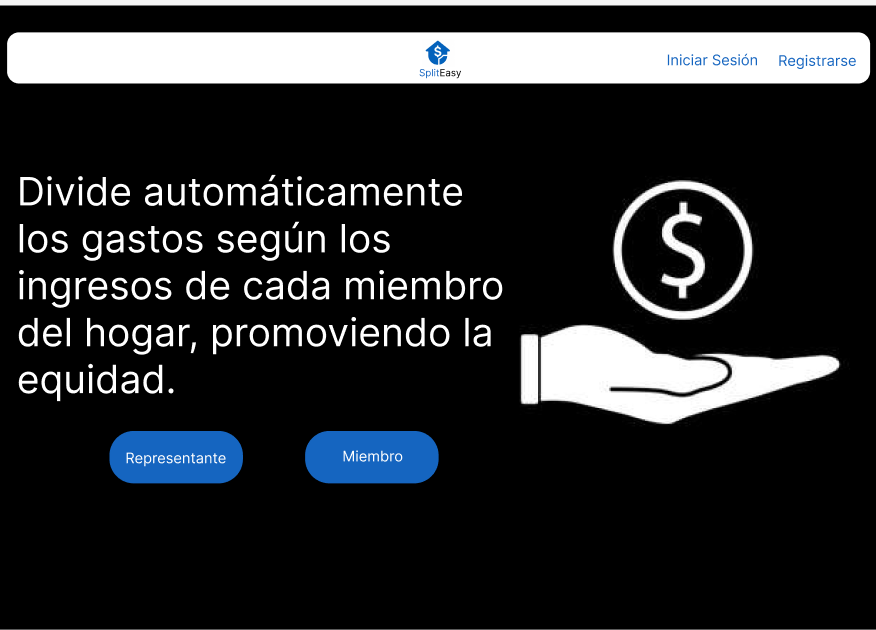

  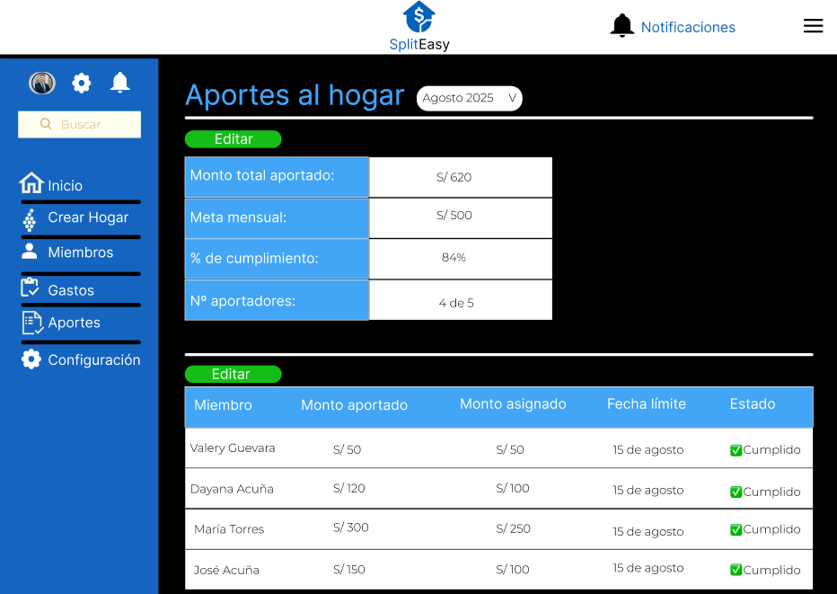

###### Vista de la Sección de Registro/Login
- **Descripción**: Acceso rápido al registro o login desde un botón destacado.

  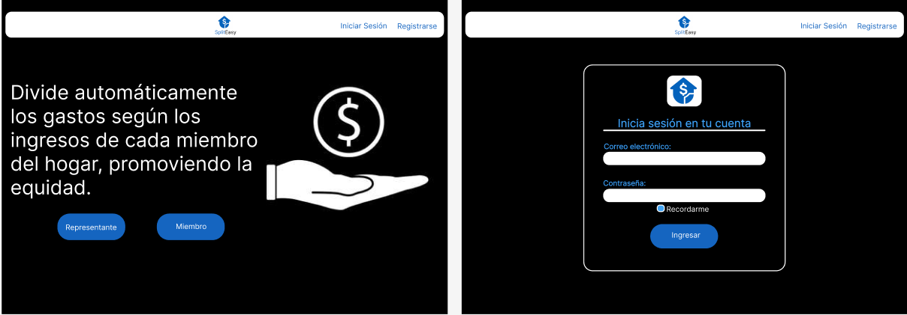

  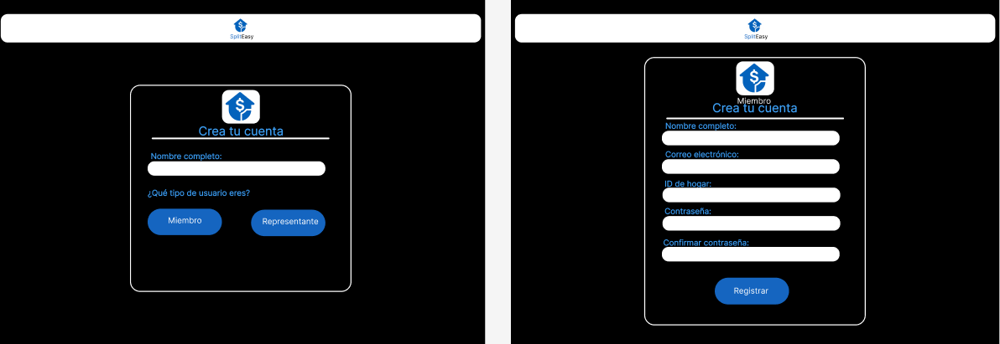

###### Vista de la Sección de Características
- **Descripción**: Muestra las funcionalidades clave de la plataforma, tanto para representantes como para miembros.

####### Funcionalidad característica de los representantes:
- **Gestión de los Aportes que se realizan en el hogar**.

  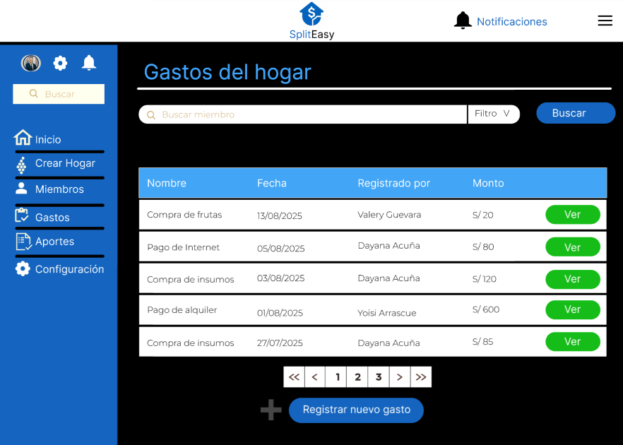

####### Funcionalidad característica de los miembros:
- **Gestión de sus propios aportes que hacen al hogar**.

  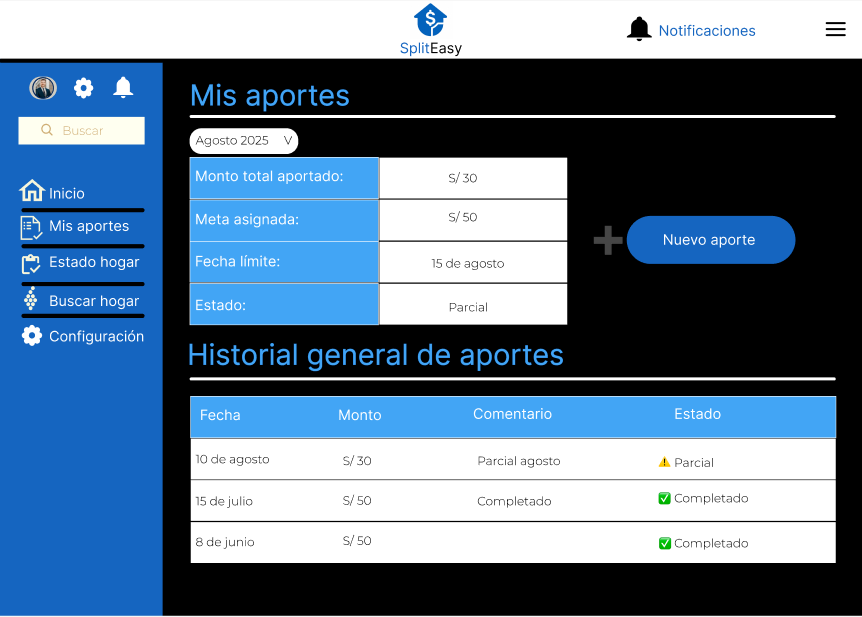

#### 5.2.1.6. Services Documentation Evidence for Sprint Review.

##### Resumen de logros:
Durante este **Sprint 1**, se completó la documentación básica de los servicios web necesarios para las funcionalidades clave de la landing page. La documentación incluye los **endpoints** asociados con el registro y login de usuarios, así como las interacciones relacionadas con la visualización de las funciones principales de la plataforma.

##### Tabla de Endpoints Documentados:

| **Endpoint**              | **Acción Implementada**            | **Verbo HTTP** | **Sintaxis de Llamada**               | **Parámetros**         | **Ejemplo de Respuesta**                                              |
|---------------------------|------------------------------------|----------------|---------------------------------------|------------------------|----------------------------------------------------------------------|
| `/api/users/register`     | Crear un nuevo usuario             | POST           | POST /api/users/register              | `username, password`    | `{ "status": "success", "message": "User created successfully" }`     |
| `/api/users/login`        | Iniciar sesión                     | POST           | POST /api/users/login                 | `username, password`    | `{ "status": "success", "message": "Login successful", "token": "abc123" }` |
| `/api/features`           | Obtener características            | GET            | GET /api/features                     | Ninguno                | `{ "features": ["Feature 1", "Feature 2"] }`                         |
| `/api/proportional-system`| Explicar sistema proporcional      | GET            | GET /api/proportional-system          | Ninguno                | `{ "description": "Proportional contribution system explained" }`   |

##### Enlace al repositorio de Web Services:
[https://github.com/1ASI0729-2510-4313-G3-SplitEasy](https://github.com/1ASI0729-2510-4313-G3-SplitEasy)

##### ID de commits relacionados con la documentación:

| **Commit ID** | **Commit Message**                                               | **Fecha**    |
|---------------|------------------------------------------------------------------|--------------|
| #66           | Merge pull request #66 from develop                              | 22/04/2025   |
| #68           | Merge pull request #68 from develop                              | 23/04/2025   |
| (sin hash)    | docs: formal documentation of endpoints for registration/login  | 23/04/2025   |
| (sin hash)    | docs(sprint): document Sprint 1 backlog and tasks for SplitEasy  | 24/04/2025   |
