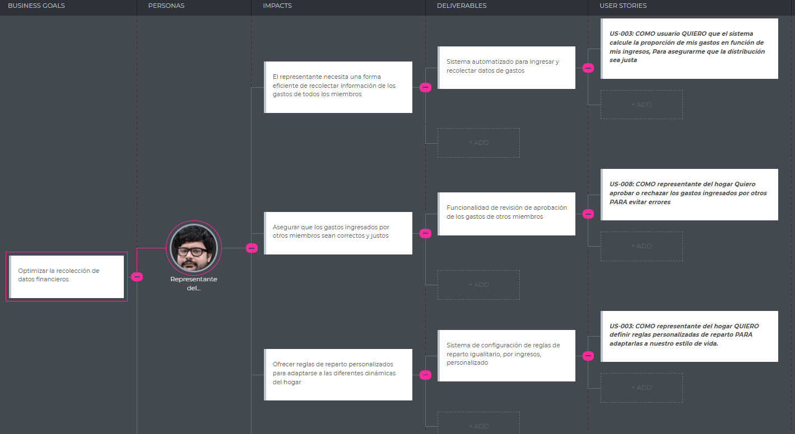
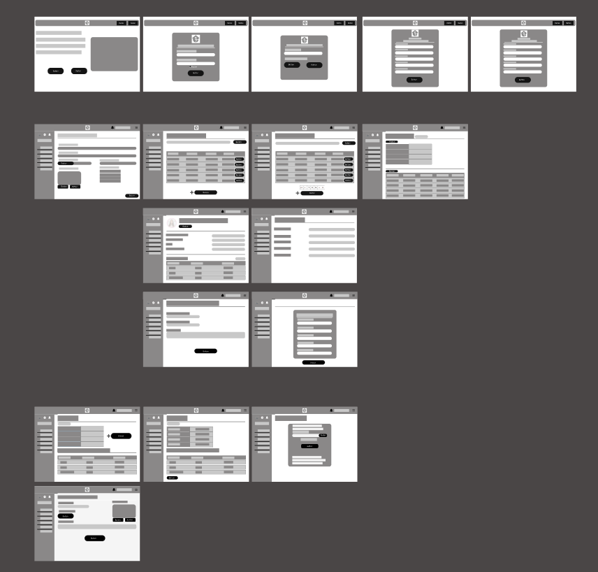

<p align="center">
  
</p>

<p align="center"><strong>Universidad Peruana de Ciencias Aplicadas</strong></p>

<p align="center"><strong>Ingeniería de Software</strong><br>
Desarrollo de Aplicaciones Open Source <br>
<strong>Profesor:</strong> Alberto Wilmer Sanchez Seña </p>

<h2 align="center">INFORME</h2>
<h2 align="center">2025 - 10</h2>

<h3 align="center">Startup: ChabeCode</h3>
<h3 align="center">1ASI0729-2510-4313</h3>
<h3 align="center">1ASI0729-2510-4313</h3>

<p align="center"><strong>Producto: SplitEasy</strong></p>

<h3 align="center">Team Members:</h3>

<div align="center">

| **Member**                           | **Code**     |
|--------------------------------------|--------------|
|Jorge Luis Díaz Fiestas      |  U20231D534  |
|Paulo Percy Quincho Gamarra         |  U20191E562 |
|Jose Luis Martinez Valdivia         |  U202213989 |
</div>

<p align="center"><strong>Mayo 2025</strong></p>

# Registro de Versiones del Informe
| Versión | Fecha       | Autor(es)                                                              | Descripción                                                                                                                                         |
|---------|-------------|------------------------------------------------------------------------|-----------------------------------------------------------------------------------------------------------------------------------------------------|
| TB1     | 25/03/2025  | Jorge Luis Díaz Fiestas        | Desarrollo del capítulo I: Introducción                                                                                                             |
|         | 29/03/2025  | Alexander Piero Fernandez Garfias                                        | Desarrollo del capítulo II: Competidores                                                                                                            |
|         | 29/03/2025  |  Jhordi Luis Carranza Pérez                                        | Desarrollo del capítulo II: Entrevistas                                                                                                             |
|         | 30/03/2025  | Paulo Percy Quincho Gamarra                                            | Desarrollo del capítulo II: Needfinding                                                                                                             |
|         | 08/04/2025  | Paulo Percy Quincho Gamarra                                            | Desarrollo del capítulo III: To-Be Scenario Mapping y Product Backlog                                                                              |
|         | 10/04/2025  | Paulo Percy Quincho Gamarra, Luis Gustavo Román Pajuelo                | Desarrollo del capítulo III: User stories                                                                                                           |
|         | 12/04/2025  |  Alexander Piero Fernandez Garfias                                         | Desarrollo del capítulo III: Impact Mapping                                                                                                         |
|         | 14/04/2025  | Paulo Percy Quincho Gamarra,  Alexander Piero Fernandez Garfias        | Desarrollo del capítulo IV: Style Guidelines, Landing Page UI Design, Web Applications UX/UI Design, Web Application Prototyping y Domain-Driven Software Architecture |
|         | 16/04/2025  | Jorge Luis Díaz Fiestas                                        | Desarrollo del capítulo IV: Software Object-Oriented Design y Database Design                                                                      |
|         | 18/04/2025  | Jhordi Luis Carranza Pérez                                          | Desarrollo del capítulo V: Software Configuration Management                                                                                       |
|         | 20/04/2025  |  Alexander Piero Fernandez Garfias             | Desarrollo del capítulo V: Sprint Planning 1                                                                                                        |

# Project Report Collaboration Insights
Link del repositorio: https://github.com/1ASI0729-2510-4313-G3-SplitEasy/Report.git


Insights TB1 (Todos participaron):
<p align="left">
  
</p>

<p align="left">
  
</p>
                                                                              
# Contenido

- [Registro de Versiones del Informe](#registro-de-versiones-del-informe)
- [Project Report Collaboration Insights](#project-report-collaboration-insights)
- [Contenido](#contenido)
  - [Capítulo I: Introducción](#capítulo-i-introducción)
  - [Capítulo II: Requirements Elicitation \& Analysis](#capítulo-ii-requirements-elicitation--analysis)
  - [Capítulo III: Requirements Specification](#capítulo-iii-requirements-specification)
  - [Capítulo IV: Product Design](#capítulo-iv-product-design)
  - [Capítulo V: Product Implementation, Validation \& Deployment](#capítulo-v-product-implementation-validation--deployment)
  - [Anexos](#anexos)
- [Student Outcome](#student-outcome)
- [Project: SplitEasy](#project-spliteasy)
- [Chapter 1: Introduction](#chapter-1-introduction)
  - [1.1. Startup Profile](#11-startup-profile)
    - [1.1.1. Descripción de la Startup](#111-descripción-de-la-startup)
    - [1.1.2. Perfiles de Integrantes del Grupo](#112-perfiles-de-integrantes-del-grupo)
  - [1.2. Solution Profile](#12-solution-profile)
    - [1.2.1. Antecedentes y Problemática](#121-antecedentes-y-problemática)
    - [What](#what)
      - [¿Cuál es el problema?](#cuál-es-el-problema)
      - [¿Cuál es la relación con la persona en cuestión?](#cuál-es-la-relación-con-la-persona-en-cuestión)
    - [When](#when)
      - [¿Cuándo sucede el problema?](#cuándo-sucede-el-problema)
      - [¿Cuándo utiliza el cliente el producto?](#cuándo-utiliza-el-cliente-el-producto)
    - [Where](#where)
      - [¿Dónde está el cliente cuando usa el producto?](#dónde-está-el-cliente-cuando-usa-el-producto)
      - [¿A dónde se dirige?](#a-dónde-se-dirige)
      - [¿Dónde surge el problema?](#dónde-surge-el-problema)
    - [Why](#why)
      - [¿Cuál es la causa principal del problema?](#cuál-es-la-causa-principal-del-problema)
    - [Who](#who)
      - [¿Quiénes están involucrados?](#quiénes-están-involucrados)
      - [¿A quiénes les sucede el problema?](#a-quiénes-les-sucede-el-problema)
      - [¿Quién lo utilizará?](#quién-lo-utilizará)
    - [How](#how)
      - [¿Cómo ocurre el problema?](#cómo-ocurre-el-problema)
      - [¿En qué condiciones los clientes usan nuestro producto?](#en-qué-condiciones-los-clientes-usan-nuestro-producto)
      - [¿Qué llevará a la persona a usar nuestro producto?](#qué-llevará-a-la-persona-a-usar-nuestro-producto)
    - [1.2.2. Lean UX Process](#122-lean-ux-process)
      - [1.2.2.1. Lean UX Problem Statements](#1221-lean-ux-problem-statements)
      - [1.2.2.2. Lean UX Assumptions](#1222-lean-ux-assumptions)
    - [Business Outcomes](#business-outcomes)
    - [User Outcomes](#user-outcomes)
      - [1.2.2.3. Lean UX Hypothesis Statements](#1223-lean-ux-hypothesis-statements)
      - [1.2.2.4. Lean UX Canvas](#1224-lean-ux-canvas)
  - [Segmentos Objetivos](#segmentos-objetivos)
    - [Segmento objetivo 1: Personas del hogar](#segmento-objetivo-1-personas-del-hogar)
    - [Segmento objetivo 2: Representante del hogar](#segmento-objetivo-2-representante-del-hogar)
- [Chapter 2: Requirements Elicitation \& Analysis](#chapter-2-requirements-elicitation--analysis)
  - [2.1. Competidores](#21-competidores)
    - [2.1.1. Analisis Competitivo](#211-analisis-competitivo)
      - [¿Por qué llevar a cabo este análisis?](#por-qué-llevar-a-cabo-este-análisis)
    - [2.1.2. Estrategias y tácticas frente a competidores](#212-estrategias-y-tácticas-frente-a-competidores)
      - [Estrategia de diferenciación por valor social](#estrategia-de-diferenciación-por-valor-social)
      - [Estrategia de funcionalidad avanzada desde el inicio](#estrategia-de-funcionalidad-avanzada-desde-el-inicio)
      - [Estrategia de comunidad y crecimiento orgánico](#estrategia-de-comunidad-y-crecimiento-orgánico)
  - [2.2. Entrevistas](#22-entrevistas)
    - [2.2.1. Diseño de Entrevistas](#221-diseño-de-entrevistas)
    - [Segmento objetivo 1: Personas del hogar](#segmento-objetivo-1-personas-del-hogar-1)
    - [Segmento objetivo 2: Representante del hogar](#segmento-objetivo-2-representante-del-hogar-1)
    - [2.2.2. Registro de entrevistas](#222-registro-de-entrevistas)
      - [**Primer Segmento - Personas del Hogar:** ](#primer-segmento---personas-del-hogar-)
      - [**Segundo Segmento - Representantes del Hogar:**](#segundo-segmento---representantes-del-hogar)
      - [**Segundo Segmento - Representantes del Hogar:**](#segundo-segmento---representantes-del-hogar-1)
    - [2.2.3. Análisis de entrevistas](#223-análisis-de-entrevistas)
  - [2.3 Needfinding](#23-needfinding)
      - [Segmento #1: Personas del hogar](#segmento-1-personas-del-hogar)
      - [Segmento #2: Representante del hogar](#segmento-2-representante-del-hogar)
    - [2.3.1. User Personas](#231-user-personas)
    - [2.3.2. User Task Matrix](#232-user-task-matrix)
    - [2.3.3. User Journey Mapping](#233-user-journey-mapping)
    - [Segmento 1: Personas del hogar](#segmento-1-personas-del-hogar-1)
    - [Segmento 2: Representante del hogar](#segmento-2-representante-del-hogar-1)
    - [2.3.4. Empathy Mapping](#234-empathy-mapping)
    - [Segmento 1: Personas del hogar](#segmento-1-personas-del-hogar-2)
    - [Segmento 2: Representante del hogar](#segmento-2-representante-del-hogar-2)
    - [2.3.5. As-is Scenario Mapping](#235-as-is-scenario-mapping)
    - [Segmento #1: Personas del Hogar](#segmento-1-personas-del-hogar-3)
    - [Segmento #2: Representante del Hogar](#segmento-2-representante-del-hogar-3)
  - [2.4. Ubiquitous Language](#24-ubiquitous-language)
- [Capítulo 3: Requirements Specification](#capítulo-3-requirements-specification)
  - [3.1 To-Be Scenario Mapping](#31-to-be-scenario-mapping)
    - [Segmento 1: Miembros del hogar](#segmento-1-miembros-del-hogar)
    - [Segmento 2: Representante del hogar](#segmento-2-representante-del-hogar-4)
  - [3.2. User Stories](#32-user-stories)
    - [Epic](#epic)
    - [EP01 - Registro y Gestión de Perfil](#ep01---registro-y-gestión-de-perfil)
    - [EP02 - Panel del Representante del Hogar](#ep02---panel-del-representante-del-hogar)
    - [EP03 - Panel del Miembro del Hogar](#ep03---panel-del-miembro-del-hogar)
    - [EP04 - Gestión de Gastos Compartidos](#ep04---gestión-de-gastos-compartidos)
    - [EP05 - Seguimiento y Recordatorios](#ep05---seguimiento-y-recordatorios)
    - [EP06 - Soporte y Comunidad](#ep06---soporte-y-comunidad)
    - [EP07 - Exploración como Visitante](#ep07---exploración-como-visitante)
  - [3.3. Impact Mapping](#33-impact-mapping)
    - [Segmento 1: Miembros del hogar](#segmento-1-miembros-del-hogar-1)
    - [Segmento 2: Representante del hogar](#segmento-2-representante-del-hogar-5)
  - [3.4. Product Backlog](#34-product-backlog)
    - [Priorización de User Stories - Plataforma SplitEasy](#priorización-de-user-stories---plataforma-spliteasy)
- [Capítulo IV: Product Design](#capítulo-iv-product-design-1)
  - [4.1. Style Guidelines](#41-style-guidelines)
    - [4.1.1. General Style Guidelines](#411-general-style-guidelines)
      - [Tipografía](#tipografía)
      - [Colores](#colores)
      - [Espaciado](#espaciado)
      - [Iconografía](#iconografía)
      - [Tono de Comunicación y Lenguaje Aplicado](#tono-de-comunicación-y-lenguaje-aplicado)
    - [4.1.2. Web Style Guidelines](#412-web-style-guidelines)
  - [4.2. Information Architecture](#42-information-architecture)
    - [4.2.1. Organization Systems](#421-organization-systems)
      - [Organización Visual del Contenido](#organización-visual-del-contenido)
      - [Esquemas de Categorización de Contenido](#esquemas-de-categorización-de-contenido)
      - [Implementación en la Interfaz](#implementación-en-la-interfaz)
    - [4.2.2. Labeling Systems](#422-labeling-systems)
      - [Menú de navegación](#menú-de-navegación)
      - [Botón principal](#botón-principal)
      - [Sección "How does it work?" para Representantes](#sección-how-does-it-work-para-representantes)
      - [Sección "How does it work?" para Miembros](#sección-how-does-it-work-para-miembros)
      - [Footer](#footer)
    - [4.2.3. SEO Tags and Meta Tags](#423-seo-tags-and-meta-tags)
      - [Landing Page](#landing-page)
    - [Web Application](#web-application)
    - [4.2.4. Searching Systems](#424-searching-systems)
      - [Filtros de búsqueda por entradas](#filtros-de-búsqueda-por-entradas)
      - [Filtros de búsqueda por tabs](#filtros-de-búsqueda-por-tabs)
      - [Flujo de búsqueda y filtros](#flujo-de-búsqueda-y-filtros)
    - [4.2.5. Navigation Systems](#425-navigation-systems)
      - [1. Navegación en la Landing Page](#1-navegación-en-la-landing-page)
      - [2. Navegación en la Web Application](#2-navegación-en-la-web-application)
      - [Para Representantes del Hogar:](#para-representantes-del-hogar)
      - [Para Miembros del Hogar:](#para-miembros-del-hogar)
      - [Interacción con el sistema](#interacción-con-el-sistema)
  - [4.3. Landing Page UI Design](#43-landing-page-ui-design)
    - [4.3.1. Landing Page Wireframe](#431-landing-page-wireframe)
    - [4.3.2. Landing Page Mock-up](#432-landing-page-mock-up)
  - [4.4. Web Applications UX/UI Design](#44-web-applications-uxui-design)
    - [4.4.1. Web Applications Wireframes](#441-web-applications-wireframes)
    - [4.4.2. Web Applications Wireflow Diagrams](#442-web-applications-wireflow-diagrams)
    - [4.4.3. Web Applications Mock-ups](#443-web-applications-mock-ups)
    - [4.4.4. Web Applications User Flow Diagrams](#444-web-applications-user-flow-diagrams)
  - [4.5. Web Applications Prototyping](#45-web-applications-prototyping)
  - [4.6. Domain-Driven Software Architecture](#46-domain-driven-software-architecture)
    - [4.6.1. Software Architecture Context Diagram](#461-software-architecture-context-diagram)
    - [4.6.2. Software Architecture Container Diagrams](#462-software-architecture-container-diagrams)
    - [4.6.3. Software Architecture Components Diagrams](#463-software-architecture-components-diagrams)
  - [4.7. Software Object-Oriented Design](#47-software-object-oriented-design)
    - [4.7.1 Class Diagrams](#471-class-diagrams)
    - [4.7.2. Class Dictionary](#472-class-dictionary)
      - [Class: HouseholdMember](#class-householdmember)
      - [Class: HouseholdManager](#class-householdmanager)
      - [Class: Household](#class-household)
      - [Class: Contribution](#class-contribution)
      - [Class: Expense](#class-expense)
      - [Class: Document](#class-document)
      - [Class: Balance](#class-balance)
      - [Enumerations](#enumerations)
        - [ContributionStatus](#contributionstatus)
        - [ExpenseCategory](#expensecategory)
  - [4.8. SplitEasy - Database Design](#48-spliteasy---database-design)
    - [Descripción General](#descripción-general)
  - [Diagrama Entidad-Relación](#diagrama-entidad-relación)
    - [users](#users)
    - [households](#households)
    - [household\_members](#household_members)
    - [bills](#bills)
    - [contributions](#contributions)
    - [member\_contributions](#member_contributions)
    - [settings](#settings)
    - [Comentario General](#comentario-general)
    - [Índices](#índices)
    - [Objetivos del Diseño](#objetivos-del-diseño)
    - [4.8.1. Database Diagram](#481-database-diagram)
- [Capítulo V: Product Implementation, Validation \& Deployment](#capítulo-v-product-implementation-validation--deployment-1)
  - [5.1. Software Configuration Management](#51-software-configuration-management)
    - [5.1.1. Software Development Environment Configuration](#511-software-development-environment-configuration)
      - [Project Management](#project-management)
      - [Requirements Management](#requirements-management)
      - [Product UX/UI Design](#product-uxui-design)
      - [Software Development](#software-development)
      - [Software Documentation](#software-documentation)
    - [5.1.2. Source Code Management](#512-source-code-management)
    - [5.1.3. Source Code Style Guide \& Conventions](#513-source-code-style-guide--conventions)
      - [HTML](#html)
      - [CSS](#css)
      - [JavaScript](#javascript)
      - [Angular](#angular)
      - [Springboot](#springboot)
    - [5.1.4. Software Deployment Configuration](#514-software-deployment-configuration)
  - [5.2. Landing Page, Services \& Applications Implementation](#52-landing-page-services--applications-implementation)
    - [5.2.1. Sprint 1](#521-sprint-1)
      - [5.2.1.1. Sprint Planning 1](#5211-sprint-planning-1)
      - [5.2.1.3. Sprint Backlog 1 – SplitEasy](#5213-sprint-backlog-1--spliteasy)
  - [Sprint 1 - Objetivo](#sprint-1---objetivo)
  - [Historias de Usuario Abordadas (EP07 - Exploración como Visitante)](#historias-de-usuario-abordadas-ep07---exploración-como-visitante)
  - [Tasks del Sprint](#tasks-del-sprint)
    - [Evidencias de Tablero Trello](#evidencias-de-tablero-trello)
  - [](#)
  - [Integrantes del Equipo](#integrantes-del-equipo)
      - [5.2.1.4. Deployment Evidence for Sprint Review](#5214-deployment-evidence-for-sprint-review)
      - [5.2.1.5. Execution Evidence for Sprint Review.](#5215-execution-evidence-for-sprint-review)
        - [Capturas de pantalla de vistas principales implementadas:](#capturas-de-pantalla-de-vistas-principales-implementadas)
          - [Vista de la Landing Page](#vista-de-la-landing-page)
          - [Vista de la Sección de Registro/Login](#vista-de-la-sección-de-registrologin)
          - [Vista de la Sección de Características](#vista-de-la-sección-de-características)
          - [Funcionalidad característica de los representantes:](#funcionalidad-característica-de-los-representantes)
          - [Funcionalidad característica de los miembros:](#funcionalidad-característica-de-los-miembros)
      - [5.2.1.6. Services Documentation Evidence for Sprint Review.](#5216-services-documentation-evidence-for-sprint-review)
        - [Resumen de logros:](#resumen-de-logros)
        - [Tabla de Endpoints Documentados:](#tabla-de-endpoints-documentados)
        - [Enlace al repositorio de Web Services:](#enlace-al-repositorio-de-web-services)
        - [ID de commits relacionados con la documentación:](#id-de-commits-relacionados-con-la-documentación)
    - [5.2.2 Sprint 2](#522-sprint-2)
      - [5.2.2.1 Sprint Planning 2](#5221-sprint-planning-2)
      - [5.2.2.2 Aspect Leaders and Collaborators](#5222-aspect-leaders-and-collaborators)
  - [](#-1)
      - [5.2.2.3 Deployment Evidence for Sprint Review](#5223-deployment-evidence-for-sprint-review)
      - [5.2.2.4 Testing Suite Evidence for Sprint Review](#5224-testing-suite-evidence-for-sprint-review)
      - [5.2.2.5. Execution Evidence for Sprint Review](#5225-execution-evidence-for-sprint-review)
      - [5.2.2.6. Services Documentation Evidence for Sprint Review](#5226-services-documentation-evidence-for-sprint-review)
        - [Capturas de la documentación:](#capturas-de-la-documentación)
  - [](#-2)
    - [Repositorio en GitHub:](#repositorio-en-github)
      - [5.2.2.7. Software Deployment Evidence for Sprint Review](#5227-software-deployment-evidence-for-sprint-review)
        - [Capturas incluidas:](#capturas-incluidas)
  - [](#-3)
      - [5.2.2.8. Team Collaboration Insights during Sprint](#5228-team-collaboration-insights-during-sprint)
        - [Acciones de colaboración:](#acciones-de-colaboración)
        - [Capturas incluidas:](#capturas-incluidas-1)
        - [Participación destacada:](#participación-destacada)
    - [5.2.3. Sprint 3](#523-sprint-3)
      - [5.2.3.1. Sprint Planning 3](#5231-sprint-planning-3)
      - [5.2.3.2. Aspect Leaders and Collaborators](#5232-aspect-leaders-and-collaborators)
      - [5.2.3.3. Sprint Backlog 3](#5233-sprint-backlog-3)
      - [5.2.3.4. Development Evidence for Sprint Review](#5234-development-evidence-for-sprint-review)
      - [5.2.3.5. Execution Evidence for Sprint Review](#5235-execution-evidence-for-sprint-review)
      - [Households (Hogares)](#households-hogares)
      - [Users y Bills (Usuarios y Cuentas)](#users-y-bills-usuarios-y-cuentas)
      - [Contribuciones](#contribuciones)
      - [Household Members (Miembros del Hogar)](#household-members-miembros-del-hogar)
      - [Bills (Detalle de facturas)](#bills-detalle-de-facturas)
      - [5.2.3.6. Services Documentation Evidence for Sprint Review](#5236-services-documentation-evidence-for-sprint-review)
      - [Ejemplo de definición técnica de un endpoint (`/api/v1/households`):](#ejemplo-de-definición-técnica-de-un-endpoint-apiv1households)
      - [5.2.3.7. Software Deployment Evidence for Sprint Review](#5237-software-deployment-evidence-for-sprint-review)
      - [5.2.3.8. Team Collaboration Insights during Sprint](#5238-team-collaboration-insights-during-sprint)
    - [5.2.4. Sprint 4](#524-sprint-4)
      - [5.2.4.1. Sprint Planning 4.](#5241-sprint-planning-4)
      - [5.2.4.2. Aspect Leaders and Collaborators.](#5242-aspect-leaders-and-collaborators)
      - [5.2.4.3.Sprint Backlog 4.](#5243sprint-backlog-4)
      - [5.2.4.4.Development Evidence for Sprint Review.](#5244development-evidence-for-sprint-review)
      - [5.2.4.5.Execution Evidence for Sprint Review.](#5245execution-evidence-for-sprint-review)
      - [5.2.4.6.Services Documentation Evidence for Sprint Review.](#5246services-documentation-evidence-for-sprint-review)
      - [5.2.4.7.Software Deployment Evidence for Sprint Review.](#5247software-deployment-evidence-for-sprint-review)
      - [5.2.4.8.Team Collaboration Insights during Sprint.](#5248team-collaboration-insights-during-sprint)
  - [5.3. Validation Interviews](#53-validation-interviews)
    - [5.3.1 Diseño de Entrevistas](#531-diseño-de-entrevistas)
    - [5.3.2 Registro de Entrevistas](#532-registro-de-entrevistas)
    - [SEGMENTO 1:](#segmento-1)
    - [SEGMENTO 2:](#segmento-2)
    - [5.3.3. Evaluaciones según heurísticas](#533-evaluaciones-según-heurísticas)
  - [5.4. Video About-the-Product](#54-video-about-the-product)
  - [5.5. Video: "About-The-Team"](#55-video-about-the-team)
- [Conclusión](#conclusión)
  - [Enfoque centrado en el usuario](#enfoque-centrado-en-el-usuario)
  - [Funcionalidades clave implementadas](#funcionalidades-clave-implementadas)
  - [Beneficios y valor agregado](#beneficios-y-valor-agregado)
  - [Futuro y escalabilidad](#futuro-y-escalabilidad)
- [Referencias (Normas APA 7)](#referencias-normas-apa-7)
  - [Aplicaciones para dividir gastos](#aplicaciones-para-dividir-gastos)
  - [Herramientas de desarrollo y gestión de proyectos](#herramientas-de-desarrollo-y-gestión-de-proyectos)
  - [Desarrollo General](#desarrollo-general)

## Capítulo I: Introducción
- [1.1. Start-up Profile](#11-start-up-profile)
  - [1.1.1. Descripción de la Startup](#111-descripción-de-la-startup)
  - [1.1.2. Perfiles de integrantes del equipo](#112-perfiles-de-integrantes-del-equipo)
- [1.2. Solution Profile](#12-solution-profile)
  - [1.2.1. Antecedentes y problemática](#121-antecedentes-y-problemática)
  - [1.2.2. Lean UX Process](#122-lean-ux-process)
    - [1.2.2.1. Lean UX Problem Statements](#1221-lean-ux-problem-statements)
    - [1.2.2.2. Lean UX Assumptions](#1222-lean-ux-assumptions)
    - [1.2.2.3. Lean UX Hypothesis Statements](#1223-lean-ux-hypothesis-statements)
    - [1.2.2.4. Lean UX Canvas](#1224-lean-ux-canvas)
- [1.3. Segmentos objetivo](#13-segmentos-objetivo)

## Capítulo II: Requirements Elicitation & Analysis
- [2.1. Competidores](#21-competidores)
  - [2.1.1. Análisis competitivo](#211-análisis-competitivo)
  - [2.1.2. Estrategias y tácticas frente a competidores](#212-estrategias-y-tácticas-frente-a-competidores)
- [2.2. Entrevistas](#22-entrevistas)
  - [2.2.1. Diseño de entrevistas](#221-diseño-de-entrevistas)
  - [2.2.2. Registro de entrevistas](#222-registro-de-entrevistas)
  - [2.2.3. Análisis de entrevistas](#223-análisis-de-entrevistas)
- [2.3. Needfinding](#23-needfinding)
  - [2.3.1. User Personas](#231-user-personas)
  - [2.3.2. User Task Matrix](#232-user-task-matrix)
  - [2.3.3. User Journey Mapping](#233-user-journey-mapping)
  - [2.3.4. Empathy Mapping](#234-empathy-mapping)
  - [2.3.5. As-is Scenario Mapping](#235-as-is-scenario-mapping)
- [2.4. Ubiquitous Language](#24-ubiquitous-language)

## Capítulo III: Requirements Specification
- [3.1. To-Be Scenario Mapping](#31-to-be-scenario-mapping)
- [3.2. User Stories](#32-user-stories)
- [3.3. Impact Mapping](#33-impact-mapping)
- [3.4. Product Backlog](#34-product-backlog)

## Capítulo IV: Product Design
- [4.1. Style Guidelines](#41-style-guidelines)
  - [4.1.1. General Style Guidelines](#411-general-style-guidelines)
  - [4.1.2. Web Style Guidelines](#412-web-style-guidelines)
- [4.2. Information Architecture](#42-information-architecture)
  - [4.2.1. Organization Systems](#421-organization-systems)
  - [4.2.2. Labeling Systems](#422-labeling-systems)
  - [4.2.3. SEO Tags and Meta Tags](#423-seo-tags-and-meta-tags)
  - [4.2.4. Searching Systems](#424-searching-systems)
  - [4.2.5. Navigation Systems](#425-navigation-systems)
- [4.3. Landing Page UI Design](#43-landing-page-ui-design)
  - [4.3.1. Landing Page Wireframe](#431-landing-page-wireframe)
  - [4.3.2. Landing Page Mock-up](#432-landing-page-mock-up)
- [4.4. Web Applications UX/UI Design](#44-web-applications-uxui-design)
  - [4.4.1. Web Applications Wireframes](#441-web-applications-wireframes)
  - [4.4.2. Web Applications Wireflow Diagrams](#442-web-applications-wireflow-diagrams)
  - [4.4.3. Web Applications Mock-ups](#443-web-applications-mock-ups)
  - [4.4.4. Web Applications User Flow Diagrams](#444-web-applications-user-flow-diagrams)
- [4.5. Web Applications Prototyping](#45-web-applications-prototyping)
- [4.6. Domain-Driven Software Architecture](#46-domain-driven-software-architecture)
  - [4.6.1. Software Architecture Context Diagram](#461-software-architecture-context-diagram)
  - [4.6.2. Software Architecture Container Diagrams](#462-software-architecture-container-diagrams)
  - [4.6.3. Software Architecture Components Diagrams](#463-software-architecture-components-diagrams)
- [4.7. Software Object-Oriented Design](#47-software-object-oriented-design)
  - [4.7.1. Class Diagrams](#471-class-diagrams)
  - [4.7.2. Class Dictionary](#472-class-dictionary)
- [4.8. Database Design](#48-database-design)
  - [4.8.1. Database Diagram](#481-database-diagram)

## Capítulo V: Product Implementation, Validation & Deployment
- [5.1. Software Configuration Management](#51-software-configuration-management)
  - [5.1.1. Software Development Environment Configuration](#511-software-development-environment-configuration)
  - [5.1.2. Source Code Management](#512-source-code-management)
  - [5.1.3. Source Code Style Guide & Conventions](#513-source-code-style-guide--conventions)
  - [5.1.4. Software Deployment Configuration](#514-software-deployment-configuration)
- [5.2. Landing Page, Services & Applications Implementation](#52-landing-page-services--applications-implementation)
  - [5.2.1. Sprint](#521-sprint)
    - [5.2.1.1. Sprint Planning](#5211-sprint-planning)
    - [5.2.1.2. Sprint Backlog](#5212-sprint-backlog)
    - [5.2.1.3. Development Evidence for Sprint Review](#5213-development-evidence-for-sprint-review)
    - [5.2.1.4. Testing Suite Evidence for Sprint Review](#5214-testing-suite-evidence-for-sprint-review)
    - [5.2.1.5. Execution Evidence for Sprint Review](#5215-execution-evidence-for-sprint-review)
    - [5.2.1.6. Services Documentation Evidence for Sprint Review](#5216-services-documentation-evidence-for-sprint-review)
    - [5.2.1.7. Software Deployment Evidence for Sprint Review](#5217-software-deployment-evidence-for-sprint-review)
    - [5.2.1.8. Team Collaboration Insights during Sprint](#5218-team-collaboration-insights-during-sprint)
- [5.2.3. Sprint 3](#523-sprint-3)
    - [5.2.3.1. Sprint Planning 3](#5231-sprint-planning-3)
    - [5.2.3.2. Aspect Leaders and Collaborators](#5232-aspect-leaders-and-collaborators)
    - [5.2.3.3. Sprint Backlog 3](#5233-sprint-backlog-3)
    - [5.2.3.4. Development Evidence for Sprint Review](#5234-development-evidence-for-sprint-review)
    - [5.2.3.5. Execution Evidence for Sprint Review](#5235-execution-evidence-for-sprint-review)
    - [5.2.3.6. Services Documentation Evidence for Sprint Review](#5236-services-documentation-evidence-for-sprint-review)
    - [5.2.3.7. Software Deployment Evidence for Sprint Review](#5237-software-deployment-evidence-for-sprint-review)
    - [5.2.3.8. Team Collaboration Insights during Sprint](#5238-team-collaboration-insights-during-sprint)
  - [5.3. Validation Interviews](#53-validation-interviews)
    - [5.3.1. Diseño de Entrevistas](#531-diseño-de-entrevistas)
    - [5.3.2. Registro de Entrevistas](#532-registro-de-entrevistas)
    - [5.3.3. Evaluaciones según heurísticas](#533-evaluaciones-según-heurísticas)
 
## Anexos

- Enlace Backend Desplegado: https://backend-app-1-vd66.onrender.com/swagger-ui/index.html
- Enlace Frontend Desplegado: https://6857d89dafb3ac374611eac0--spliteasy-frontend.netlify.app/
- Enlace Landing-Page Despeglado: https://1asi0729-2510-4313-g3-spliteasy.github.io/Split-landing/


# Student Outcome
| **Criterio específico** | **Acciones realizadas** | **Conclusiones** |
|-------------------------|--------------------------|------------------|
| Comunica oralmente con efectividad a diferentes rangos de audiencia. | **Jorge Luis Díaz Fiestas (TB1):**<br>Ayudé en la organización y grabación del video de presentación del equipo, coordinando qué comunicar y cómo expresarlo.<br>**(TB2):** Supervisé el proyecto. Coordiné reuniones y guié al equipo en el desarrollo de funcionalidades claves como login y workspace.<br>**(TB3):** Comunicaciones técnicas constantes sobre el backend: diseño de base de datos, desarrollo de endpoints, validaciones, pruebas, despliegue y control de acceso por rol (US38).<br><br>**Paulo Percy Quincho Gamarra (TB1):**<br>Expliqué diagramas C4 al equipo y argumenté decisiones técnicas en reuniones.<br>**(TB2):** Expuse mejoras visuales y accesibilidad. Participé en coordinaciones sobre el módulo de autenticación.<br>**(TB3):** Expliqué al equipo la creación de endpoints de autenticación, configuración del servidor, documentación backend y solución del control de acceso (US38).<br><br>**Alexander Piero Fernández Garfias (TB1):**<br>Participé en entrevistas con usuarios y colaboré en la presentación del “About the Team”.<br>**(TB2):** Aporté comentarios sobre tipografía, estilo y consistencia visual. Participé en sesiones de feedback visual.<br><br>**Jhordi Luis Carranza Pérez (TB1):**<br>Colaboré en el video grupal “About the Team” y expresé ideas en reuniones internas.<br>**(TB2):** Apoyé brevemente en el estilo visual y revisé tablas e imágenes de la documentación escrita. | El trabajo grupal nos ayudó a estructurar mejor nuestras ideas orales y adaptarlas según el público: usuarios, docentes o compañeros.<br><br>Presentar avances y coordinar tareas entre diferentes entregas fortaleció nuestra claridad para comunicar asuntos técnicos en tiempo real.<br><br>El desarrollo de funcionalidades exigió explicar y justificar decisiones técnicas en reuniones frecuentes. |
| Comunica por escrito con efectividad a diferentes rangos de audiencia. | **Jorge Luis Díaz Fiestas (TB1):**<br>Revisé ortografía y redacción del informe, incluyendo conclusiones y descripciones funcionales.<br>**(TB2):** Documenté las vistas implementadas, configuraciones del workspace y flujos técnicos de login y recuperación de contraseña.<br>**(TB3):** Documenté backend completo: creación de base de datos, autenticación segura, validaciones, pruebas, despliegue y control de acceso (US38).<br><br>**Paulo Percy Quincho Gamarra (TB1):**<br>Redacté el Needfinding, To-Be Scenario Mapping y parte de los diagramas C4.<br>**(TB2):** Documenté ajustes en accesibilidad, optimización visual y footer.<br>**(TB3):** Documenté endpoints de autenticación, configuración del servidor, documentación de backend y control de acceso (US38).<br><br>**Alexander Piero Fernández Garfias (TB1):**<br>Revisé parcialmente el Impact Map, el Product Backlog y el informe de entrevistas.<br>**(TB2):** Realicé observaciones sobre la coherencia textual y estructura del informe.<br><br>**Jhordi Luis Carranza Pérez (TB1):**<br>Escribí algunas historias de usuario y revisé redacción de conclusiones.<br>**(TB2):** Actualicé imágenes, tablas y algunos detalles menores en la documentación del informe. | La escritura técnica constante en los reportes y documentación nos ayudó a mejorar la redacción estructurada y clara.<br><br>Nos permitió adaptar el lenguaje escrito según la audiencia (docente, usuario o técnica) y propósito (descriptivo, instructivo o reflexivo).<br><br>Aumentó nuestra capacidad de registrar, validar y explicar decisiones técnicas de forma precisa y profesional. |


# Project: SplitEasy
# Chapter 1: Introduction
## 1.1. Startup Profile

###  1.1.1. Descripción de la Startup

SplitEasy es una startup tecnológica enfocada en brindar soluciones financieras equitativas dentro del entorno familiar o de convivencia. Nuestra plataforma permite a los miembros del hogar gestionar de forma justa y proporcional los gastos compartidos, basándose en los ingresos individuales de cada persona. A través de un sistema automatizado, transparente y fácil de usar, SplitEasy promueve la responsabilidad financiera, la buena comunicación y la organización del presupuesto colectivo, ayudando a evitar conflictos y fomentar una cultura de colaboración dentro del hogar.

- **Nombre:** SplitEasy  
- **Misión:** Nuestra misión es facilitar la gestión financiera del hogar mediante una herramienta digital que distribuye los gastos comunes de manera proporcional a los ingresos de cada miembro, promoviendo la equidad, la transparencia y la armonía en la convivencia.  
- **Visión:** Nuestra visión es convertirnos en la plataforma líder en gestión financiera compartida para hogares en América Latina, siendo reconocidos por empoderar a las personas a tomar decisiones económicas justas, responsables y colaborativas.  
- **Valores:** Transparencia, simplicidad y colaboración.  

### 1.1.2. Perfiles de Integrantes del Grupo

<table border="1" cellspacing="0" cellpadding="8">
  <tr>
    <td></td>
    <td>
      <strong>Nombres y apellidos:</strong> Jorge Luis Díaz Fiestas  <br>
      <strong>Código de estudiante:</strong> U20231D534 <br>
      <strong>Carrera:</strong> Ing. de Software<br>
      <strong>Descripción:</strong> Soy Jorge Díaz, estudiante de Ing. de Software, del 5° ciclo. Destacado en el trabajo en grupo y apto para dar retroalimentación. Con conocimientos básicos en Arduino, programación web (HTML, CSS, JS, React, TypeScript, Firebase), bases de datos (SQL, Firebase, Supabase, MongoDB, MariaDB) y lenguajes C/C++.
    </td>
  </tr>
  <tr>
    <td></td>
    <td>
      <strong>Nombres y apellidos:</strong> Paulo Percy Quincho Gamarra <br>
      <strong>Código de estudiante:</strong> U20191E562<br>
      <strong>Carrera:</strong> Ing. de Software<br>
      <strong>Descripción:</strong> Soy puntual, lo que me permite realizar todos los trabajos a tiempo. Me gusta tener buena comunicación con el equipo.
    </td>
  </tr>
  <tr>
    <td></td>
    <td>
      <strong>Nombres y apellidos:</strong>  Jose Luis Martinez Valdivia  <br>
      <strong>Código de estudiante:</strong> U202213989<br>
      <strong>Carrera:</strong> Ing. de Software<br>
      <strong>Descripción:</strong> Soy una persona que me gusta cumplir con mis obligaciones de manera efectiva. Mis conocimientos técnicos van en torno a programación web, bases de datos, lenguajes de alto y bajo nivel como C++, Python y JavaScript.
    </td>
  </tr>
</table>

## 1.2. Solution Profile

SplitEasy es una plataforma digital diseñada para facilitar la distribución equitativa de los gastos del hogar entre sus miembros, teniendo en cuenta los ingresos individuales de cada uno. El sistema calcula automáticamente el porcentaje que cada miembro debe aportar en función de su capacidad económica, lo que asegura una distribución justa de los gastos comunes, como alquiler, servicios y alimentos. Los usuarios pueden registrar sus ingresos, ver cuánto deben pagar y cuánto han pagado, y el representante del hogar tiene una visión general de todo el proceso. Además, la plataforma ofrece un seguimiento en tiempo real, reportes mensuales detallados y alertas automáticas sobre pagos pendientes. Con una interfaz intuitiva y fácil de usar, SplitEasy no solo optimiza la gestión financiera, sino que también promueve la transparencia y la confianza entre los miembros del hogar, reduciendo los posibles conflictos relacionados con el dinero y asegurando una gestión financiera eficiente y justa.

### 1.2.1. Antecedentes y Problemática

La metodología 5W y 2H es un enfoque utilizado para identificar la causa raíz de problemas, errores o no conformidades en sistemas. Desarrollada por Toyota, esta herramienta es fundamental dentro del Sistema de Producción Toyota (TPS), ya que, según Taichii Ohno, clarifica problemas y facilita la implementación de acciones correctivas o preventivas (Palko et al., 2015). Además, esta metodología es adaptable a cualquier tipo de organización, lo que la convierte en una herramienta versátil para la resolución de problemas.

### What

#### ¿Cuál es el problema?

El problema es la distribución inadecuada de los gastos en hogares donde las personas tienen diferentes ingresos, lo que genera desigualdad en las contribuciones y posibles conflictos. Esto puede ocurrir cuando las parejas o compañeros de hogar intentan dividir los gastos de manera equitativa sin tener en cuenta las diferencias en sus salarios.

#### ¿Cuál es la relación con la persona en cuestión?

El sistema está diseñado para que cada miembro del hogar pueda visualizar y aportar su parte justa según su capacidad económica. El representante del hogar gestiona el seguimiento y asegura que todos contribuyan de manera justa.

### When

#### ¿Cuándo sucede el problema?

El problema ocurre a menudo cuando llega el momento de pagar las facturas del hogar (mensualmente, por ejemplo). Los miembros del hogar se enfrentan a la dificultad de repartir los gastos de manera justa, especialmente si hay variaciones significativas en sus ingresos.

#### ¿Cuándo utiliza el cliente el producto?

El cliente utilizará el producto cada vez que se registre un gasto común (alquiler, luz, agua, supermercado, etc.) o cuando quiera conocer su contribución justa según su ingreso. También lo usarán al final de cada mes para realizar un seguimiento de pagos y deudas pendientes.

### Where

#### ¿Dónde está el cliente cuando usa el producto?

El cliente generalmente estará en su hogar o en un lugar donde tenga acceso a Internet, como en su teléfono móvil o computadora. Es un producto digital, por lo que se accede a través de una aplicación web o móvil.

#### ¿A dónde se dirige?

El cliente se dirige al panel de control del sistema para consultar los gastos, los montos que debe aportar y el saldo pendiente.

#### ¿Dónde surge el problema?

El problema surge en el hogar, cuando los gastos comunes (como luz, agua, comida, etc.) deben ser repartidos de forma proporcional entre los miembros, teniendo en cuenta sus diferentes ingresos.

### Why

#### ¿Cuál es la causa principal del problema?

La causa principal es la falta de un sistema claro y equitativo para distribuir los gastos entre personas con ingresos diferentes. Las contribuciones desiguales pueden generar malestar o conflictos dentro del hogar, ya que no se refleja la capacidad de cada uno para aportar.

### Who

#### ¿Quiénes están involucrados?

Los principales involucrados son los miembros del hogar y el representante del hogar.

#### ¿A quiénes les sucede el problema?

Les sucede a las personas que viven juntas y comparten gastos, como parejas, familias o compañeros de cuarto que tienen ingresos distintos.

#### ¿Quién lo utilizará?

- **Los miembros del hogar**, quienes podrán ver cuánto deben pagar según su capacidad económica.  
- **El representante del hogar**, quien gestiona y supervisa el proceso de reparto de los gastos.

### How

#### ¿Cómo ocurre el problema?

El problema ocurre cuando se intenta dividir los gastos comunes (como el alquiler, la electricidad, el agua, la comida, etc.) sin un cálculo equitativo basado en los ingresos de cada persona, lo que genera desigualdad en las contribuciones.

#### ¿En qué condiciones los clientes usan nuestro producto?

Los clientes usarán el producto cuando necesiten calcular su contribución proporcional a los gastos del hogar o cuando quieran verificar qué tanto han pagado y cuánto les queda por pagar según su ingreso. También lo usarán si quieren tener un control más organizado sobre las finanzas compartidas.

#### ¿Qué llevará a la persona a usar nuestro producto?

La necesidad de un reparto equitativo de los gastos del hogar, la falta de transparencia en las contribuciones o la búsqueda de soluciones para evitar conflictos financieros en el hogar llevará a la persona a usar el producto. Además, si desean ver los montos a pagar de forma clara y en tiempo real, el sistema será una herramienta útil para ello.

<p align="center"><strong>Representación de costo promedio de errores en cálculos manuales - 2020</strong></p>
<p align="center">
  
</p>
<p align="center">Fernando Blanco P. (2020). Gráfico de LDL – ESTADÍSTICA VISUAL (VIII). Gráficos con barras de error: manual de usuario – Lima, 2020</p>
<p align="center"><em>Figura: Representación visual del costo promedio de errores manuales.</em></p>

### 1.2.2. Lean UX Process

Lean UX se define como un proceso iterativo y colaborativo que prioriza la experimentación y el aprendizaje continuo sobre la creación de documentación exhaustiva. En lugar de centrarse en entregar un producto final completamente detallado, este enfoque permite a los equipos de diseño y desarrollo trabajar en conjunto para construir prototipos y realizar pruebas rápidas. Estas pruebas se realizan con usuarios reales y en contextos reales, lo que permite validar hipótesis y ajustar el producto en función de los resultados obtenidos. El objetivo principal de Lean UX es reducir el desperdicio y aumentar la eficiencia en el desarrollo del producto, permitiendo a los equipos responder de manera más ágil a las necesidades y expectativas de los usuarios (Gothelf & Seiden, 2013).

#### 1.2.2.1. Lean UX Problem Statements

**¿Cómo podemos crear una herramienta innovadora que motive a los miembros del hogar a gestionar sus finanzas compartidas de manera justa, permitiendo una distribución proporcional de los gastos según sus ingresos individuales?**  
Muchas personas que comparten un hogar enfrentan dificultades al dividir los gastos de manera equitativa. La falta de un sistema justo puede generar conflictos, resentimientos y desorganización financiera. Las herramientas actuales son muy básicas o se limitan a simples divisiones matemáticas que no consideran la capacidad económica de cada persona.

**¿Cómo podemos diseñar una solución que promueva la transparencia, el compromiso y la responsabilidad financiera entre los miembros del hogar?**  
Hemos observado que cuando no existe un registro claro de lo que cada persona debe o ha pagado, surgen confusiones y desconfianza. La ausencia de una herramienta que brinde visibilidad y control compartido dificulta una convivencia armoniosa en el aspecto económico.

**¿Cómo podemos integrar reportes automáticos y alertas que ayuden a los usuarios a cumplir con sus pagos, y que al mismo tiempo den control al representante del hogar para monitorear el estado financiero del grupo?**  
En muchos hogares, una persona se encarga de la administración, pero no siempre tiene los medios para realizar un seguimiento claro. Los recordatorios manuales y el control informal suelen ser ineficientes y pueden causar fricciones innecesarias.

**¿Cómo podemos facilitar una herramienta intuitiva que se adapte tanto a personas con conocimientos básicos de finanzas como a quienes desean un control más detallado de los gastos familiares?**  
Los usuarios necesitan una plataforma sencilla, pero también lo suficientemente flexible para mostrar datos relevantes y personalizables. Muchas soluciones actuales son complejas o no abordan este enfoque colectivo y equitativo.

**¿Cómo podemos fomentar una cultura de ahorro y planificación financiera conjunta dentro del hogar, basada en metas comunes y acuerdos colaborativos?**  
La mayoría de los hogares no tienen metas financieras compartidas ni hábitos de ahorro establecidos en grupo. La falta de planificación colectiva limita el crecimiento económico del hogar y genera dependencia o desigualdad en las contribuciones.

#### 1.2.2.2. Lean UX Assumptions

### Business Outcomes

- Creemos que nuestros usuarios necesitan una herramienta digital para gestionar los gastos del hogar de forma justa y proporcional.  
- Esta necesidad se resuelve con una plataforma que calcula automáticamente cuánto debe aportar cada persona en función de sus ingresos.  
- Nuestros clientes iniciales serán parejas, familias o grupos de convivencia que desean organizar sus finanzas colectivas de forma equitativa.  
- El valor principal que los usuarios esperan es la distribución justa de los gastos según ingresos y la visibilidad de los pagos.  
- Otros beneficios clave incluyen: reportes automáticos, recordatorios de pagos, control centralizado por parte del representante del hogar, y sugerencias para ahorro grupal.  
- Generamos ingresos a través de versiones premium que ofrecen funciones avanzadas como análisis históricos, exportación de datos, y personalización de reglas de reparto.  
- Nuestra principal competencia serán apps de finanzas personales y hojas de cálculo compartidas, pero SplitEasy se destaca por su enfoque colaborativo y equitativo.  
- Superaremos a la competencia ofreciendo personalización basada en ingresos, visibilidad colectiva y herramientas de colaboración.  
- Nuestro mayor riesgo es que los usuarios no confíen en los cálculos o no se adapten al uso de una plataforma compartida.  
- Lo resolveremos con una interfaz intuitiva, algoritmos claros y explicativos, y soporte personalizado.  
- Creemos que al automatizar y transparentar la distribución de gastos, mejoraremos la convivencia, la confianza y la organización financiera del hogar. Si esta hipótesis es incorrecta, podríamos tener baja retención de usuarios.

### User Outcomes

- **¿Quién será nuestro usuario?**  
  Personas que viven en un mismo hogar (parejas, familias, compañeros de piso) y desean organizar los gastos de forma justa.

- **¿Dónde encaja nuestro producto en su vida?**  
  En la planificación y gestión de los gastos mensuales compartidos, desde cualquier lugar, especialmente al momento de dividir pagos importantes como alquiler, luz, agua, comida, etc.

- **¿Qué problemas tiene nuestro producto y cómo se pueden resolver?**  
  Puede haber falta de compromiso o datos erróneos al registrar ingresos. Se resolverá con validación simple, incentivos y recordatorios automáticos.

- **¿Cómo y cuándo es usado nuestro producto?**  
  Es utilizado regularmente al inicio y final de cada mes, y también al hacer pagos importantes o para revisar el estado financiero compartido.

- **¿Qué problemas tiene nuestro producto?**  
  Podría haber resistencia al cambio en hogares con dinámicas ya establecidas. Lo abordaremos facilitando la migración y ofreciendo beneficios visibles desde el primer uso.

- **¿Qué características son importantes?**
  - Cálculo automático proporcional según ingresos  
  - Reportes visuales del estado de aportes  
  - Panel para el representante del hogar  
  - Historial de pagos y contribuciones  
  - Alertas de vencimiento  
  - Objetivos y metas compartidas  
  - Seguridad de datos  
  - Experiencia simple y colaborativa  

#### 1.2.2.3. Lean UX Hypothesis Statements

**Hipótesis 1: Distribución proporcional de gastos**  
Creemos que una herramienta que calcule automáticamente cuánto debe aportar cada miembro del hogar según sus ingresos fomentará una convivencia más justa y organizada.  
_Sabremos que estamos bien cuando al menos el 70% de los usuarios reporten una disminución de conflictos por dinero y una mayor satisfacción con el reparto de gastos en los primeros tres meses de uso._

**Hipótesis 2: Supervisión por el representante del hogar**  
Creemos que permitir que un representante tenga una visión general del estado financiero del grupo y reciba alertas mejorará la gestión y cumplimiento de los pagos.  
_Sabremos que estamos bien cuando veamos una reducción en pagos atrasados y un uso activo del panel de control por parte del representante en al menos el 60% de los hogares registrados._

#### 1.2.2.4. Lean UX Canvas

<p align="center">
  
</p>

## Segmentos Objetivos

### Segmento objetivo 1: Personas del hogar

**Aspectos demográficos:**
- Sexo: Masculino y femenino  
- Edades: 18 - 65 años  
- Nivel socioeconómico: Clases A, B y C (alta, media-alta y media)  
- Estado civil: Solteros, casados, convivientes, parejas, compañeros de cuarto  

**Aspectos geográficos:**
- Nacionalidad: Peruana  
- Zona geográfica en la que vive: Urbana y suburbana  
- Departamento: Lima Metropolitana y otras ciudades principales  

**Aspectos psicográficos:**
- Buscan una forma equitativa de compartir los gastos del hogar, como la renta, los servicios, y otros gastos comunes.  
- Están interesados en herramientas que les ayuden a gestionar sus finanzas de manera transparente y justa.  
- Se preocupan por mantener un equilibrio financiero entre los miembros del hogar, asegurándose de que cada uno aporte según sus ingresos.  
- Tienen un estilo de vida que involucra la convivencia con otros y comparten responsabilidades, por lo que buscan facilitar el proceso de distribución de gastos. 

### Segmento objetivo 2: Representante del hogar

**Aspectos demográficos:**
- Sexo: Masculino y femenino  
- Edades: 25 - 50 años  
- Nivel socioeconómico: Clases A, B y C (alta, media-alta y media)  
- Estado civil: Casados, convivientes, parejas con hijos, o personas responsables del control de finanzas familiares  

**Aspectos geográficos:**
- Nacionalidad: Peruana  
- Zona geográfica en la que vive: Urbana y suburbana  
- Departamento: Lima Metropolitana y otras ciudades principales  

**Aspectos psicográficos:**
- Se encargan de la planificación y distribución de los gastos del hogar, buscando equidad entre los miembros del hogar.  
- Están interesados en herramientas tecnológicas que faciliten la gestión de las finanzas del hogar y el monitoreo de los gastos de manera sencilla.  
- Les preocupa el bienestar financiero de su hogar y buscan evitar conflictos económicos entre los miembros al asegurarse de que cada uno pague lo que le corresponde.  
- Están comprometidos con la gestión eficiente de los recursos del hogar, buscando que todos los gastos se distribuyan de manera proporcional a los ingresos de cada miembro.

# Chapter 2: Requirements Elicitation & Analysis

## 2.1. Competidores
### 2.1.1. Analisis Competitivo

#### ¿Por qué llevar a cabo este análisis?
Analizar la competencia en el mercado de gestión energética para hogares inteligentes.  
Comparar fortalezas, debilidades y estrategias para identificar oportunidades y amenazas.

| Categoría                  | SplitEasy (Nuestra startup)                                                                                         |  <br> Splitwise                                                                                       |  <br>  Tricount                                                                                        |   <br> SettleUp                                                                                       |
|---------------------------|----------------------------------------------------------------------------------------------------------------|--------------------------------------------------------------------------------------------------|-------------------------------------------------------------------------------------------------|------------------------------------------------------------------------------------------------|
| **Perfil - Overview**     | Aplicación de gestión financiera del hogar. Divide los gastos tomando en cuenta los ingresos.                 | Plataforma para dividir gastos entre amigos o grupos.                                           | App para dividir fácilmente gastos en grupo, ideal para eventos o viajes.                     | App para registrar deudas compartidas en contextos no permanentes como viajes o salidas.     |
| **Ventaja competitiva**   | Reparto justo y automatizado según ingresos. Fomenta equidad y transparencia.                                  | División rápida y sencilla. Reduce fricción para saldar deudas.                                | Registro ágil y claro para gastos grupales.                                                    | Claridad visual del seguimiento de pagos en grupo.                                            |
| **Perfil de Marketing**   |                                                                                                                |                                                                                                  |                                                                                                 |                                                                                                |
| Mercado objetivo          | Familias, parejas y roommates con economías compartidas y distintos niveles de ingreso.                        | Grupos de amigos o compañeros que comparten gastos ocasionalmente.                             | Grupos pequeños que hacen actividades conjuntas.                                               | Grupos de amigos jóvenes que comparten actividades.                                           |
| Estrategias de marketing  | Enfocado en la equidad financiera y automatización. Redes sociales, foros y comunidades financieras.            | Comunicación clara, fuerte presencia en redes sociales, marketing de conveniencia.             | Promoción basada en simplicidad, interfaz amigable.                                            | Publicidad a grupos sociales, organización visual como ventaja clave.                         |
| **Perfil de Producto**    |                                                                                                                |                                                                                                  |                                                                                                 |                                                                                                |
| Productos y servicios     | Plataforma para dividir gastos del hogar según ingresos. Incluye reportes, historial, metas y seguimiento.     | Registro y división de gastos compartidos. Incluye recordatorios y sincronización.             | División rápida de cuentas grupales, interfaz sencilla.                                        | Gestión visual de gastos compartidos con gráficas.                                            |
| Precios y costos          | Freemium: versión gratuita con funciones básicas. Premium: reportes, metas, recordatorios, exportación.        | Freemium: básica gratis, Pro con extras como exportación.                                       | Gratuita, opción a donaciones. Publicidad como ingreso.                                        | Gratis con opción de pago para quitar anuncios o funciones extra.                             |
| Canales de distribución   | App móvil (Google Play y App Store), redes sociales, foros, influencers de finanzas personales.                | App Store, Google Play, redes sociales, recomendaciones orgánicas.                             | App Store, Google Play, SEO en búsquedas de dividir gastos.                                   | App Store, Google Play, marketing boca a boca, redes sociales.                                |
| **Análisis SWOT**         |                                                                                                                |                                                                                                  |                                                                                                 |                                                                                                |
| Fortalezas                | Equidad proporcional basada en ingresos. Automatización. Foco en convivencia y economía compartida.            | Base de usuarios sólida. Interfaz amigable. Integraciones.                                      | Fácil de usar. Rápida. Sin registro en muchos casos.                                           | Diseño visual atractivo. Funciones colaborativas.                                             |
| Debilidades               | Proyecto en etapa inicial. Requiere datos sensibles (ingresos).                                                | Limitado a divisiones iguales o manuales. No considera ingresos.                               | Funciones limitadas. Sin seguimiento histórico.                                                | Funciones avanzadas tras muro de pago.                                                        |
| Oportunidades             | Más hogares con economías compartidas. Creciente interés en equidad y herramientas de finanzas personales.     | Posibilidad de añadir personalización o justicia financiera.                                   | Expandir mercado o integrar con fintech.                                                       | Alianzas con bancos o billeteras digitales.                                                   |
| Amenazas                  | Competencia consolidada. Preferencia por métodos tradicionales (Excel, notas, billeteras físicas).             | Lo mismo: herramientas tradicionales siguen siendo usadas.                                      | Puede quedar rezagada frente a apps con más recursos.                                          | Entrada de bancos o apps de pago con funciones similares.                                     |


### 2.1.2. Estrategias y tácticas frente a competidores

SplitEasy se diferencia de sus competidores mediante una propuesta de valor centrada en la equidad real, considerando los ingresos de cada persona en la distribución de gastos compartidos. Esta estrategia permite posicionarse en un nicho aún poco explorado por aplicaciones como Splitwise, Tricount o SettleUp, las cuales se enfocan en divisiones igualitarias o personalizadas manualmente, pero no abordan el concepto de proporcionalidad basada en capacidad económica.

#### Estrategia de diferenciación por valor social
SplitEasy enfatiza la justicia financiera dentro del hogar, reduciendo conflictos y mejorando la convivencia. Esto lo distingue de aplicaciones que solo calculan deudas sin contexto social o económico.

**Táctica:** Enfoque educativo y emocional en el marketing. Se utilizarán campañas que destaquen cómo la equidad mejora relaciones personales, apoyándose en testimonios, ejemplos reales y visuales que generen empatía.

#### Estrategia de funcionalidad avanzada desde el inicio
A diferencia de apps que limitan sus funciones en versiones gratuitas, SplitEasy ofrecerá desde el principio características como:

- Cálculo proporcional según ingresos  
- Reportes automáticos mensuales  
- Gestión de metas financieras comunes  

**Táctica:** Modelo freemium con funciones realmente diferenciadoras. Se ofrecerá una versión gratuita funcional y una versión premium con proyecciones financieras, integración bancaria y recordatorios automáticos.

#### Estrategia de comunidad y crecimiento orgánico
Incentivar la recomendación entre roommates, parejas y familias, priorizando experiencias compartidas y simplicidad.

**Táctica:** Sistema de referidos y uso colaborativo. Cada nuevo usuario puede invitar fácilmente a su grupo de convivencia, con beneficios pequeños como más espacio de historial o funciones extra por cada referido activo.

## 2.2. Entrevistas

### 2.2.1. Diseño de Entrevistas

**Propósito de la entrevista:**  
SplitEasy busca ofrecer una solución digital que permita distribuir los gastos del hogar de forma equitativa, basándose en los ingresos de cada miembro. Esta entrevista tiene como objetivo comprender las necesidades, hábitos y expectativas de las personas que comparten gastos del hogar, así como de quienes asumen la responsabilidad de administrarlos. Esta información nos permitirá diseñar una herramienta que promueva la transparencia, evite conflictos financieros y se ajuste a las realidades de los hogares peruanos actuales.

**¿Está usted dispuesto(a) a participar en una breve entrevista que nos ayude a crear una aplicación que facilite la gestión justa de los gastos en el hogar?**

### Segmento objetivo 1: Personas del hogar

**Aspectos demográficos y psicográficos clave**

- Sexo: Masculino y femenino  
- Edad: 18 a 65 años  
- Nivel socioeconómico: A, B, y C  
- Estado civil: Solteros, casados, convivientes, parejas, roommates  
- Zona: Urbana y suburbana (Perú)

**Preguntas:**

1. ¿Con quién vive actualmente y cómo reparten los gastos del hogar?  
2. ¿Considera justo el sistema que usan para dividir los pagos? ¿Por qué?  
3. ¿Cuáles son los mayores retos al organizar los gastos compartidos?  
4. ¿Han tenido desacuerdos por temas de dinero o pagos en el hogar?  
5. ¿Han considerado dividir los gastos en función de los ingresos de cada persona?  
6. ¿Utilizan alguna app para anotar los pagos del hogar? ¿Cuál y qué tan útil les resulta?  
7. ¿Qué funcionalidades cree que debería tener una app ideal para gestionar gastos entre varias personas?  
8. ¿Cómo le gustaría visualizar lo que le toca pagar, lo que ya pagó y lo que está pendiente?  
9. ¿Cree que una aplicación como SplitEasy podría ayudar a mejorar la convivencia y la organización en su hogar?

### Segmento objetivo 2: Representante del hogar

**Aspectos demográficos y psicográficos clave**

- Sexo: Masculino y femenino  
- Edad: 25 a 50 años  
- Nivel socioeconómico: A, B, y C  
- Estado civil: Casados, convivientes, parejas con hijos, personas responsables de las finanzas del hogar  
- Zona: Urbana y suburbana (Perú)

**Preguntas:**

1. ¿Cuál es su rol dentro de su hogar en cuanto a la administración del dinero?  
2. ¿Cómo organiza actualmente los ingresos y gastos del hogar?  
3. ¿Considera que el reparto de los gastos es equitativo para todos los miembros?  
4. ¿Qué dificultades enfrenta para lograr un reparto justo de los gastos?  
5. ¿Cómo controla que cada miembro cumpla con su parte financiera?  
6. ¿Qué herramientas (apps, cuadernos, Excel, etc.) usa actualmente para llevar este control?  
7. ¿Qué funcionalidades le gustaría que tenga una app como SplitEasy?  
8. ¿Qué tan importante considera la transparencia financiera dentro del hogar?  
9. ¿Estaría dispuesto(a) a registrar los ingresos de cada miembro para que la aplicación calcule automáticamente cuánto debe aportar cada uno?  
10. ¿Qué beneficios cree que traería una solución como SplitEasy en la convivencia familiar?

### 2.2.2. Registro de entrevistas

#### **Primer Segmento - Personas del Hogar:** <br>

**REGISTRO DE ENTREVISTA 1:** <br>

Nombre completo del entrevistado: Jesús Cassana

Edad: 27 años

Distrito: Cercado de Lima

Screenshot del video:
<p align="left">
  
</p>

URL del video en Microsoft Stream: https://shorturl.at/7UPcY

Duración: 3 minutos y 38 segundos

Resumen descriptivo de la entrevista:
Jesús Cassana, de 27 años, convive con su pareja y se desempeña como contador. Actualmente asume la mayor parte de los gastos del hogar, ya que su pareja trabaja como mesera y no siempre puede contribuir con una cantidad fija. Expresa que, aunque intentan dividir algunos servicios básicos (luz, agua), la distribución no es equitativa y suelen surgir desacuerdos.

Jesús considera justo un sistema que divida los gastos según los ingresos de cada persona, aunque reconoce que esto podría generar discusiones. No utiliza ninguna aplicación para registrar pagos del hogar, pero le parece una herramienta útil para fomentar la equidad y el ahorro, especialmente para emergencias. Desea funcionalidades claras que le muestren cuánto debe pagar, cuánto ha pagado y qué está pendiente.

Características objetivas y subjetivas observadas:

- Personalidad: Responsable, comprometido con el hogar, busca soluciones justas, pero pragmático frente a las limitaciones económicas.

- Marcas/Influencias: No menciona marcas, pero se nota apertura al uso de herramientas digitales.

- Tecnología: Familiarizado con apps móviles y dispuesto a usarlas si son funcionales.

- Canales de interacción: Interacción directa (conversaciones) y potencial digital (desea una app).

- Browser/Dispositivos: Probablemente usa smartphone y laptop para actividades laborales y domésticas.

- Nivel digital: Intermedio; no usa app, pero comprende su utilidad.

**REGISTRO DE ENTREVISTA 2:** <br>

Nombre completo del entrevistado: Eric De Delia

Edad: 25 años

Distrito: Lima Cercado

Screenshot del video: 
<p align="left">
  
</p>

URL del video en Microsoft Stream: https://shorturl.at/jV3bV

Inicio de la entrevista: 01:00

Duración: 6 minutos y 39 segundos

Resumen descriptivo de la entrevista:
  Eric De Delia tiene 25 años y vive con su pareja, con quien mantiene una relación estable desde hace varios años. Actualmente es el único proveedor del hogar, ya que su pareja se encuentra con problemas de salud y no puede trabajar. Como asesor bancario en una consultora, Eric asume todos los gastos del hogar, incluyendo servicios básicos (luz, agua, internet) y costos médicos.
  
  Expresa que la situación actual no es justa, ya que la carga económica es unilateral. Han tenido desacuerdos por temas financieros y aunque han considerado dividir gastos según ingresos, les resulta difícil implementar esa idea mientras su pareja no genere ingresos. No utilizan ninguna aplicación para anotar los pagos, pero considera que sería muy útil, especialmente si permite distribuir los gastos proporcionalmente, gestionar ahorros para emergencias, citas o viajes, y organizar los ingresos mensuales con reportes visuales y claros.
  
  Características objetivas y subjetivas observadas:
  
  - Personalidad: Comprometido, empático, realista, con alta disposición a asumir responsabilidades, busca soluciones prácticas.
  
  - Marcas/Influencias: No menciona marcas, pero muestra disposición a usar soluciones tecnológicas si son útiles.
  
  - Tecnología: Nivel medio-alto. Comprende el potencial de una app bien diseñada para su situación doméstica.
  
  - Canales de interacción: Preferencia por herramientas digitales (aunque aún no implementadas).
  
  - Browser/Dispositivos: Probable uso diario de smartphone y laptop; trabaja en consultoría bancaria.

**REGISTRO DE ENTREVISTA 3:** <br>

Nombre completo del entrevistado: Denis Monsalve

Edad: 21

Distrito: No mencionado

Screenshot del video: 
<p align="left">
  
</p>

URL del video en Microsoft Stream: https://upcedupe-my.sharepoint.com/:v:/g/personal/u20191e835_upc_edu_pe/Ebc2v4G3OnFKn_lM39sFKjUBXK7kW_iu1TjNEgcR1vRlBg

Inicio de la entrevista: 00:02

Duración: 3 minutos y 43 segundos

Resumen descriptivo de la entrevista:

El entrevistado vive actualmente con sus padres y comparte los gastos del hogar principalmente con su padre. Considera justo el sistema que usan porque existe apoyo mutuo y buena comunicación. Asegura que no han tenido desacuerdos ya que establecen acuerdos cuando uno de los dos no puede cubrir alguna parte, actuando en función del beneficio familiar.

Menciona que ya dividen los gastos según los ingresos de cada uno y que eso les facilita la organización económica. No utilizan ninguna aplicación por falta de tiempo, y manejan las cuentas de manera tradicional. Está abierto a usar una app, especialmente si permite visualizar los gastos e ingresos de manera clara, por ejemplo, diferenciando por colores. Sin embargo, hace una observación importante sobre la brecha digital: las personas mayores, como sus padres, podrían tener dificultades con plataformas electrónicas.

Características objetivas y subjetivas observadas:

- Personalidad: Cooperativo, respetuoso del núcleo familiar, flexible frente a las situaciones económicas del hogar.

- Marcas/Influencias: N/A directamente, aunque se infiere familiaridad con métodos tradicionales.

- Tecnología: Bajo uso de herramientas digitales para finanzas domésticas.

- Canales de interacción: Gestión manual de gastos, con disposición a soluciones digitales simples.

- Browser/Dispositivos: No especificado; probablemente smartphone personal y poca intervención por parte de sus padres.

- Nivel digital: Medio-bajo; menciona que nunca ha usado una app de finanzas, pero abierto a explorar.


#### **Segundo Segmento - Representantes del Hogar:**

**REGISTRO DE ENTREVISTA 1:**

Nombre del entrevistador: Jorge Diaz

Nombre del entrevistado: Marjorie Luna Victoria

Edad: 18 años

Distrito: No especificado

Screenshot del video: 

<p align="left">
  
</p>

URL del video en Microsoft Stream: https://shorturl.at/wqLaD

Inicio de la entrevista: 00:17

Duración: 3 minutos y 31 segundos

**Resumen descriptivo de la entrevista:**

Marriery tiene 18 años y vive con una amiga. Ambas son roommates y comparten los gastos del hogar, incluyendo alquiler, servicios y alimentos. Dividen los gastos en partes iguales, pero a veces uno de los dos termina pagando más debido a pequeñas diferencias en los gastos personales. Considera justo el sistema actual, ya que ambas tienen ingresos similares, aunque ha habido algunas desavenencias, las cuales se resuelven hablando.

Los principales retos que enfrentan son recordar quién pagó qué y cuándo, ya que a veces no se actualizan los gastos de manera oportuna. No usan ninguna aplicación específica, solo una nota compartida en el celular, aunque esta no siempre está al día. Está interesada en una aplicación que le permita registrar los gastos fácilmente, visualizar el aporte de cada una y recibir recordatorios.

Le gustaría que la app tuviera una interfaz visual, con gráficos o barras, que le permita entender rápidamente lo que se ha pagado y lo que aún está pendiente. Cree que una aplicación como Split Easy ayudaría a evitar malos entendidos y a mejorar la organización y convivencia entre ellas.


**Características objetivas y subjetivas observadas:**
- Tipo de convivencia: Roommates (compañeras de cuarto)

- Responsabilidad económica: Dividida en partes iguales, pero a veces desequilibrada

- Herramientas actuales: Nota compartida en celular (no estructurado)

- Nivel tecnológico: Medio (conocimiento básico de apps)

- Preferencias de UX/UI: Interfaz visual (gráficos o barras), fácil de entender

- Actitudes clave: Busca equidad, claridad, y transparencia en el reparto de gastos


**REGISTRO ENTREVISTA 2:**

Nombre del entrevistador: Jhordi Carranza

Nombre del entrevistado: José Carranza

Edad: 21 años

Distrito: Lima 

Screenshot del video:

<p align="left">
  
</p>

URL del video en Microsoft Stream: https://shorturl.at/Rs9WW

Inicio de la entrevista: 00:00

Duración: 3 minutos

**Resumen descriptivo de la entrevista:**

  José Carranza, un joven de 21 años, comparte su departamento con tres amigos. Viven en un ambiente de convivencia similar al de roommates, donde se dividen los gastos de manera equitativa, pero siempre surgen pequeños problemas cuando alguno de los compañeros olvida pagar su parte o cuando un gasto específico es desproporcionado.
  
  José Carranza menciona que, aunque intentan repartir los gastos de manera justa, a veces no pueden hacerlo de forma precisa porque algunos de sus compañeros tienen ingresos más altos que otros. Esto lleva a un desbalance que crea pequeños conflictos, aunque siempre logran solucionarlos hablando.
  
  En cuanto a la organización de los pagos, no utilizan ninguna aplicación, sino que lo hacen a través de un grupo en WhatsApp y algunas notas en sus celulares. Sin embargo, esto les genera dificultades, ya que no siempre se actualiza correctamente y a veces se olvida qué pago corresponde a quién.
  
  José Carranza considera que una aplicación bien diseñada que les ayude a dividir los gastos de manera justa, registrar los pagos y enviar recordatorios sería útil. Le gustaría que la aplicación tuviera gráficos simples o barras que le permitieran visualizar rápidamente lo que cada uno debe pagar y lo que ya se ha pagado. Además, esta herramienta debería enviar recordatorios de pagos pendientes y mostrar un resumen claro del mes.

**Características objetivas y subjetivas observadas:**

Tipo de convivencia: Roommates 

Responsabilidad económica: Reparto equitativo, pero con desbalance por diferencias de ingresos

Herramientas actuales: WhatsApp y notas en celulares

Nivel tecnológico: Medio (conocimiento de apps, pero no usa)

Preferencias de UX/UI: Interfaz visual, gráficos o barras fáciles de entender

Actitudes clave: Busca equidad, solución rápida de problemas, transparencia en los pagos


#### **Segundo Segmento - Representantes del Hogar:**

Nombre del entrevistador: Alexander Fernández 

Nombre del entrevistado: Diego Ramírez

Edad: 22 años

Distrito: Lima

Screenshot del video: 

<p align="left">
  
</p>

URL del video en Microsoft Stream: https://shorturl.at/QuV6U

Inicio de la entrevista: 00:11

Duración: 1 minuto con 52 segundos

**Resumen descriptivo de la entrevista:**

  Diego Ramírez, estudiante de Ingeniería Industrial de 22 años, convive con dos amigos. Comentan que intentan dividir los gastos en partes iguales, pero esto no siempre es posible ya que no todos tienen los mismos ingresos. Considera que el sistema no es justo porque termina pagando más de lo que le corresponde.
  
  Los principales retos que enfrentan son ponerse de acuerdo, hacer seguimiento de quién pagó qué, y organizar la información. No utilizan ninguna aplicación, solo notas en celulares o grupos de WhatsApp, pero reconoce que la información se pierde fácilmente.
  
  Está interesado en una aplicación que permita registrar gastos, visualizar fácilmente quién debe cuánto, y que envíe recordatorios. Le gustaría una interfaz visual, con colores o gráficos simples. Cree que una app como Split Easy sería útil para evitar discusiones y lograr una distribución justa entre todos los miembros.

**Características objetivas y subjetivas observadas:**

  Tipo de convivencia: Con amigos (coliving o roommates)
  
  Responsabilidad económica: Compartida, pero desigual
  
  Herramientas actuales: Notas en celular y WhatsApp (no estructurado)
  
  Nivel tecnológico: Medio-alto (sabe lo que espera de una app)
  
  Preferencias de UX/UI: Visual, clara, rápida, con colores y gráficos simples
  
  Actitudes clave: Busca justicia, simplicidad y evitar conflictos


### 2.2.3. Análisis de entrevistas

**SEGMENTO - PERSONAS DEL HOGAR:**

| Característica                                          | Tipo      | Evidencia                                     | Porcentaje (3 entrevistas) |
| ------------------------------------------------------- | --------- | --------------------------------------------- | -------------------------- |
| Convivencia con familiares o pareja                     | Objetiva  | Todos viven con su pareja o padres            | 100%                       |
| Ingreso principal asumido por uno solo                  | Objetiva  | En 2/3 casos, solo una persona trabaja        | 67%                        |
| Reparto de gastos según ingresos                        | Subjetiva | 3/3 consideran justo dividir según ingresos   | 100%                       |
| No uso de app financiera actualmente                    | Objetiva  | Ninguno usa app, pero estarían dispuestos     | 100%                       |
| Interés por funcionalidades como ahorro y visualización | Subjetiva | Mencionado en todas las entrevistas           | 100%                       |
| Conflictos por temas de dinero                          | Subjetiva | 2/3 han tenido conflictos por pagos           | 67%                        |
| Brecha generacional en adopción digital                 | Subjetiva | Mencionado en entrevista 3 (personas mayores) | 33%                        |

Observaciones clave:
La falta de herramientas digitales no se debe a desinterés, sino a falta de opciones prácticas o conocimiento. Todos los entrevistados están dispuestos a usar una app si esta es intuitiva y útil.

Se evidencian dos arquetipos complementarios:

- El proveedor de hogar joven: trabaja, cubre la mayoría de los gastos, busca una forma justa de organizar.

- El conviviente colaborador tradicional: comparte con padres, usa métodos manuales, dispuesto a adoptar herramientas simples.

**SEGMENTO - REPRESENTANTES DEL HOGAR:**

| Característica                                           | Tipo      | Evidencia                                                     | % (3 entrevistas) |
| -------------------------------------------------------- | --------- | ------------------------------------------------------------- | ----------------- |
| Convivencia con amigos                                   | Objetiva  | Todos viven con amigos, no con familiares o pareja            | 100%              |
| Reparto en partes iguales, pero desequilibrado           | Subjetiva | "A veces uno termina pagando más que el otro"                 | 100%              |
| No uso de app, solo notas compartidas                    | Objetiva  | WhatsApp y notas, pero no actualizadas siempre                | 100%              |
| Necesidad de herramientas visuales                       | Subjetiva | "Gráficos o barras fáciles de entender"                       | 100%              |
| Problemas para recordar pagos                            | Subjetiva | "A veces no recordamos quién pagó qué"                        | 100%              |
| Funcionalidades deseadas: recordatorios, claridad visual | Subjetiva | "Registrar pagos, ver quién debe qué, y enviar recordatorios" | 100%              |

**Observaciones clave:**

  La falta de un sistema estructurado y la dependencia de herramientas informales como WhatsApp y notas en celulares se destacan como puntos de mejora. Los gráficos y recordatorios automáticos son cruciales para mejorar la convivencia y evitar malentendidos por los pagos.
  
  El arquetipo final emergente sería:
  “El roommate organizado pero caótico”: joven que busca mantener la equidad en los pagos, pero necesita soluciones tecnológicas que simplifiquen la administración de gastos y eviten conflictos.


## 2.3 Needfinding

Las necesidades principales que hemos encontrado en nuestros segmentos objetivos son las siguientes:

#### Segmento #1: Personas del hogar
- Distribuir los gastos del hogar de manera equitativa según ingresos  
- Tener visibilidad clara de los aportes y gastos compartidos  
- Evitar conflictos financieros dentro de la convivencia  
- Usar herramientas digitales que simplifiquen la organización de pagos  

#### Segmento #2: Representante del hogar
- Gestionar y supervisar los pagos del hogar de forma centralizada  
- Recibir recordatorios automáticos y reportes financieros claros  
- Asegurar la equidad y transparencia en la distribución de los gastos  
- Ahorrar tiempo en la planificación financiera y evitar malentendidos  

### 2.3.1. User Personas

**Segmento #1: Personas del hogar / User Persona: Camila Torres**
<p align="left">
  
</p>

**Segmento #2: Representante del hogar / User Persona: Javier Morales**
<p align="left">
  
</p>

### 2.3.2. User Task Matrix
En esta sección se presenta la User Task Matrix, una herramienta enfocada en los 2 segmentos clave de usuarios de SplitEasy, en miembro del hogar y en responsable del hogar, que permite identificar sus tareas habituales y principales necesidades. Este análisis resulta fundamental para establecer prioridades al momento de definir las funcionalidades del producto e integrar el product backlog. Para la dimensión de frecuencia, se han utilizado cinco niveles: never, rarely, sometimes, often y always; y para la importancia, tres niveles: low, medium y high.

| **User Task**                                              | **Camila Torres - Miembro del hogar** |                                     | **Javier Morales - Responsable del hogar** |                                     |
|------------------------------------------------------------|----------------------------------------|-------------------------------------|--------------------------------------------|-------------------------------------|
|                                                            | **Frecuencia**                         | **Importancia**                     | **Frecuencia**                             | **Importancia**                     |
| Registrar y dividir los gastos del hogar                   | Often                                  | High                                | Sometimes                                  | High                                |
| Revisar cuánto debe aportar cada integrante                | Often                                  | High                                | Sometimes                                  | High                                |
| Usar aplicaciones móviles de finanzas compartidas          | Sometimes                              | Medium                              | Sometimes                                  | Medium                              |
| Hablar con los demás sobre gastos y responsabilidades      | Sometimes                              | High                                | Rarely                                     | High                                |
| Verificar si los pagos del mes ya se realizaron            | Often                                  | High                                | Often                                      | High                                |
| Planificar y distribuir el presupuesto del hogar           | Never                                  | Low                                 | Often                                      | High                                |
| Supervisar que los pagos mensuales estén cubiertos         | Never                                  | Low                                 | Often                                      | High                                |
| Calcular cuánto debería aportar cada miembro               | Never                                  | Low                                 | Sometimes                                  | High                                |
| Buscar herramientas para facilitar la gestión financiera   | Sometimes                              | Medium                              | Sometimes                                  | Medium                              |
| Resolver conflictos por dinero entre miembros              | Rarely                                 | High                                | Rarely                                     | High                                |

### 2.3.3. User Journey Mapping
En esta sección se presentarán los user journey mapping para cada user persona. El recorrido comienza cuando una persona del hogar recibe una notificación relacionada a un nuevo gasto compartido, enviada a través de SplitEasy. A partir de ello, consulta su historial de aportes y visualiza cuánto han pagado otros miembros del hogar. Luego, se realiza el cálculo proporcional de lo que debe aportar, basado en reglas previamente acordadas. Posteriormente, se comunica con otros miembros en caso de dudas o para validar el monto. El recorrido finaliza cuando realiza el pago de su parte desde la aplicación o mediante un enlace compartido.

### Segmento 1: Personas del hogar


<p align="left">
  
</p>

### Segmento 2: Representante del hogar


<p align="left">
  
</p>

### 2.3.4. Empathy Mapping

### Segmento 1: Personas del hogar

<p align="left">
  
</p>

### Segmento 2: Representante del hogar

<p align="left">
  
</p>

### 2.3.5. As-is Scenario Mapping

### Segmento #1: Personas del Hogar

<p align="left">
  
</p>

### Segmento #2: Representante del Hogar

<p align="left">
  
</p>

## 2.4. Ubiquitous Language

| **Término en Inglés**          | **Término en Español**       | **Definición**                                                                                                                                           |
|--------------------------------|-----------------------------|----------------------------------------------------------------------------------------------------------------------------------------------------------|
| Household Representative      | Representante del hogar     | Usuario responsable de administrar el hogar dentro del sistema. Tiene permisos especiales para registrar nuevos miembros, ingresar gastos comunes y visualizar los aportes de todos. |
| Household Member              | Miembro del hogar           | Usuario que forma parte de un hogar registrado. Aporta según su capacidad económica y puede visualizar su historial de gastos y contribuciones.              |
| Income-Based Contribution     | Contribución basada en ingresos | Mecanismo mediante el cual se calcula la cantidad que debe aportar cada miembro del hogar, según el ingreso personal declarado. Busca que el reparto sea justo y equitativo. |
| Shared Expense                | Gasto compartido             | Gasto que afecta a todo el hogar y que debe dividirse proporcionalmente entre sus miembros (por ejemplo, alquiler, servicios, compras comunes).              |
| Spending Record               | Registro de gastos          | Documento digital o entrada dentro del sistema que detalla la fecha, el monto, la categoría y quién ingresó el gasto.                                       |
| Contribution Percentage       | Porcentaje de contribución  | Valor en porcentaje que representa la participación proporcional de cada miembro en los gastos comunes del hogar, calculado con base en su ingreso.         |
| Financial Overview            | Resumen financiero          | Vista general de los ingresos, aportes y gastos de un hogar, accesible para sus miembros y con mayor detalle para el representante.                       |
| Pending Contribution          | Contribución pendiente      | Monto que un miembro del hogar aún no ha cubierto con respecto a los gastos registrados. Puede generar recordatorios o alertas.                             |
| Expense Category              | Categoría de gasto          | Clasificación usada para organizar los gastos ingresados (por ejemplo: alimentación, servicios, alquiler, entretenimiento). Facilita el análisis y el seguimiento. |
| Adjustment Report             | Reporte de ajustes          | Documento generado automáticamente por el sistema cuando hay una variación significativa en los ingresos de un miembro, sugiriendo una nueva distribución de aportes. |

# Capítulo 3: Requirements Specification

## 3.1 To-Be Scenario Mapping

### Segmento 1: Miembros del hogar

<p align="left">
  
</p>

### Segmento 2: Representante del hogar

<p align="left">
  
</p>

## 3.2. User Stories
### Epic

| EPIC ID | Nombre del Epic                  | Descripción |
|---------|----------------------------------|-------------|
| EP01    | Registro y Gestión de Perfil     | Como usuario, quiero registrarme y gestionar mi perfil de forma segura y personalizada, para acceder a SplitEasy desde cualquier dispositivo. |
| EP02    | Panel del Representante del Hogar| Como representante del hogar, quiero gestionar y supervisar las finanzas del hogar de forma centralizada y transparente. |
| EP03    | Panel del Miembro del Hogar      | Como miembro del hogar, quiero registrar mis ingresos, ver mis responsabilidades y mantenerme al día con mis pagos. |
| EP04    | Gestión de Gastos Compartidos    | Como usuario, quiero registrar, clasificar y gestionar gastos para mantener el control financiero del hogar. |
| EP05    | Seguimiento y Recordatorios      | Como usuario, quiero recibir recordatorios y alertas automáticas para no olvidar mis responsabilidades financieras. |
| EP06    | Soporte y Comunidad              | Como usuario, quiero acceder a soporte técnico y a recursos para mejorar mi uso de la plataforma y resolver dudas. |
| EP07    | Exploración como Visitante       | Como visitante, quiero conocer la funcionalidad, beneficios y casos de uso de SplitEasy desde la landing page para evaluar si la plataforma es útil para mi hogar antes de registrarme. |

### EP01 - Registro y Gestión de Perfil

| User Story ID | Título                          |
|---------------|----------------------------------|
| US01          | Registro de usuario              |
| US02          | Inicio de sesión seguro          |
| US03          | Edición de información personal  |
| US04          | Cierre de sesión desde todos los dispositivos |
| US05          | Configuración de notificaciones personales |
| US36          | Implementar autenticación JWT |
| US37          | Cifrar contraseñas en base de datos |
| US38          | Validar roles de administrador y miembro en backend |
| US39          | Implementar actualización de perfil a partir de API |  
| US46          | Conectar formularios de registro y login del front-end con endpoints   |
| US47          | Validar respuestas del backend en la gestión de perfil del usuario      |

### EP02 - Panel del Representante del Hogar

| User Story ID | Título                          |
|---------------|----------------------------------|
| US06          | Crear hogar                      |
| US07          | Aprobar gastos                   |
| US08          | Ajustar porcentajes de aportes   |
| US09          | Visualizar reportes mensuales    |
| US10          | Configurar métodos de pago aceptados |
| US48          | Manejar errores del servidor en vistas del representante               |

### EP03 - Panel del Miembro del Hogar

| User Story ID | Título                          |
|---------------|----------------------------------|
| US11          | Ingresar ingresos personales     |
| US12          | Ver monto a pagar                |
| US13          | Registrar pagos realizados       |
| US14          | Ver historial de pagos           |
| US15          | Ver distribución de gastos del hogar |
| US49          | Implementar manejo de estados de carga y éxito en el panel del miembro |

### EP04 - Gestión de Gastos Compartidos

| User Story ID | Título                          |
|---------------|----------------------------------|
| US16          | Registrar nuevo gasto            |
| US17          | Adjuntar comprobantes de gasto   |
| US18          | Clasificar gastos por categoría  |
| US19          | Comentar o justificar un gasto   |
| US20          | Visualizar gráficos de gastos    |
| US40          | Validar que el gasto tiene adjunto al menos 1 comprobante |
| US41          | Agregar API para filtrar gastos por rango de fecha |
| US42          | Implementar actualización y eliminación de gastos |  
| US50          | Verificar integración entre back-end de gastos y sus componentes en front-end |

### EP05 - Seguimiento y Recordatorios

| User Story ID | Título                          |
|---------------|----------------------------------|
| US21          | Recordatorios de pago            |
| US22          | Alertas de pagos pendientes      |
| US23          | Recordatorio de actualización de ingresos |
| US24          | Confirmación de aportes          |
| US25          | Notificación de cambios en el hogar |
| US43          | API para programar recordatorios de pago |
| US44          | Integrar cron job para envío de recordatorios |  
| US51          | Conectar notificaciones del sistema con el backend                     |

### EP06 - Soporte y Comunidad

| User Story ID | Título                          |
|---------------|----------------------------------|
| US26          | Acceso a ayuda en línea          |
| US27          | Chat con soporte técnico         |
| US28          | Reportar un problema             |
| US29          | Sugerencias de mejora            |
| US30          | Foro comunitario                 |
| US45          | API para dar seguimiento a reportes de problemas |
| US52          | Validar seguridad de comunicación entre frontend y backend (CORS, HTTPS) |
| US53          | Probar funcionamiento completo en entorno de producción                |

### EP07 - Exploración como Visitante

| User Story ID | Título                          |
|---------------|----------------------------------|
| US31          | Visualizar información general sobre SplitEasy desde la landing page              |
| US32          | Conocer las funciones principales para representantes y miembros del hogar         |
| US33          | Explorar beneficios del sistema de aportes proporcionales  |
| US34          | Ver ejemplos o simulaciones de cómo funciona la plataforma |
| US35          | 	Acceder fácilmente al registro o login desde botones destacados |
| US54          | Documentar los pasos para desplegar nuevas versiones                   |
| US55          | Habilitar monitoreo básico del sistema desplegado (logs, uptime)       |

| ID Épica | Épica                             | ID HU | Título HU                         | Descripción HU                                                                 | Criterios de Aceptación                                                                                                                                                                   |
|----------|-----------------------------------|-------|------------------------------------|--------------------------------------------------------------------------------|--------------------------------------------------------------------------------------------------------------------------------------------------------------------------------------------|
| EP01     | Registro y Gestión de Perfil      | US01  | Registro de usuario                | Como visitante, quiero registrarme en la plataforma para comenzar a usar SplitEasy.                              | - Escenario 1: Acceso a la página de registro<br>Dado que el usuario está en la pantalla principal,<br>Cuando haga clic en el botón de "Registrarse",<br>Entonces será dirigido al formulario de registro.<br><br>- Escenario 2: Registro exitoso<br>Dado que el usuario completó el formulario correctamente,<br>Cuando haga clic en "Enviar",<br>Entonces recibirá una confirmación y será redirigido al panel inicial. |
| EP01     | Registro y Gestión de Perfil      | US02  | Inicio de sesión seguro            | Como usuario registrado, quiero iniciar sesión de forma segura para acceder a mis datos personales.              | - Escenario 1: Ingreso de credenciales correctas<br>Dado que el usuario introduce sus datos,<br>Cuando sean correctos,<br>Entonces accederá al sistema.<br><br>- Escenario 2: Datos incorrectos<br>Dado que el usuario introduce datos erróneos,<br>Cuando intente iniciar sesión,<br>Entonces recibirá un mensaje de error.                                      |
| EP01     | Registro y Gestión de Perfil      | US03  | Edición de información personal    | Como usuario, quiero editar mi información personal para mantenerla actualizada.                                 | - Escenario 1: Acceso al perfil<br>Dado que el usuario ya está logueado,<br>Cuando entre a la sección "Perfil",<br>Entonces podrá ver su información editable.<br><br>- Escenario 2: Guardar cambios<br>Dado que el usuario edite su nombre,<br>Cuando haga clic en "Guardar",<br>Entonces la información se actualizará.                                      |
| EP01     | Registro y Gestión de Perfil      | US04  | Cierre de sesión desde todos los dispositivos | Como usuario, quiero cerrar sesión desde todos mis dispositivos para mayor seguridad.                     | - Escenario 1: Cerrar sesión global<br>Dado que el usuario se encuentra en su cuenta,<br>Cuando presione el botón "Cerrar sesión en todos los dispositivos",<br>Entonces todas las sesiones activas se cerrarán. |
| EP01     | Registro y Gestión de Perfil      | US05  | Configuración de notificaciones personales | Como usuario, quiero configurar mis notificaciones para recibir alertas relevantes.                        | - Escenario 1: Acceder a notificaciones<br>Dado que el usuario accede a su perfil,<br>Cuando haga clic en "Notificaciones",<br>Entonces verá las opciones para activar o desactivar alertas.<br><br>- Escenario 2: Guardar configuración<br>Dado que el usuario seleccione sus preferencias,<br>Cuando haga clic en "Guardar",<br>Entonces la configuración será aplicada. |
| EP01 | Registro y Gestión de Perfil | US36 | Implementar autenticación JWT | Como desarrollador o usuario, quiero que el inicio de sesión implemente autenticación JWT para mayor seguridad en el manejo de sesiones. | - Escenario 1: Generar JWT<br>Dado que el usuario proporciona credenciales correctas,<br>Cuando se autentica,<br>Entonces el backend responde con un JWT válido.<br><br>- Escenario 2: Validar JWT<br>Dado que el JWT se adjunta en el encabezado de la solicitud,<br>Cuando el backend verifica el token,<br>Entonces autoriza o rechaza el acceso según sea válido o vencido. |
| EP01 | Registro y Gestión de Perfil | US37 | Cifrar contraseñas en base de datos | Como desarrollador, quiero que las contraseñas de los usuarios sean encriptadas antes de guardarlos en la base de datos. | - Escenario 1: Al registrar o actualizar password<br>Dado que el password llega en texto plano,<br>Cuando el backend lo encripta,<br>Entonces se almacena en la base de datos de forma hashed.<br>- Escenario 2: Al autenticar<br>Dado que el password en base de datos está hashed,<br>Cuando el backend verifica credenciales,<br>Entonces primero hace el hash de la password ingresada y lo compara con el guardado. |
| EP01 | Registro y Gestión de Perfil | US38 | Validar roles de administrador y miembro en backend | Como desarrollador, quiero que ciertos endpoints sean usados solo por determinados roles. | - Escenario 1: Peticiones de administrador<br>Dado que el rol incluido en el JWT es administrador,<br>Cuando invoque un endpoint administrador,<br>Entonces el backend permitirá el acceso.<br>- Escenario 2: Peticiones de miembro<br>Dado que el rol incluido en el JWT es miembro,<br>Cuando invoque un endpoint administrador,<br>Entonces el backend rechazará la solicitud con 403. |
| EP01 | Registro y Gestión de Perfil | US39 | Implementar actualización de perfil a partir de API | Como usuario, quiero actualizar mi perfil a partir de una API. | - Escenario 1: Actualización exitosa<br>Dado que el token es válido,<br>Cuando el usuario envía nuevos datos,<br>Entonces el backend actualiza el perfil en la base de datos.<br>- Escenario 2: Token vencido o sin autenticar<br>Dado que el token es vencido o inexistente,<br>Cuando el backend recibe la solicitud,<br>Entonces responde con 401. |
| EP01     | Registro y Gestión de Perfil      | US46  | Conectar formularios con endpoints | Como desarrollador, quiero conectar los formularios de registro y login con los endpoints del backend para que funcionen correctamente. | - Escenario 1: Registro conectado<br>Dado que el usuario complete el formulario de registro,<br>Cuando haga clic en "Enviar",<br>Entonces el formulario enviará la información al endpoint correspondiente.<br><br>- Escenario 2: Login funcional<br>Dado que el usuario ingrese sus credenciales,<br>Cuando presione "Iniciar sesión",<br>Entonces se autentica con el backend y se redirige al panel. |
| EP01     | Registro y Gestión de Perfil      | US47  | Validar respuestas del backend     | Como desarrollador, quiero validar las respuestas del backend para mostrar mensajes adecuados al usuario. | - Escenario 1: Registro fallido<br>Dado que haya un error del backend,<br>Cuando el usuario envíe un formulario,<br>Entonces se mostrará un mensaje de error específico.<br><br>- Escenario 2: Login incorrecto<br>Dado que el backend retorne un 401,<br>Cuando se intente iniciar sesión,<br>Entonces el front mostrará "Credenciales inválidas". |
| EP02     | Panel del Representante del Hogar | US06  | Crear hogar                        | Como representante del hogar, quiero crear un hogar en la app para empezar a gestionar sus finanzas.             | - Escenario 1: Ingreso a creación de hogar<br>Dado que el usuario haya iniciado sesión,<br>Cuando haga clic en “Crear hogar”,<br>Entonces podrá ingresar un nombre e ID para el hogar.<br><br>- Escenario 2: Confirmación de creación<br>Dado que el usuario complete los campos requeridos,<br>Cuando presione "Confirmar",<br>Entonces se creará el hogar y se mostrará en su panel. |
| EP02     | Panel del Representante del Hogar | US07  | Aprobar gastos                     | Como representante, quiero aprobar gastos para tener control sobre lo que se gasta en el hogar.                  | - Escenario 1: Visualizar gastos pendientes<br>Dado que haya gastos sin aprobar,<br>Cuando el representante acceda al panel,<br>Entonces verá una lista de gastos para revisar.<br><br>- Escenario 2: Aprobación<br>Dado que el representante seleccione un gasto,<br>Cuando presione "Aprobar",<br>Entonces el gasto pasará a estado "Aprobado".               |
| EP02     | Panel del Representante del Hogar | US08  | Ajustar porcentajes de aportes     | Como representante, quiero modificar los porcentajes de contribución de cada miembro según sus ingresos.         | - Escenario 1: Acceder a ajustes de aportes<br>Dado que el representante esté en el panel,<br>Cuando seleccione la opción "Ajustar porcentajes",<br>Entonces verá una lista editable de miembros.<br><br>- Escenario 2: Guardar ajustes<br>Dado que se realicen cambios,<br>Cuando presione "Guardar",<br>Entonces se actualizarán los porcentajes automáticamente. |
| EP02     | Panel del Representante del Hogar | US09  | Visualizar reportes mensuales      | Como representante, quiero ver reportes de ingresos y gastos mensuales para tomar decisiones informadas.        | - Escenario 1: Acceso al panel de reportes<br>Dado que el representante esté en su dashboard,<br>Cuando seleccione “Reportes mensuales”,<br>Entonces se mostrarán gráficos y resúmenes.<br><br>- Escenario 2: Descargar reporte<br>Dado que el representante lo desee,<br>Cuando haga clic en “Descargar PDF”,<br>Entonces se descargará el informe correspondiente. |
| EP02     | Panel del Representante del Hogar | US10  | Configurar métodos de pago aceptados | Como representante, quiero configurar qué métodos de pago están habilitados en el hogar.                         | - Escenario 1: Ver métodos disponibles<br>Dado que el usuario acceda a configuración,<br>Cuando seleccione "Métodos de pago",<br>Entonces verá una lista de métodos disponibles.<br><br>- Escenario 2: Activar métodos<br>Dado que seleccione métodos específicos,<br>Cuando presione “Guardar”,<br>Entonces esos métodos quedarán habilitados para el hogar. |
| EP02     | Gestión Personal de Finanzas | US14  | Ver historial de pagos      | Como miembro del hogar, quiero consultar un historial de todos mis pagos anteriores para verificar mis contribuciones.        | - Escenario 1:  Acceso al historial<br>Dado que el usuario quiere ver sus aportes anteriores,<br>Cuando acceda a la sección “Historial de pagos” desde su panel,<br>Entonces verá una lista ordenada cronológicamente con fechas, montos, conceptos y comprobantes de cada pago realizado.<br><br>- Escenario 2: Filtro por periodo<br>Dado que el usuario desea consultar un periodo específico,<br>Cuando seleccione un mes o rango de fechas,<br>Entonces el sistema mostrará únicamente los pagos correspondientes a ese periodo. |
| EP02     | Panel del Representante del Hogar | US48  | Manejar errores del servidor       | Como representante, quiero que el sistema maneje errores del servidor de forma clara para entender qué ocurre. | - Escenario 1: Error al cargar gastos<br>Dado que haya una falla en el endpoint de gastos,<br>Cuando se intente acceder al listado,<br>Entonces se mostrará un mensaje "No se pudo cargar los datos". |
| EP03     | Panel del Miembro del Hogar   | US11  | Ingresar ingresos personales | Como miembro del hogar, quiero registrar mis ingresos para que el sistema calcule mi aporte.         | - Escenario 1: Acceso al formulario de ingresos<br>Dado que el miembro haya iniciado sesión,<br>Cuando seleccione "Ingresos",<br>Entonces se mostrará el formulario de ingreso de datos.<br><br>- Escenario 2: Confirmación de ingreso<br>Dado que complete los datos,<br>Cuando presione "Guardar",<br>Entonces su ingreso quedará registrado en el sistema.                     |
| EP03     | Panel del Miembro del Hogar   | US12  | Ver monto a pagar          | Como miembro, quiero visualizar cuánto debo aportar al hogar basado en mis ingresos.                | - Escenario 1: Acceso al panel de pagos<br>Dado que el usuario haya ingresado sus ingresos,<br>Cuando acceda a "Mis aportes",<br>Entonces verá el monto que le corresponde pagar este mes.                                                  |
| EP03     | Panel del Miembro del Hogar   | US13  | Registrar pagos realizados | Como miembro, quiero registrar que realicé un pago para que el sistema lleve un seguimiento.        | - Escenario 1: Ingreso de pago<br>Dado que el miembro haya realizado un pago,<br>Cuando acceda a "Registrar pago",<br>Entonces podrá indicar el monto, la fecha y el método usado.<br><br>- Escenario 2: Confirmación<br>Dado que ingrese los datos,<br>Cuando presione “Guardar”,<br>Entonces el pago quedará registrado correctamente.         |
| EP03     | Gestión Personal de Finanzas   | US15  | Ver historial de pagos | Como miembro del hogar, quiero consultar un historial de todos mis pagos anteriores para verificar mis contribuciones.       | - Escenario 1: Acceso al historial<br>Dado que el usuario quiere ver sus aportes anteriores,<br>Cuando acceda a la sección “Historial de pagos” desde su panel,<br>Entonces verá una lista ordenada cronológicamente con fechas, montos, conceptos y comprobantes de cada pago realizado.<br><br>- Escenario 2: Filtro por periodo<br>Dado que el usuario desea consultar un periodo específico,<br>Cuando seleccione un mes o rango de fechas,<br>Entonces el sistema mostrará únicamente los pagos correspondientes a ese periodo. |
| EP03     | Panel del Miembro del Hogar       | US49  | Manejo de estados de carga y éxito | Como miembro, quiero ver indicadores de carga o éxito al registrar mis datos para mejorar la experiencia. | - Escenario 1: Indicador de carga<br>Dado que se envían datos al backend,<br>Cuando aún no se recibe respuesta,<br>Entonces se mostrará un spinner de carga.<br><br>- Escenario 2: Registro exitoso<br>Dado que se guarde correctamente,<br>Cuando el servidor responda,<br>Entonces se muestra un mensaje de éxito. |
| EP04     | Gestión de Gastos Compartidos | US16  | Registrar nuevo gasto        | Como usuario, quiero registrar un nuevo gasto para mantener actualizados los movimientos financieros.   | - Escenario 1: Acceso al formulario<br>Dado que el usuario haya iniciado sesión,<br>Cuando acceda a "Registrar gasto",<br>Entonces verá un formulario con campos de monto, categoría y descripción.<br><br>- Escenario 2: Guardado del gasto<br>Dado que complete el formulario,<br>Cuando presione “Guardar”,<br>Entonces el nuevo gasto se almacenará en el sistema. |
| EP04     | Gestión de Gastos Compartidos | US17  | Adjuntar comprobantes de gasto | Como usuario, quiero subir comprobantes para respaldar los gastos registrados.                          | - Escenario 1: Carga de comprobante<br>Dado que el usuario registre un gasto,<br>Cuando presione “Adjuntar archivo”,<br>Entonces podrá subir una imagen o PDF como comprobante.<br><br>- Escenario 2: Visualización<br>Dado que se haya adjuntado un comprobante,<br>Cuando acceda al gasto,<br>Entonces podrá ver o descargar el archivo.                         |
| EP04     | Gestión de Gastos Compartidos | US18  | Clasificar gastos por categoría | Como usuario, quiero categorizar los gastos para facilitar su análisis y visualización.                 | - Escenario 1: Selección de categoría<br>Dado que el usuario registre un gasto,<br>Cuando acceda a la lista de categorías,<br>Entonces podrá seleccionar entre alimentación, servicios, mantenimiento, etc.<br><br>- Escenario 2: Filtro<br>Dado que seleccione una categoría,<br>Cuando aplique el filtro,<br>Entonces se mostrarán solo los gastos correspondientes.       |
| EP04     | Gestión de Gastos Compartidos | US19  | Comentar o justificar un gasto | Como usuario, quiero añadir comentarios para explicar el motivo de un gasto compartido.                | - Escenario 1: Comentario en gasto<br>Dado que el usuario haya registrado un gasto,<br>Cuando seleccione “Añadir comentario”,<br>Entonces podrá escribir y guardar una nota explicativa visible a los miembros del hogar.                                  |
| EP04     | Gestión de Gastos Compartidos | US20  | Visualizar gráficos de gastos | Como usuario, quiero ver gráficos de gastos para entender en qué se gasta más.                          | - Escenario 1: Acceso a visualizaciones<br>Dado que el usuario esté en el panel de gastos,<br>Cuando acceda a “Ver gráficos”,<br>Entonces podrá ver gráficos circulares o de barras agrupados por categoría, fecha o usuario.                                    |
| EP04 | Gestión de Gastos Compartidos | US40 | Validar que el gasto tenga adjunto al menos 1 comprobante | Como desarrollador, quiero que cada gasto tenga al menos 1 comprobante adjunto antes de guardarlos. | - Escenario 1: Gasto sin adjunto<br>Dado que el gasto no tiene comprobante,<br>Cuando el backend recibe la solicitud,<br>Entonces responde con error 400.<br>- Escenario 2: Gasto con adjunto<br>Dado que el gasto tiene comprobante,<br>Cuando el backend grava en la base de datos,<br>Entonces lo acepta. |
| EP04 | Gestión de Gastos Compartidos | US41 | Agregar API para filtrar gastos por rango de fecha | Como desarrollador, quiero filtrar gastos según rango de fecha. | - Escenario 1: Filtrar con rango válido<br>Dado que envío inicio y fin,<br>Cuando el backend filtra,<br>Entonces responde con gastos en ese rango.<br>- Escenario 2: Rango sin resultados<br>Dado que el rango no tiene gastos,<br>Cuando el backend consulta,<br>Entonces responde con una lista vacía. |
| EP04 | Gestión de Gastos Compartidos | US42 | Implementar actualización y eliminación de gastos | Como desarrollador, quiero poder actualizar o eliminar gastos. | - Escenario 1: Actualización<br>Dado que el gasto existe,<br>Cuando el administrador envía nuevos datos,<br>Entonces el backend actualiza el registro.<br>- Escenario 2: Eliminado<br>Dado que el administrador solicita borrar,<br>Cuando el backend elimina el gasto,<br>Entonces deja de aparecer en futuros reportes. |
| EP04     | Gestión de Gastos Compartidos     | US50  | Verificar integración de gastos    | Como desarrollador, quiero verificar que el backend de gastos esté correctamente conectado al frontend. | - Escenario 1: Mostrar lista de gastos<br>Dado que haya gastos registrados,<br>Cuando el usuario acceda a la sección de gastos,<br>Entonces se mostrará la información proveniente del backend.<br><br>- Escenario 2: Agregar gasto<br>Dado que se complete el formulario,<br>Cuando se presione "Guardar",<br>Entonces se guardará mediante la API y se actualizará la vista. |
| EP05     | Seguimiento y Recordatorios | US21  | Recordatorios de pago               | Como usuario, quiero recibir recordatorios automáticos de pago para no retrasarme en mis aportes.| - Escenario 1: Activación del recordatorio<br>Dado que el usuario tenga una fecha límite de pago,<br>Cuando se acerque esa fecha,<br>Entonces recibirá una notificación automática por correo o en la app.<br><br>- Escenario 2: Configuración<br>Dado que acceda a ajustes,<br>Cuando edite preferencias,<br>Entonces podrá activar o desactivar los recordatorios. |
| EP05     | Seguimiento y Recordatorios | US22  | Alertas de pagos pendientes         | Como usuario, quiero ser alertado si tengo pagos atrasados para regularizar mi situación.         | - Escenario 1: Detección automática<br>Dado que el usuario no haya pagado después de la fecha límite,<br>Cuando acceda al sistema,<br>Entonces verá una alerta destacada en su panel.<br><br>- Escenario 2: Alerta múltiple<br>Dado que haya varios pagos pendientes,<br>Cuando abra la alerta,<br>Entonces podrá ver el detalle de cada uno. |
| EP05     | Seguimiento y Recordatorios | US23  | Recordatorio de actualización de ingresos | Como usuario, quiero ser recordado de actualizar mis ingresos para mantener la equidad del sistema.| - Escenario 1: Periodicidad<br>Dado que haya pasado un mes sin actualización,<br>Cuando el usuario inicie sesión,<br>Entonces verá un mensaje solicitando revisar su ingreso.<br><br>- Escenario 2: Confirmación<br>Dado que actualice el ingreso,<br>Cuando guarde los cambios,<br>Entonces se reiniciará el periodo de espera. |
| EP05     | Seguimiento y Recordatorios | US24  | Confirmación de aportes              | Como usuario, quiero recibir confirmación cada vez que realizo un aporte para mayor seguridad.     | - Escenario 1: Notificación inmediata<br>Dado que el usuario registre un pago,<br>Cuando el sistema lo procese,<br>Entonces recibirá una confirmación por correo o notificación dentro de la app.<br><br>- Escenario 2: Registro visible<br>Dado que quiera revisar sus confirmaciones,<br>Cuando acceda al historial,<br>Entonces verá las confirmaciones pasadas. |
| EP05     | Seguimiento y Recordatorios | US25  | Notificación de cambios en el hogar | Como usuario, quiero ser notificado si hay cambios en el hogar para estar informado.               | - Escenario 1: Nuevo miembro<br>Dado que un nuevo miembro se una,<br>Cuando sea aprobado por el representante,<br>Entonces se notificará a todos los miembros.<br><br>- Escenario 2: Cambios administrativos<br>Dado que el representante edite los porcentajes de aporte,<br>Cuando se guarde el cambio,<br>Entonces se notificará a los afectados. |
| EP05 | Seguimiento y Recordatorios | US43 | API para programar recordatorios de pago | Como desarrollador, quiero dar de alta recordatorios específicos de pago en el backend. | - Escenario 1: Crear recordatorio<br>Dado que el administrador proporciona fecha y monto,<br>Cuando el backend grava el recordatorio,<br>Entonces el recordatorio queda incluido en la base de datos.<br>- Escenario 2: Listar recordatorios<br>Dado que el administrador consulta,<br>Cuando el backend responde,<br>Entonces proporciona la lista de recordatorios pendientes. |
| EP05 | Seguimiento y Recordatorios | US44 | Integrar cron job para envío de recordatorios | Como desarrollador, quiero que el backend envie automáticamente recordatorios cuando vencen. | - Escenario 1: Ejecución de cron<br>Dado que el cron se fija cada día,<br>Cuando llega el vencimiento,<br>Entonces el backend envía mensajes o notificaciones.<br>- Escenario 2: Sin vencimientos<br>Dado que no vencen recordatorios ese día,<br>Cuando el cron se invoca,<br>Entonces no envía nada. |
| EP05     | Seguimiento y Recordatorios       | US51  | Conectar notificaciones al backend | Como usuario, quiero que las notificaciones estén sincronizadas con el backend para recibir alertas reales. | - Escenario 1: Notificación activa<br>Dado que una alerta esté programada en el backend,<br>Cuando llegue su hora,<br>Entonces el usuario verá una notificación en el frontend. |
| EP06     | Soporte y Comunidad | US26  | Acceso a ayuda en línea | Como usuario, quiero acceder a una sección de ayuda en línea para resolver mis dudas básicas. | - Escenario 1: Acceso desde el menú<br>Dado que el usuario esté en cualquier vista,<br>Cuando haga clic en “Ayuda” en el menú principal,<br>Entonces será redirigido a la sección de preguntas frecuentes.<br><br>- Escenario 2: Búsqueda rápida<br>Dado que use el buscador,<br>Cuando escriba su duda,<br>Entonces obtendrá respuestas relacionadas. |
| EP06     | Soporte y Comunidad | US27  | Chat con soporte técnico | Como usuario, quiero chatear con un agente de soporte para resolver problemas técnicos específicos. | - Escenario 1: Inicio de chat<br>Dado que el usuario esté en la sección de ayuda,<br>Cuando seleccione “Chatear con soporte”,<br>Entonces se abrirá una ventana de conversación con el agente disponible.<br><br>- Escenario 2: Horario de atención<br>Dado que acceda fuera de horario,<br>Cuando intente iniciar chat,<br>Entonces verá un mensaje informativo con horarios. |
| EP06     | Soporte y Comunidad | US28  | Reportar un problema     | Como usuario, quiero poder reportar errores o fallas para que el equipo técnico las solucione. | - Escenario 1: Formulario de reporte<br>Dado que haya experimentado un problema,<br>Cuando acceda al formulario de reporte,<br>Entonces podrá describir el incidente y enviarlo.<br><br>- Escenario 2: Confirmación de envío<br>Dado que complete el formulario,<br>Cuando lo envíe,<br>Entonces recibirá una confirmación con número de ticket. |
| EP06     | Soporte y Comunidad | US29  | Sugerencias de mejora    | Como usuario, quiero dejar sugerencias para mejorar la plataforma de manera colaborativa.       | - Escenario 1: Ingreso de sugerencia<br>Dado que tenga una idea,<br>Cuando acceda a la sección “Sugerencias”,<br>Entonces podrá llenar un formulario y enviarla.<br><br>- Escenario 2: Visualización de estado<br>Dado que envíe una sugerencia,<br>Cuando acceda a su perfil,<br>Entonces podrá ver si está en evaluación o implementada. |
| EP06     | Soporte y Comunidad | US30  | Foro comunitario         | Como usuario, quiero participar en un foro donde pueda compartir experiencias y resolver dudas. | - Escenario 1: Navegación general<br>Dado que el usuario entre al foro,<br>Cuando seleccione una categoría,<br>Entonces verá los temas y respuestas más recientes.<br><br>- Escenario 2: Crear publicación<br>Dado que quiera iniciar un nuevo tema,<br>Cuando publique,<br>Entonces su mensaje se mostrará en el hilo correspondiente. |
| EP06 | Soporte y Comunidad | US45 | API para dar seguimiento a reportes de problemas | Como desarrollador, quiero dar seguimiento a problemas reportados en el backend. | - Escenario 1: Listado de reportes<br>Dado que el administrador consulta,<br>Cuando el backend responde,<br>Entonces proporciona una lista de reportes pendientes.<br>- Escenario 2: Actualización de estado<br>Dado que el administrador corrige el problema,<br>Cuando actualiza el estado,<br>Entonces el backend deja el problema como resuelto. |
| EP06 | Soporte y Comunidad | US46 | Implementar comentarios o respuestas en el foro | Como desarrollador o moderador, quiero dar respuestas en el foro. | - Escenario 1: Agregar respuesta<br>Dado que el administrador tiene privilegios,<br>Cuando responde a un tema,<br>Entonces el backend registra el nuevo comentario.<br>- Escenario 2: Moderar<br>Dado que el administrador considera que el comentario es inapropiado,<br>Cuando lo elimina,<br>Entonces deja de aparecer en el hilo. |
| EP06     | Soporte y Comunidad               | US52  | Validar seguridad de comunicación  | Como desarrollador, quiero validar que el frontend y backend se comuniquen de forma segura usando HTTPS y CORS. | - Escenario 1: Solicitud segura<br>Dado que el frontend envía una solicitud,<br>Cuando use HTTPS y cabeceras correctas,<br>Entonces el backend la acepta.<br><br>- Escenario 2: CORS validado<br>Dado que la solicitud provenga de origen permitido,<br>Cuando el backend reciba la solicitud,<br>Entonces la procesa correctamente. |
| EP06     | Soporte y Comunidad               | US53  | Probar sistema en producción       | Como desarrollador, quiero probar todo el sistema en producción para asegurarme de que funciona correctamente. | - Escenario 1: Navegación completa<br>Dado que el sistema esté desplegado,<br>Cuando el usuario navegue,<br>Entonces podrá usar todas las funciones sin errores.<br><br>- Escenario 2: Acceso a API<br>Dado que un usuario autenticado use la app,<br>Cuando interactúe con las funciones,<br>Entonces las peticiones se procesan correctamente. |
| EP07     | Exploración como Visitante | US31   | Visualizar información general sobre SplitEasy desde la landing page | Como visitante, quiero ver información clara sobre SplitEasy desde la página principal para entender su propósito. | - Escenario 1: Acceso inicial<br>Dado que el visitante acceda a la landing page,<br>Cuando cargue la vista,<br>Entonces verá un resumen claro de qué es SplitEasy y cómo funciona.<br><br>- Escenario 2: Responsive design<br>Dado que acceda desde móvil o PC,<br>Entonces la información debe estar adecuadamente adaptada. |
| EP07     | Exploración como Visitante | US32   | Conocer las funciones principales para representantes y miembros del hogar | Como visitante, quiero conocer las funcionalidades para cada tipo de usuario para decidir si me interesa. | - Escenario 1: Sección de funciones<br>Dado que esté en la landing,<br>Cuando haga scroll o clic en “Funciones”,<br>Entonces verá tarjetas explicativas para representantes y miembros.<br><br>- Escenario 2: Enlaces internos<br>Dado que seleccione una función,<br>Entonces será redirigido a más detalles en la misma página. |
| EP07     | Exploración como Visitante | US33   | Explorar beneficios del sistema de aportes proporcionales | Como visitante, quiero entender cómo funciona el sistema proporcional de aportes para saber si me conviene. | - Escenario 1: Sección explicativa<br>Dado que acceda a la landing,<br>Cuando llegue a la sección de “Sistema proporcional”,<br>Entonces verá un texto y/o animación que explica con claridad su funcionamiento.<br><br>- Escenario 2: Comprensión clara<br>Dado que lea el contenido,<br>Entonces entenderá con ejemplos simples los beneficios del sistema. |
| EP07     | Exploración como Visitante | US34   | Ver ejemplos o simulaciones de cómo funciona la plataforma | Como visitante, quiero ver ejemplos o simulaciones para imaginarme cómo sería usar la plataforma. | - Escenario 1: Acceso a simulaciones<br>Dado que esté en la sección “¿Cómo funciona?”,<br>Cuando haga clic en “Ver ejemplo”,<br>Entonces se mostrará una simulación o demo visual del flujo de uso.<br><br>- Escenario 2: Casos ilustrativos<br>Dado que revise los ejemplos,<br>Entonces identificará casos similares a su situación real. |
| EP07     | Exploración como Visitante | US35   | Acceder fácilmente al registro o login desde botones destacados | Como visitante, quiero tener botones claros para registrarme o iniciar sesión desde cualquier parte de la landing. | - Escenario 1: Botón fijo en el header<br>Dado que navegue por la landing,<br>Cuando quiera registrarse,<br>Entonces podrá hacer clic en un botón visible en la parte superior.<br><br>- Escenario 2: Llamados a la acción<br>Dado que lea una sección que le interese,<br>Entonces verá un botón que lo invita a registrarse o iniciar sesión. |
| EP07     | Exploración como Visitante        | US54  | Documentar despliegue              | Como desarrollador, quiero documentar los pasos del despliegue para facilitar futuras actualizaciones. | - Escenario 1: Instrucciones claras<br>Dado que un nuevo desarrollador acceda a la guía,<br>Cuando lea los pasos,<br>Entonces podrá repetir el despliegue exitosamente. |
| EP07     | Exploración como Visitante        | US55  | Monitoreo del sistema desplegado   | Como administrador, quiero monitorear el sistema en producción para asegurar su disponibilidad. | - Escenario 1: Ver logs<br>Dado que el sistema registre errores,<br>Cuando se revisen los logs,<br>Entonces se podrá detectar fallas.<br><br>- Escenario 2: Verificar uptime<br>Dado que el sistema esté en funcionamiento,<br>Cuando se consulte el monitor,<br>Entonces debe reflejar disponibilidad continua. |

## 3.3. Impact Mapping

### Segmento 1: Miembros del hogar

<p align="left">
  
</p>

### Segmento 2: Representante del hogar

<p align="left">
  
</p>

## 3.4. Product Backlog

### Priorización de User Stories - Plataforma SplitEasy

| Prioridad | User Story ID | Título HU                                             | Story Points |
|-----------|----------------|--------------------------------------------------------|---------------|
| 1         | US31           | Visualizar información general desde la landing page  | 2             |
| 2         | US32           | Conocer funciones principales de los usuarios         | 2             |
| 3         | US33           | Explorar beneficios del sistema de aportes proporcionales | 3         |
| 4         | US34           | Ver ejemplos o simulaciones de cómo funciona la plataforma | 3         |
| 5         | US35           | Acceder fácilmente al registro o login desde botones  | 1             |
| 6         | US01           | Registro de usuario                                   | 3             |
| 7         | US02           | Inicio de sesión seguro                               | 2             |
| 8         | US06           | Crear hogar                                           | 3             |
| 9         | US08           | Ajustar porcentajes de aportes                        | 5             |
| 10        | US09           | Visualizar reportes mensuales                         | 5             |
| 11        | US11           | Ingresar ingresos personales                          | 3             |
| 12        | US12           | Ver monto a pagar                                     | 2             |
| 13        | US13           | Registrar pagos realizados                            | 2             |
| 14        | US14           | Ver historial de pagos                                | 2             |
| 15        | US15           | Ver distribución de gastos del hogar                  | 2             |
| 16        | US16           | Registrar nuevo gasto                                 | 3             |
| 17        | US17           | Adjuntar comprobantes de gasto                        | 2             |
| 18        | US18           | Clasificar gastos por categoría                       | 3             |
| 19        | US19           | Comentar o justificar un gasto                        | 2             |
| 20        | US20           | Visualizar gráficos de gastos                         | 3             |
| 21        | US21           | Recordatorios de pago                                 | 3             |
| 22        | US22           | Alertas de pagos pendientes                           | 2             |
| 23        | US23           | Recordatorio de actualización de ingresos             | 2             |
| 24        | US24           | Confirmación de aportes                               | 1             |
| 25        | US25           | Notificación de cambios en el hogar                   | 1             |
| 26        | US05           | Configuración de notificaciones personales            | 3             |
| 27        | US04           | Cierre de sesión desde todos los dispositivos         | 2             |
| 28        | US03           | Edición de información personal                       | 2             |
| 29        | US07           | Aprobar gastos                                        | 2             |
| 30        | US10           | Configurar métodos de pago aceptados                  | 2             |
| 31        | US26           | Acceso a ayuda en línea                               | 2             |
| 32        | US27           | Chat con soporte técnico                              | 3             |
| 33        | US28           | Reportar un problema                                  | 2             |
| 34        | US29           | Sugerencias de mejora                                 | 1             |
| 35        | US30           | Foro comunitario                                      | 3             |
| 36 | US36 | Implementar autenticación JWT | 5 |
| 37 | US37 | Cifrar contraseñas en base de datos | 3 |
| 38 | US38 | Validar roles de administrador y miembro en backend | 3 |
| 39 | US39 | Implementar actualización de perfil a partir de API | 2 |
| 40 | US40 | Validar que el gasto tiene adjunto al menos 1 comprobante | 2 |
| 41 | US41 | Agregar API para filtrar gastos por rango de fecha | 3 |
| 42 | US42 | Implementar actualización y eliminación de gastos | 5 |
| 43 | US43 | API para programar recordatorios de pago | 2 |
| 44 | US44 | Integrar cron job para envío de recordatorios | 3 |
| 45 | US45 | API para dar seguimiento a reportes de problemas | 2 |
| 46 | US46 | Implementar comentarios o respuestas en el foro | 3 |
| 47        | US46           | Conectar formularios con endpoints                     | 3             |
| 48        | US47           | Validar respuestas del backend                         | 2             |
| 49        | US48           | Manejar errores del servidor                           | 2             |
| 50        | US49           | Manejo de estados de carga y éxito                     | 2             |
| 51        | US50           | Verificar integración de gastos                        | 3             |
| 52        | US51           | Conectar notificaciones al backend                     | 2             |
| 53        | US52           | Validar seguridad de comunicación                      | 3             |
| 54        | US53           | Probar sistema en producción                           | 3             |
| 55        | US54           | Documentar despliegue                                  | 2             |
| 56        | US55           | Monitoreo del sistema desplegado                       | 2             |

# Capítulo IV: Product Design

## 4.1. Style Guidelines

**SplitEasy** es una plataforma digital creada para simplificar y equilibrar la gestión financiera dentro del hogar. Mediante un sistema de cálculo proporcional según ingresos, permite distribuir gastos de forma justa, promoviendo la transparencia, la colaboración y el control financiero compartido. Con una interfaz moderna y directa, SplitEasy responde a las necesidades de hogares contemporáneos que buscan soluciones simples, efectivas y accesibles.

Esta sección presenta una guía estructurada que consolida todos los elementos visuales y de diseño utilizados en la interfaz de SplitEasy. Se incluyen recursos gráficos como tipografías, paleta cromática —con predominancia de negros, blancos y azul celeste—, íconos y componentes de interfaz. El objetivo es mantener una identidad visual coherente, sobria y tecnológica que refleje el enfoque funcional y equitativo de la marca.

Las guías de estilo están divididas en tres bloques —**General Style Guidelines**, **Web Style Guidelines** y **Mobile Style Guidelines**—, lo cual garantiza una experiencia uniforme, accesible y atractiva tanto en dispositivos móviles como en la web. Esta consistencia estética mejora la navegación, refuerza la confianza del usuario y comunica visualmente los valores de la plataforma: claridad, equilibrio y control.

### 4.1.1. General Style Guidelines

SplitEasy busca transmitir una identidad visual moderna y clara, enfocada en la transparencia, la colaboración y la equidad financiera. La marca utiliza colores oscuros como base para dar una sensación de profesionalismo y seriedad, mientras que el azul celeste funciona como color de acento para resaltar acciones importantes y darle un toque fresco y tecnológico.

El logotipo es simple pero distintivo, pensado para ser fácilmente reconocible en cualquier dispositivo. La tipografía es limpia y legible, lo que facilita la navegación y mantiene una experiencia visual coherente.

Todo el diseño está orientado a que los usuarios se sientan en control de sus finanzas compartidas sin complicaciones. Con este estilo, SplitEasy busca representar su propósito: ayudar a los hogares a organizar sus gastos de forma justa, práctica y accesible.

#### Tipografía

SplitEasy utiliza la tipografía **Roboto**, elegida por su estilo limpio, moderno y excelente legibilidad en interfaces digitales oscuras. Se aplican sus variantes **Regular**, **Medium**, **Bold** y **Black** para diferenciar jerarquías de contenido de forma clara y visualmente equilibrada.

Los tamaños de fuente empleados son:

- `h1` → 3em (48px)  
- `h2` → 2em (32px)  
- `h3` → 1em (16px)  
- **Texto general** → 1em (16px)

Esta estructura asegura una experiencia coherente y cómoda de lectura en todos los dispositivos.

#### Colores

La identidad visual de SplitEasy se construye sobre una paleta cromática moderna y profesional que se proyecta sobre un fondo negro, utilizado como color de fondo principal `#000000`. Esta base oscura permite que los demás colores resalten con claridad y armonía, reforzando la estética tecnológica de la plataforma.

- **Color primario**: `#1565C0` (azul oscuro), utilizado en elementos clave para transmitir solidez y confianza.  
- **Color secundario**: `#42A5F5` (celeste), aplicado en botones, íconos o enlaces activos, aportando dinamismo y frescura.  
- **Color de apoyo**: `#E3F2FD` (azul muy claro), usado para crear contrastes suaves o resaltar secciones sin romper la armonía.  
- **Texto general**: `#FFFFFF` (blanco), seleccionado para garantizar máxima legibilidad sobre el fondo oscuro.

Esta combinación asegura una experiencia visual clara, accesible y coherente con los valores del proyecto: orden, transparencia y modernidad.

<p align="left">
  
</p>

#### Espaciado

- **Botones**: Padding de `1rem` vertical y `2rem` horizontal.  
- **Margin entre texto**: `margin-bottom: 1rem` para elementos como `h1`, `h2`, `p`, etc.  
- **Margin entre elementos**: `margin-bottom: 1.5rem` (ej. `.precio-card`).  
- **Margin entre secciones**: Padding de `2rem` en el contenedor general (ajustable a `6rem` si es necesario).

#### Iconografía

La iconografía utilizada en SplitEasy mejora la experiencia del usuario, facilita la navegación y representa visualmente las funcionalidades clave. Se emplea la biblioteca **Bootstrap Icons**, que asegura una estética moderna, coherente y responsiva.

**Íconos principales y su propósito**:

- `bi-house-door-fill` (Home): Página principal / hogar.  
- `bi-info-circle-fill` (About): Información del proyecto.  
- `bi-gear-fill` (Services): Funcionalidades del sistema.  
- `bi-question-circle-fill` (How does it work?): Guía del flujo de uso.  
- `bi-currency-dollar` (Prices): Planes de suscripción.  
- `bi-chat-left-quote-fill` (Reviews): Opiniones de usuarios.  
- `bi-envelope-fill` (Contact us): Correo de contacto.

**Iconos en servicios**:

- `bi-calculator`: Cálculo Proporcional.  
- `bi-pie-chart-fill`: Seguimiento de Gastos.  
- `bi-people-fill`: Transparencia y Colaboración.

**Iconos en How does it work?**:

- `bi-person-plus-fill`: Registro de usuarios.  
- `bi-house-fill`: Crear hogar.  
- `bi-cash-coin`: Asignar aportes.  
- `bi-bar-chart-fill`: Control financiero.

**Íconos en el Footer**:

- `bi-facebook`, `bi-instagram`, `bi-twitter`, `bi-linkedin`: Enlaces a redes sociales.  
- `bi-envelope-fill`: Correo electrónico (`mailto:contacto@spliteasy.com`).

El uso constante de una misma familia de íconos asegura coherencia visual y contribuye a una experiencia de usuario fluida e intuitiva.

#### Tono de Comunicación y Lenguaje Aplicado

El tono de comunicación en la landing page es **claro, cercano y accesible**, diseñado para todos los usuarios.

**Aspectos clave**:

- **Tono amigable y cercano**: Lenguaje directo, inclusivo y motivador.  
- **Claridad en las opciones**:
  - **Representante**: Puede crear y administrar el hogar.  
  - **Miembro**: Puede ingresar al hogar con un ID.  
- **Simplificación del proceso**: Instrucciones breves y claras.  
- **Empatía con las necesidades**: Refleja comprensión de desafíos financieros.  
- **Invitación a la acción**: Frases proactivas como “Crea tu hogar” o “Ingresa a tu hogar”.  
- **Accesibilidad**: Lenguaje fácil de entender sin barreras.

Este enfoque garantiza una experiencia funcional, adaptada a las necesidades de todos los usuarios, haciendo que tanto representantes como miembros se sientan cómodos y seguros.

### 4.1.2. Web Style Guidelines

Se utilizó la tendencia web de **funcionalismo minimalista** con un esquema de colores oscuros predominante (negro y gris oscuro) como fondo. Esto proporciona una experiencia visual suave, favoreciendo el contraste con elementos interactivos y textos claros.

<p align="left">
  
</p>

Para enriquecer la estética y agregar dinamismo:

- Se emplearon íconos blancos con moderación.  
- El diseño se mantiene minimalista pero atractivo.  
- Los íconos, claramente visibles sobre el fondo oscuro, refuerzan una experiencia visual limpia y ordenada.

Este equilibrio entre funcionalidad y diseño moderno garantiza una interfaz eficaz y atractiva.

<p align="left">
  
</p>

## 4.2. Information Architecture

### 4.2.1. Organization Systems

En la plataforma **SplitEasy**, se emplean diferentes sistemas de organización del contenido para mejorar la accesibilidad y experiencia de los usuarios, dependiendo del tipo de información que se presenta. Estos sistemas aseguran que los usuarios puedan navegar de manera intuitiva y eficiente por la aplicación. A continuación, se detallan los enfoques utilizados:

#### Organización Visual del Contenido

**Jerárquica (Visual Hierarchy):**  
La organización jerárquica se aplica en secciones donde es fundamental mostrar una estructura clara de importancia y relevancia, como en los formularios de creación de hogar o de asignación de aportes. Se emplean tamaños de texto diferenciados y un orden lógico de presentación, destacando los elementos más importantes (como los botones de acción o los campos requeridos) para guiar al usuario de forma natural a través de la plataforma.

**Secuencial (Step-by-Step to Accomplish):**  
En tareas que requieren la realización de pasos secuenciales, como el proceso de registro de usuario o creación de hogar, se utiliza un enfoque paso a paso. Los usuarios avanzan de una pantalla a otra de manera clara y ordenada, asegurando que comprendan el flujo de trabajo y puedan completar cada acción antes de pasar a la siguiente, minimizando la confusión.

#### Esquemas de Categorización de Contenido

**Por Audiencia (Grupos de Usuarios):**  
Dado que la plataforma tiene dos tipos de usuarios (representantes del hogar y miembros del hogar), el contenido se organiza de manera distinta para cada grupo. Los representantes tienen acceso a herramientas para gestionar los aportes y la creación de hogar, mientras que los miembros solo pueden consultar sus aportes y realizar seguimiento a los gastos. La categorización se adapta a las necesidades específicas de cada tipo de usuario, con una navegación clara que les lleva a las secciones correspondientes.

**Por Tópicos:**  
Además, la categorización por tópicos se utiliza en las secciones de ayuda y soporte. Los usuarios pueden acceder a diferentes categorías de contenido, como "Preguntas Frecuentes", "Política de Privacidad" y "Centro de Ayuda", lo que facilita la búsqueda de información relevante para resolver problemas específicos.

#### Implementación en la Interfaz

La organización jerárquica y secuencial se ve reflejada en el diseño de la interfaz, utilizando una estructura de navegación clara que incluye menús desplegables, botones con texto explicativo y pasos visibles para guiar al usuario en cada proceso.

Los esquemas de categorización por audiencia y por tópicos están integrados en las pantallas de inicio y las secciones de soporte, donde los usuarios pueden acceder rápidamente a la información que más les interesa, con un diseño que hace uso de íconos y texto, manteniendo el estilo visual minimalista y accesible.

Este enfoque asegura que la experiencia de navegación en SplitEasy sea intuitiva, eficiente y adaptada a las necesidades específicas de cada tipo de usuario, mejorando la funcionalidad y la experiencia general de la plataforma.

### 4.2.2. Labeling Systems

La landing page de SplitEasy emplea un sistema de etiquetado directo, simple y orientado a la acción, con el fin de facilitar la comprensión rápida de los contenidos y la navegación fluida para distintos tipos de usuarios. Se prioriza la claridad en la presentación textual de las secciones, utilizando el menor número de palabras posible y apoyándose en íconos visuales para reforzar los mensajes clave.

#### Menú de navegación

En el menú de navegación superior de la landing page, se emplean etiquetas simples, directas y acompañadas de íconos de Bootstrap Icons:

- "Home" (`bi-house-door-fill`)
- "About" (`bi-info-circle-fill`)
- "Services" (`bi-tools`)
- "How does it work?" (`bi-lightbulb-fill`)
- "Prices" (`bi-currency-dollar`)
- "Reviews" (`bi-chat-dots-fill`)
- "Contact us" (`bi-envelope-fill`)

<p align="left">
  
</p>

#### Botón principal

- **"Register"**: principal llamada a la acción (CTA), funciona tanto para miembros como representantes.

<p align="left">
  
</p>

#### Sección "How does it work?" para Representantes

- **"Sign up"** (`bi-person-plus-fill`)
- **"Create your home"** (`bi-house-fill`)
- **"Assign contributions"** (`bi-cash-coin`)
- **"Control your finances"** (`bi-bar-chart-fill`)

<p align="left">
  
</p>

#### Sección "How does it work?" para Miembros

- **"Sign up"** (`bi-person-plus-fill`)
- **"Join a household"** (`bi-key-fill`)
- **"Declare your income"** (`bi-wallet-fill`)
- **"Monitor your contributions"** (`bi-graph-up-arrow`)

<p align="left">
  
</p>

#### Footer

- **Legal notice**
- **Privacy Policy**
- **Cookies Policy**

En la sección de soporte:

- **Contact Support**
- **Help Center**

También se incorporan íconos de redes sociales: Facebook, Instagram, Twitter, LinkedIn.

<p align="left">
  
</p>

### 4.2.3. SEO Tags and Meta Tags

#### Landing Page

html
<head>
    <meta charset="utf-8">
    <meta name="viewport" content="width=device-width, initial-scale=1">

    <title>SplitEasy - Control financiero justo para tu hogar</title>
    <meta name="description" content="SplitEasy te ayuda a dividir los gastos del hogar de forma proporcional según los ingresos de cada miembro. Fácil, justo y transparente.">
    <meta name="keywords" content="SplitEasy, finanzas compartidas, gastos del hogar, app de finanzas, control de gastos, división de pagos">
    <meta name="author" content="Equipo SplitEasy">

    <!-- CSS & Icons -->
    <link href="https://cdn.jsdelivr.net/npm/bootstrap@5.3.3/dist/css/bootstrap.min.css" rel="stylesheet">
    <link rel="stylesheet" href="https://cdn.jsdelivr.net/npm/bootstrap-icons@1.11.3/font/bootstrap-icons.min.css">
    <link rel="preconnect" href="https://fonts.googleapis.com">
    <link rel="preconnect" href="https://fonts.gstatic.com" crossorigin>
    <link href="https://fonts.googleapis.com/css2?family=Roboto&display=swap" rel="stylesheet">
    <link rel="stylesheet" href="css/style.css">
    <link rel="icon" href="/images/logo.PNG" alt="Logo">
</head>

### Web Application

<!-- SEO tags para la Web Application de SplitEasy -->
<title>SplitEasy App - Gestiona tus aportes y gastos familiares</title>
<meta name="description" content="Ingresa o crea un hogar, asigna aportes según ingresos y mantén el control de los gastos de tu familia de forma sencilla y equitativa.">
<meta name="keywords" content="SplitEasy app, control de finanzas, ingresos familiares, aportes proporcionales, gastos en el hogar, economía familiar">
<meta name="author" content="Equipo SplitEasy">

### 4.2.4. Searching Systems

En el caso de SplitEasy, se implementará un sistema de búsqueda y filtros que permita a los miembros y representantes del hogar encontrar información relevante rápidamente y facilitar su navegación dentro de la aplicación. El sistema de búsqueda y filtros estará estructurado de manera que cada tipo de usuario (miembro o representante) tenga acceso a las herramientas más útiles para su rol específico.

#### Filtros de búsqueda por entradas

**Miembros del hogar:**
- **Buscar por ID de hogar:** Los miembros podrán buscar e ingresar el ID de hogar proporcionado por el representante para unirse a un hogar ya creado.
- **Filtrar por fecha de contribución:** Ver un historial de aportes por fechas (mensual, semanal).
- **Estado de los aportes:** Filtrar contribuciones por estado: `"Aportado"`, `"Pendiente"`, `"Excedente"`.
- **Filtrar por tipo de gasto:** Clasificación de gastos por categorías como `"Alimentos"`, `"Servicios"`, etc.

**Representantes del hogar:**
- **Filtrar por estado de los aportes:** Ver contribuciones por fecha o estado.
- **Filtrar por miembros:** Buscar por nombre o ID de miembro para revisar su historial.
- **Estado del balance financiero:** Filtrar el balance general del hogar por fecha o tipo de gasto.

#### Filtros de búsqueda por tabs

Para mejorar la experiencia de usuario, se incluirán tabs interactivos que faciliten el acceso a información específica de forma ordenada.

**Miembros:**
- **Tab de historial de aportes:** Resumen de aportes con filtros por fecha, monto y estado.
- **Tab de estado de gastos:** Visualización de cómo se distribuyen los gastos del hogar.
- **Tab de búsqueda por ID de hogar:** Asociar ID de hogar para ingresar al perfil vinculado.

**Representantes:**
- **Tab de gestión de aportes:** Vista de aportes de todos los miembros con filtros por estado y fecha.
- **Tab de balance general:** Balance general filtrado por categorías y periodo.

#### Flujo de búsqueda y filtros

El flujo será simple y eficiente. En cada sección relevante (aportaciones, balances, gastos), se mostrará un campo de búsqueda o filtros configurables. Los filtros serán fáciles de aplicar y remover, asegurando una experiencia de navegación fluida.

### 4.2.5. Navigation Systems

En SplitEasy, la navegación debe ser fluida, intuitiva y accesible tanto en la **Landing Page** como en la **Web Application**.

#### 1. Navegación en la Landing Page

La página principal guía a nuevos usuarios hacia el registro o la información clave de forma clara y atractiva.

**Elementos de navegación:**
- **Menú de navegación superior** (con iconos):  
  - *Home*  
  - *About*  
  - *Services*  
  - *How does it work?*  
  - *Prices*  
  - *Reviews*  
  - *Contact us*
- **Llamadas a la acción (CTAs):**  
  Ejemplos: *"Sign up"*.
- **Desplazamiento fluido:**  
  Scroll natural por secciones de la página sin salir de ella.

#### 2. Navegación en la Web Application

La navegación se adapta al tipo de usuario y sus necesidades específicas.

#### Para Representantes del Hogar:

**Menú lateral fijo con opciones:**
- Dashboard
- Miembros del hogar
- Gastos
- Aportes
- Configuración de hogar

**Breadcrumbs:**  
Navegación jerárquica para volver a secciones anteriores o más generales.

#### Para Miembros del Hogar:

**Menú superior simplificado con opciones:**
- Dashboard
- Aportes
- Estado del hogar
- Buscar ID de hogar

**Accesos rápidos (botones flotantes):**
- Agregar aporte
- Ver detalles del gasto

#### Interacción con el sistema

- **Accesibilidad:** Navegación clara y visible con etiquetas comprensibles.
- **Navegación de búsqueda:** Filtros rápidos para búsqueda por ID de hogar o estado de aportes.
- **Ayuda y tutoriales:** Sección de asistencia con guía paso a paso para cada sección.

## 4.3. Landing Page UI Design

### 4.3.1. Landing Page Wireframe

<p align="left">
  
</p>
<p align="left">
  
</p>
<p align="left">
  
</p>
<p align="left">
  
</p>
<p align="left">
  
</p>

### 4.3.2. Landing Page Mock-up

<p align="left">
  
</p>
<p align="left">
  
</p>
<p align="left">
  
</p>

## 4.4. Web Applications UX/UI Design

### 4.4.1. Web Applications Wireframes

<p align="left">
  
</p>

### 4.4.2. Web Applications Wireflow Diagrams

<p align="left">
  
</p>

### 4.4.3. Web Applications Mock-ups

<p align="left">
  
</p>

### 4.4.4. Web Applications User Flow Diagrams
A continuación, se muestra el User Flow Diagram estructurado en base a los objetivos principales del usuario. Cada sección del flujo corresponde a una meta funcional específica, mostrando los recorridos posibles mediante mockups de alta fidelidad.

<a href="https://ibb.co/qQDr02h"></a>

<a href="https://ibb.co/MDPpnN2x"></a>

<a href="https://ibb.co/QFVqT9TJ"></a>

<a href="https://ibb.co/xS81FFk2"></a>

## 4.5. Web Applications Prototyping 

Se desarrolló un prototipo interactivo enfocado en la navegación web para evaluar y mejorar la accesibilidad y la experiencia de usuario antes del lanzamiento final. Este modelo simula fielmente el recorrido dentro del sitio, permitiendo explorar secciones y flujos como en la versión definitiva. Diseñado con una arquitectura clara, jerarquía visual coherente y principios de diseño inclusivo, garantiza una navegación intuitiva y accesible. Gracias a sus maquetas de alta fidelidad, el prototipo permite validar decisiones de diseño, detectar fricciones y asegurar una experiencia de uso consistente.

<a href="https://ibb.co/pqTxmFF"></a>

Link al prototipo: https://www.figma.com/proto/KpblxTexy8JiWceW2N9VmM/Open-Source?node-id=61-17&p=f&t=ciOjUSWSfUyZ9jxj-1&scaling=scale-down&content-scaling=fixed&page-id=33%3A9&starting-point-node-id=61%3A17

Link del video explicativo: https://upcedupe-my.sharepoint.com/:v:/g/personal/u20231d534_upc_edu_pe/EeExTohQK7VDrZmrG2Ze3j8BWq2i0RG-r1I8l03WIW7eZg?e=3VCooB&nav=eyJyZWZlcnJhbEluZm8iOnsicmVmZXJyYWxBcHAiOiJTdHJlYW1XZWJBcHAiLCJyZWZlcnJhbFZpZXciOiJTaGFyZURpYWxvZy1MaW5rIiwicmVmZXJyYWxBcHBQbGF0Zm9ybSI6IldlYiIsInJlZmVycmFsTW9kZSI6InZpZXcifX0%3D

## 4.6. Domain-Driven Software Architecture

### 4.6.1. Software Architecture Context Diagram

<a href="https://ibb.co/tw5Yz0RC"></a>

### 4.6.2. Software Architecture Container Diagrams

<a href="https://ibb.co/fd0J3nck"></a>

### 4.6.3. Software Architecture Components Diagrams

<a href="https://ibb.co/KjLGMxrp"></a>

## 4.7. Software Object-Oriented Design

### 4.7.1 Class Diagrams

<p align="left">
  
</p>

### 4.7.2. Class Dictionary

#### Class: HouseholdMember

**Attributes:**
- `id: UUID` — Identificador único para el miembro.
- `name: String` — Nombre completo del miembro.
- `email: String` — Dirección de correo electrónico del miembro.
- `householdId: String` — ID del hogar al que pertenece el miembro.

**Methods:**
- `login(): void` — Autentica al usuario y le da acceso al sistema.
- `viewContributionHistory(): List<Contribution>` — Devuelve una lista del historial de aportes del miembro.
- `viewExpensesByCategory(): List<Expense>` — Muestra los gastos del hogar categorizados.
- `findHouseholdByID(householdId): Household` — Recupera la información del hogar usando su ID.

#### Class: HouseholdManager

**Additional Attributes:**
- `isResponsible: Boolean` — Indica si el miembro es el representante del hogar.

**Additional Methods:**
- `manageContributions(): void` — Permite al representante ver y ajustar los aportes del hogar.
- `viewFinancialBalance(): Balance` — Recupera el balance financiero general del hogar.
- `configureHousehold(): void` — Permite modificar la configuración del hogar y gestionar a los miembros.
- `createHousehold(householdName: String): Household` — Permite al representante crear un nuevo hogar con un nombre especificado.

#### Class: Household

**Attributes:**
- `id: UUID` — Identificador único del hogar.
- `householdName: String` — Nombre del hogar.
- `creationDate: Date` — Fecha de creación del hogar.

**Methods:**
- `addMember(m: HouseholdMember): void` — Añade un nuevo miembro al hogar.
- `viewMembers(): List<HouseholdMember>` — Muestra todos los miembros actuales del hogar.
- `viewExpenses(): List<Expense>` — Lista todos los gastos registrados en el hogar.
- `viewBalance(): Balance` — Muestra el balance financiero actual del hogar.

#### Class: Contribution

**Attributes:**
- `id: UUID` — Identificador único del aporte.
- `amount: Decimal` — Monto del aporte.
- `date: Date` — Fecha en la que se realizó el aporte.
- `status: ContributionStatus` — Estado actual del aporte (Pending, Contributed, Surplus).
- `member: HouseholdMember` — Miembro que realizó el aporte.

**Methods:**
- `updateStatus(): void` — Cambia el estado del aporte.
- `filterByDate(d1, d2): List<Contribution>` — Devuelve los aportes dentro de un rango de fechas específico.
- `filterByStatus(status): List<Contribution>` — Filtra los aportes según su estado.

#### Class: Expense

**Attributes:**
- `id: UUID` — Identificador único del gasto.
- `description: String` — Descripción del gasto.
- `amount: Decimal` — Costo del gasto.
- `category: ExpenseCategory` — Categoría del gasto (ej. Food, Utilities, etc.).
- `date: Date` — Fecha en la que se registró el gasto.

**Methods:**
- `assignToContribution(): void` — Asocia el gasto a un aporte existente.
- `filterByCategory(category): List<Expense>` — Filtra los gastos por su categoría.

#### Class: Document

**Attributes:**
- `id: UUID` — Identificador único del documento.
- `type: String` — Tipo de documento (ej. Invoice, Receipt).
- `fileAttachment: String` — Ruta o enlace del archivo adjunto.
- `uploadDate: Date` — Fecha en la que se subió el documento.

**Methods:**
- `download(): File` — Permite descargar el documento.
- `view(): void` — Muestra el contenido del documento.
  
#### Class: Balance

**Attributes:**
- `totalContributed: Decimal` — Total de dinero aportado por los miembros del hogar.
- `totalSpent: Decimal` — Total de dinero gastado por el hogar.
- `balance: Decimal` — Balance restante (aportado - gastado).

**Methods:**
- `calculateBalance(): void` — Calcula el balance financiero actual.
- `filterByDate(d1, d2): Balance` — Filtra los datos del balance por un rango de fechas.
- `filterByCategory(category): Balance` — Filtra el balance por categoría de gasto.

#### Enumerations

##### ContributionStatus
- `Pending` — El aporte ha sido programado pero aún no se ha realizado.
- `Contributed` — El aporte ha sido completado con éxito.
- `Surplus` — El aporte excede el monto requerido.

##### ExpenseCategory
- `Food` — Gastos relacionados con alimentación.
- `Utilities` — Gastos de servicios como agua, luz, gas, etc.
- `Health` — Gastos médicos y de salud.
- `Entertainment` — Gastos de ocio y recreación.
- `Other` — Otros tipos de gastos no especificados.


## 4.8. SplitEasy - Database Design

### Descripción General

La base de datos de **SplitEasy** ha sido diseñada bajo un enfoque relacional, orientado a la gestión financiera colaborativa dentro del hogar. Su estructura busca garantizar integridad referencial, equidad en la distribución de gastos y transparencia entre los miembros. Soporta funcionalidades clave como el cálculo proporcional de contribuciones, seguimiento de pagos, notificaciones automáticas, metas financieras compartidas, entre otras.

---

## Diagrama Entidad-Relación

A continuación, se describen las principales entidades del sistema, alineadas con la implementación real en la base de datos:

---

### users
Representa a todos los usuarios del sistema (miembros o representantes).

- `id`: INT (PK)
- `name`: VARCHAR(100)
- `email`: VARCHAR(100) – único
- `password`: VARCHAR(255)
- `role`: ENUM('REPRESENTANTE', 'MIEMBRO')
- `created_at`: TIMESTAMP

---

### households
Entidad que representa un hogar.

- `id`: INT (PK)
- `name`: VARCHAR(100)
- `description`: TEXT
- `currency`: VARCHAR(10) – por defecto 'USD'
- `representante_id`: INT (FK → users.id)
- `created_at`: TIMESTAMP

---

### household_members
Relación que indica qué usuarios pertenecen a qué hogares.

- `id`: INT (PK)
- `user_id`: INT (FK → users.id)
- `household_id`: INT (FK → households.id)
- `joined_at`: TIMESTAMP

---

### bills
Facturas o cuentas registradas dentro del hogar.

- `id`: INT (PK)
- `household_id`: INT (FK → households.id)
- `descripcion`: VARCHAR(255)
- `monto`: DECIMAL(10,2)
- `created_by`: INT (FK → users.id)
- `fecha`: DATE
- `created_at`: TIMESTAMP

---

### contributions
Contribuciones planificadas para cubrir facturas.

- `id`: INT (PK)
- `bill_id`: INT (FK → bills.id)
- `household_id`: INT (FK → households.id)
- `descripcion`: VARCHAR(255)
- `fecha_limite`: DATE
- `created_at`: TIMESTAMP
- `updated_at`: TIMESTAMP

---

### member_contributions
Contribuciones específicas que realiza cada miembro.

- `id`: INT (PK)
- `contribution_id`: INT (FK → contributions.id)
- `member_id`: INT (FK → users.id)
- `monto`: DECIMAL(10,2)
- `status`: ENUM('PENDIENTE', 'PAGADO')
- `pagado_en`: TIMESTAMP
- `created_at`: TIMESTAMP
- `updated_at`: TIMESTAMP

---

### settings
Configuraciones individuales de los usuarios.

- `id`: INT (PK)
- `user_id`: INT (FK → users.id)
- `language`: VARCHAR(10)
- `dark_mode`: BOOLEAN
- `notifications_enabled`: BOOLEAN

---

### Comentario General

Este modelo relacional refleja una arquitectura flexible y centrada en usuarios y hogares. Se permite distinguir entre representantes y miembros, gestionar sus contribuciones, facturas y preferencias personales.

> *Nota:* Algunas entidades conceptuales como `Notification`, `Goal`, `Income`, `Expense`, `ContributionShare` y la vista `vw_MemberBalance` descritas en el modelo inicial **no han sido implementadas aún** en el esquema SQL compartido. Estas podrían formar parte de una **fase futura de desarrollo** para ampliar las funcionalidades financieras y de comunicación del sistema.
 

---

### Índices

Se incluyen índices adicionales para mejorar el rendimiento de consultas:

- `Income.memberId`
- `Contribution.memberId`
- `Expense.householdId`
- `Payment.expenseId`
- `Notification.memberId`

---

### Objetivos del Diseño

- Transparencia: cada miembro puede ver su historial y estado financiero.
- Equidad: los gastos se distribuyen proporcionalmente en función de los ingresos.
- Escalabilidad: permite añadir nuevas funcionalidades sin alterar el núcleo del sistema.
- Mantenimiento: una estructura clara y bien normalizada facilita la administración y evolución del sistema.

### 4.8.1. Database Diagram
<p align="left">
  

</p>

# Capítulo V: Product Implementation, Validation & Deployment


## 5.1. Software Configuration Management

### 5.1.1. Software Development Environment Configuration

A continuación, se describen los productos de software empleados en el desarrollo del proyecto. Esta sección tiene como objetivo facilitar la comprensión y continuidad del trabajo a los actuales y futuros desarrolladores, asegurando una colaboración efectiva a lo largo del ciclo de vida del producto digital.

#### Project Management
- **Trello** – [https://trello.com/](https://trello.com/)  
Se ha utilizado Trello como herramienta principal de gestión de tareas. Esta plataforma permite visualizar el progreso de cada etapa del proyecto mediante tableros personalizables, facilitando la organización de pendientes, tareas en desarrollo y actividades finalizadas. Además, su interfaz intuitiva y accesibilidad desde cualquier navegador con una cuenta registrada la convierten en una solución ágil para el seguimiento de proyectos en equipo.

#### Requirements Management
- **Google Docs** – [https://docs.google.com/](https://docs.google.com/)  
Para la redacción, gestión y revisión de los requisitos del sistema se ha empleado Google Docs. Su funcionalidad de edición colaborativa en tiempo real ha permitido que todos los integrantes del equipo puedan aportar, comentar y revisar los documentos desde cualquier dispositivo.

#### Product UX/UI Design
- **Figma** – [https://www.figma.com/](https://www.figma.com/)  
Figma ha sido fundamental para el diseño de interfaces y la creación de prototipos interactivos. Permite que varios usuarios trabajen simultáneamente en los wireframes y mockups, lo que ha facilitado una comunicación más eficiente entre el equipo de diseño y desarrollo.

#### Software Development
- **Landing Page (HTML, CSS, JS)** – [https://www.jetbrains.com/idea/](https://www.jetbrains.com/idea/)  
Desarrollada con HTML5, CSS3, JavaScript y Tailwind CSS. El entorno de desarrollo fue IntelliJ IDEA Ultimate por sus herramientas avanzadas de depuración y control de versiones.

- **Frontend Web Application (Angular)** – [https://www.jetbrains.com/webstorm/](https://www.jetbrains.com/webstorm/)  
Desarrollada en Angular utilizando JetBrains WebStorm, que ofrece refactorización inteligente, integración con Git y herramientas de testing.

- **Web Services (.NET Core)** – [https://www.jetbrains.com/rider/](https://www.jetbrains.com/rider/)  
Desarrollado en ASP.NET Core con C#, usando JetBrains Rider. Se requiere el SDK de .NET disponible en [https://dotnet.microsoft.com/en-us/download](https://dotnet.microsoft.com/en-us/download).

#### Software Documentation
- **Google Docs y GitHub README**  
La documentación del software se ha centralizado en Google Docs. El archivo `README` en GitHub incluye instrucciones de despliegue, estructura del repositorio y requerimientos técnicos.

### 5.1.2. Source Code Management

El equipo utiliza Git y GitHub para el control de versiones y colaboración:

**Repositorios**:
- Report: [https://github.com/1ASI0729-2510-4313-G3-SplitEasy/Report.git](https://github.com/1ASI0729-2510-4313-G3-SplitEasy/Report.git)  
- LandingPage: [https://github.com/1ASI0729-2510-4313-G3-SplitEasy/Split-landing.git](https://github.com/1ASI0729-2510-4313-G3-SplitEasy/Split-landing.git)

**Modelo de ramas - GitFlow**:
- Rama principal: `main`
- Rama de desarrollo: `develop`
- Ramas de funcionalidades: `feature/{nombre-funcionalidad}`
- Ramas de lanzamiento: `release/{version}`
- Ramas de corrección urgente: `hotfix/{descripcion}`

**Convenciones**:
- Versionado semántico: `MAJOR.MINOR.PATCH` (ej. 1.0.0)
- Mensajes de commit bajo estándar *Conventional Commits*:
  - `feat:` agregar nueva funcionalidad
  - `fix:` corrección de bug
  - `docs:` cambios en documentación
  - `style:` cambios de estilo sin afectar funcionalidad
  - `refactor:` mejoras internas sin cambios funcionales
  - `test:` añadir pruebas

### 5.1.3. Source Code Style Guide & Conventions

Para asegurar un código limpio y fácil de mantener, se siguen las siguientes convenciones:

#### HTML
- Todas las etiquetas deben cerrarse correctamente  
  Ejemplo: `<p>Bienvenido a SplitEasy</p>`
- Uso exclusivo de minúsculas para etiquetas y atributos  
  Ejemplo: ``
- Valores de atributos entre comillas dobles  
  Ejemplo: `<a href="#services" class="nav-link">Services</a>`
- Uso de `alt`, `width` y `height` en imágenes  
  Ejemplo: ``

#### CSS
- Nombres de clase descriptivos y breves  
  Ejemplo: `.hero-section`, `.login-button`
- Separación con guiones  
  Ejemplo: `.precio-card`, `#form-contacto`
- Omisión de unidades para cero  
  Ejemplo: `margin: 0;`
- Código limpio: un selector y propiedad por línea

#### JavaScript
- Uso de `DOMContentLoaded` para ejecutar funciones al cargar el DOM
- Nombres de variables representativos  
  Ejemplo: `formContacto`, `correo`, `numero`
- Modularización del código, evitando funciones anidadas innecesarias

#### Angular
Se siguen las directrices oficiales de [Angular Style Guide](https://v17.angular.io/guide/styleguide):
- Estructura modular
- Archivos y carpetas en `kebab-case`  
  Ejemplo: `user-profile.component.ts`
- Clases en `PascalCase`  
  Ejemplo: `UserProfileComponent`, `GastoService`
- Tipado estricto y uso de interfaces

#### Springboot
Se siguen las [convenciones de SpringBoot](https://spring.io/projects/spring-boot):
- `PascalCase` para clases, métodos y propiedades  
  Ejemplo: `class HouseholdManager`, `void AddMember()`
- `camelCase` para variables locales y parámetros  
  Ejemplo: `string memberName`, `int memberId`
- Separación de responsabilidades: Controllers, Services, Models
- Inyección de dependencias mediante el constructor

### 5.1.4. Software Deployment Configuration

**Landing Page**
- Plataforma: **Vercel**
- Proceso: Despliegue automático al hacer push a `main` (GitHub conectado)

**Frontend Web Application (Angular)**
- Plataforma: **Vercel**
- Proceso: Uso de `vercel.json` para rutas personalizadas. Despliegue automático en `main`

**Web Services**
- Plataforma: **Railway**
- Proceso: Uso de `Dockerfile` para empaquetado. Railway realiza CI/CD al detectar cambios en `main`

> Esta configuración asegura un ciclo de integración y despliegue continuo (CI/CD) alineado con buenas prácticas del desarrollo moderno.


## 5.2. Landing Page, Services & Applications Implementation

### 5.2.1. Sprint 1

#### 5.2.1.1. Sprint Planning 1

A continuación, se presenta el Sprint Planning 1, donde se incluyen las evidencias de planificación e implementación del Landing Page. También se registran los avances del proyecto e insights de colaboración del equipo a través de GitHub.

| Campo | Descripción |
|-------|-------------|
| **Sprint #** | Sprint 1 |
| **Sprint Planning Background** | |
| **Date** | 2025-04-15 |
| **Time** | 03:00 PM (GMT -5) |
| **Location** | Modalidad remota por Google Meet |
| **Prepared By** | Testigos de SplitEasy |
| **Attendees (to planning meeting)** | Díaz Fiestas, Jorge Luis / Quincho Gamarra, Paulo Percy |
| **Sprint n – 1 Review Summary** | Este es el primer sprint, por lo tanto, no hay una revisión de sprint anterior. |
| **Sprint n – 1 Retrospective Summary** | Al ser el inicio del proyecto, se identificaron aspectos técnicos por aprender, como el uso de frameworks CSS. Se revisó el diseño del Landing Page en Figma, se discutió el contenido textual a incluir y se definió el objetivo principal: lograr desplegar el Landing Page en GitHub Pages al final del sprint. |
| **Sprint Goal & User Stories** |  |
| **Sprint n Goal** | Desplegar un Landing Page funcional con diseño responsive y estructura definida, accesible públicamente desde GitHub Pages. |
| **Sprint n Velocity** | 2 |
| **Sum of Story Points** | 2 |


#### 5.2.1.3. Sprint Backlog 1 – SplitEasy

Este documento corresponde al punto **5.2.1.2** del informe y resume las tareas realizadas durante el **Sprint 1** del proyecto **SplitEasy**, centrado en el desarrollo de la **landing page** de la aplicación.

---

## Sprint 1 - Objetivo

Desarrollar la landing page funcional de SplitEasy que permita a los visitantes conocer la plataforma, sus beneficios y acceder fácilmente al registro o login.

---

## Historias de Usuario Abordadas (EP07 - Exploración como Visitante)

| ID     | Título                                                                 |
|--------|------------------------------------------------------------------------|
| US31   | Visualizar información general desde la landing page                  |
| US32   | Conocer las funciones principales para representantes y miembros      |
| US33   | Explorar beneficios del sistema de aportes proporcionales             |
| US34   | Ver ejemplos o simulaciones de cómo funciona la plataforma            |
| US35   | Acceder fácilmente al registro o login desde botones destacados       |

---

## Tasks del Sprint

| Task ID | Título                           | Descripción                                                                                     | Estimación (h) | Asignado a                                 | Estado  |
|---------|----------------------------------|--------------------------------------------------------------------------------------------------|----------------|----------------------------------------------|---------|
| W01     | Navbar section                   | Implementar barra de navegación con botones a login y registro.                                | 4              | Jorge Luis Díaz Fiestas                      | ✅ Done |
| W02     | Responsive navbar section        | Hacer la navbar adaptable a móviles y escritorio.                                               | 4              | Jorge Luis Díaz Fiestas                      | ✅ Done |
| W03     | Hero section                     | Crear sección principal con mensaje atractivo.                                                  | 6              | Paulo Percy Quincho Gamarra                 | ✅ Done |
| W04     | Responsive hero section          | Adaptar hero section a todos los dispositivos.                                                  | 4              | Paulo Percy Quincho Gamarra                 | ✅ Done |
| W05     | Features section                 | Mostrar funciones clave para representantes y miembros del hogar.                              | 6              | Jhordi Luis Carranza Pérez                   | ✅ Done |
| W06     | Responsive features section      | Asegurar que la sección features sea responsive.                                                | 4              | Jhordi Luis Carranza Pérez                   | ✅ Done |
| W07     | Proportional system section      | Explicar con gráficos o texto claro el sistema proporcional.                                   | 5              | Alexander Piero Fernandez Garfias           | ✅ Done |
| W08     | Simulation section               | Mostrar ejemplos o flujos del uso de la app.                                                    | 5              | Alexander Piero Fernandez Garfias           | ✅ Done |
| W09     | Call-to-action section           | Crear sección final con botón destacado de registro.                                            | 4              | Paulo Percy Quincho Gamarra                 | ✅ Done |
| W10     | Footer with links                | Añadir footer con enlaces informativos y legales.                                               | 4              | Jorge Luis Díaz Fiestas                      | ✅ Done |
| W11     | Responsive footer section        | Adaptar visualmente el footer a todos los dispositivos.                                         | 4              | Jorge Luis Díaz Fiestas                      | ✅ Done |

### Evidencias de Tablero Trello
<p align="center">
  
</p>
---

## Integrantes del Equipo

- Jorge Luis Díaz Fiestas  
- Paulo Percy Quincho Gamarra  
- Jhordi Luis Carranza Pérez  
- Alexander Piero Fernandez Garfias  

---

 **Estado del Sprint:** COMPLETADO

#### 5.2.1.4. Deployment Evidence for Sprint Review

A continuación, se presentan los commits más representativos realizados en el repositorio del proyecto **SplitEasy** en GitHub.

| Repository | Branch | Commit Id | Commit Message | Commit Message Body | Committed on (Date) |
|------------|--------|-----------|----------------|----------------------|----------------------|
| SplitEasy  | develop | #66 | Merge pull request #66 from develop | Integración general de funcionalidades recientes a `develop`. | 22/04/2025 |
| SplitEasy  | develop | #68 | Merge pull request #68 from develop | Consolidación final para revisión del Sprint 1. | 23/04/2025 |
| SplitEasy  | feature/chapter1-resume | #70 | Merge pull request #70 from chapter1-resume | Consolidación del capítulo 1 del informe del proyecto. | 23/04/2025 |
| SplitEasy  | develop | *(sin hash)* | docs(report): document Sprint 1 planning, retrospective, and goals for Landing Page deployment | Documentación formal del Sprint 1 para el informe. | 23/04/2025 |
| SplitEasy  | develop | *(sin hash)* | docs(sprint): document Sprint 1 backlog and tasks for SplitEasy | Registro de tareas y backlog para cierre del sprint. | 24/04/2025 |
| SplitEasy  | develop | *(sin hash)* | docs: add interview analysis on shared household expense management for Split Easy | Inclusión de análisis de entrevista de usuario clave. | 21/04/2025 |
| SplitEasy  | develop | *(sin hash)* | docs: add metadata for first-segment user interview with Marjorie Luna | Metadata para entrevistas cualitativas del producto. | 20/04/2025 |
| SplitEasy  | develop | *(sin hash)* | docs: formal documentation of epics, user stories, and acceptance criteria for SplitEasy | Estructuración detallada de requisitos del proyecto. | 13/04/2025 |
| SplitEasy  | develop | *(sin hash)* | docs: add competitive analysis table and SWOT for SplitEasy and main competitors | Análisis competitivo y matriz FODA agregados al informe. | 11/04/2025 |
| SplitEasy  | develop | *(sin hash)* | docs: add Software Configuration Management | Agregado documento de gestión de configuración. | 22/04/2025 |
| SplitEasy  | develop | *(sin hash)* | docs: add Web Application Prototyping | Prototipado agregado al informe de la web app. | 22/04/2025 |
| SplitEasy  | develop | *(sin hash)* | docs: add Software Object-Oriented Design | Diseño orientado a objetos documentado. | 22/04/2025 |
| SplitEasy  | README.md | *(sin hash)* | update in user interview video link and preview image to README | Inclusión de enlace y miniatura del video de entrevistas. | 20/04/2025 |
| SplitEasy  | README.md | *(sin hash)* | add user interview video link and preview image to README | Primer commit con video y miniatura de entrevistas. | 20/04/2025 |
| SplitEasy  | README.md | *(sin hash)* | update README.md | Actualización progresiva del README.md con contenido del capítulo 1. | Varias fechas |
| SplitEasy  | develop | *(sin hash)* | assets: add UPC logo image for report cover | Se añadió logo institucional para la portada del informe. | 22/04/2025 |

#### 5.2.1.5. Execution Evidence for Sprint Review.

En este **Sprint 1**, el objetivo fue desarrollar la **landing page** funcional de SplitEasy, centrada en ofrecer a los usuarios una visión general de la plataforma, sus beneficios, y proporcionar accesos rápidos para el registro o login. Durante este Sprint se completaron las siguientes tareas clave:
- Se implementaron secciones visuales y funcionales como la barra de navegación, sección principal (**Hero**), sección de características y sistema proporcional.
- La sección de simulación y la llamada a la acción también fueron desarrolladas, garantizando una experiencia atractiva y fácil de navegar.
- Además, se ajustaron todas las secciones a un diseño **responsive**, asegurando que la landing page sea accesible tanto en dispositivos móviles como de escritorio.

##### Capturas de pantalla de vistas principales implementadas:

###### Vista de la Landing Page
- **Descripción**: Muestra la página principal con las secciones clave: **Hero**, **Features**, y **Proportional System**.

<p align="center">
  
</p>

<p align="center">
  
</p>


###### Vista de la Sección de Registro/Login
- **Descripción**: Acceso rápido al registro o login desde un botón destacado.

<p align="center">
  
</p>

<p align="center">
  
</p>

###### Vista de la Sección de Características
- **Descripción**: Muestra las funcionalidades clave de la plataforma, tanto para representantes como para miembros.

###### Funcionalidad característica de los representantes:
- **Gestión de los Aportes que se realizan en el hogar**.
<p align="center">
  
</p>

###### Funcionalidad característica de los miembros:
- **Gestión de sus propios aportes que hacen al hogar**.

<p align="center">
  
</p>

#### 5.2.1.6. Services Documentation Evidence for Sprint Review.

##### Resumen de logros:
Durante este **Sprint 1**, se completó la documentación básica de los servicios web necesarios para las funcionalidades clave de la landing page. La documentación incluye los **endpoints** asociados con el registro y login de usuarios, así como las interacciones relacionadas con la visualización de las funciones principales de la plataforma.

##### Tabla de Endpoints Documentados:

| **Endpoint**              | **Acción Implementada**            | **Verbo HTTP** | **Sintaxis de Llamada**               | **Parámetros**         | **Ejemplo de Respuesta**                                              |
|---------------------------|------------------------------------|----------------|---------------------------------------|------------------------|----------------------------------------------------------------------|
| `/api/users/register`     | Crear un nuevo usuario             | POST           | POST /api/users/register              | `username, password`    | `{ "status": "success", "message": "User created successfully" }`     |
| `/api/users/login`        | Iniciar sesión                     | POST           | POST /api/users/login                 | `username, password`    | `{ "status": "success", "message": "Login successful", "token": "abc123" }` |
| `/api/features`           | Obtener características            | GET            | GET /api/features                     | Ninguno                | `{ "features": ["Feature 1", "Feature 2"] }`                         |
| `/api/proportional-system`| Explicar sistema proporcional      | GET            | GET /api/proportional-system          | Ninguno                | `{ "description": "Proportional contribution system explained" }`   |

##### Enlace al repositorio de Web Services:
[https://github.com/1ASI0729-2510-4313-G3-SplitEasy](https://github.com/1ASI0729-2510-4313-G3-SplitEasy)

##### ID de commits relacionados con la documentación:

| **Commit ID** | **Commit Message**                                               | **Fecha**    |
|---------------|------------------------------------------------------------------|--------------|
| #66           | Merge pull request #66 from 
| 22/04/2025   |
| #68           | Merge pull request #68 from develop                              | 23/04/2025   |
| (sin hash)    | docs: formal documentation of endpoints for registration/login  | 23/04/2025   |
| (sin hash)    | docs(sprint): document Sprint 1 backlog and tasks for SplitEasy  | 24/04/2025   |


### 5.2.2 Sprint 2

#### 5.2.2.1 Sprint Planning 2

A continuación, se presentará el sprint planning 2 donde se mostrarán las evidencias de planificación para la implementación de la aplicación web.

| **Date**                               | 08/05/2025                                                                                                                                                                                                                                                                                                                                                                                                                                                                                                                                                                                                                                                            |
| -------------------------------------- | --------------------------------------------------------------------------------------------------------------------------------------------------------------------------------------------------------------------------------------------------------------------------------------------------------------------------------------------------------------------------------------------------------------------------------------------------------------------------------------------------------------------------------------------------------------------------------------------------------------------------------------------------------------------- |
| **Time**                               | 04:00 PM (GMT -5)                                                                                                                                                                                                                                                                                                                                                                                                                                                                                                                                                                                                                                                     |
| **Location**                           | Modalidad remota por Discord                                                                                                                                                                                                                                                                                                                                                                                                                                                                                                                                                                                                                                          |
| **Prepared By**                        | Equipo SplitEasy                                                                                                                                                                                                                                                                                                                                                                                                                                                                                                                                                                                                                                                      |
| **Attendees (to planning meeting)**    | Todos los miembros del equipo de SplitEasy                                                                                                                                                                                                                                                                                                                                                                                                                                                                                                                                                                                                                            |
| **Sprint 1 Review Summary**        | En este primer sprint se desarrolló la Landing Page utilizando el framework de estilos Tailwind CSS. Se revisó y adaptó el contenido textual del landing con base en las propuestas previas realizadas en Figma. Al finalizar el sprint, la Landing Page fue desplegada exitosamente en Netlify y quedó accesible públicamente mediante un enlace funcional.                                                                                                                                                                                                                                                                                                          |
| **Sprint 1 Retrospective Summary** | En este sprint se planea avanzar con el desarrollo del front-end de la aplicación web, incluyendo las vistas para la autenticación de usuario y las vistas core del usuario reclutador. También se tiene previsto implementar la configuración de idioma utilizando la librería i18n con Vue. Además, se contempla desarrollar la sección de Términos de Servicio, el video sobre el producto y el video del equipo. Las tareas han sido organizadas y gestionadas a través de la plataforma Trello. Al finalizar el sprint, se espera contar con una versión actualizada del landing page y una demo funcional del front-end de la aplicación desplegada en Netlify. |

| **Sprint 2 Goal**       | Desarrollar las vistas de autenticación y usuario reclutador en el front-end, implementar i18n con Vue, y preparar recursos audiovisuales clave. Se espera una demo funcional del front-end en Netlify. |
| ----------------------- | ------------------------------------------------------------------------------------------------------------------------------------------------------------------------------------------------------- |
| **Sprint 2 Velocity**   | 40                                                                                                                                                                                                      |
| **Sum of Story Points** | 30                                                                                                                                                                                                      |


#### 5.2.2.2 Aspect Leaders and Collaborators

A continuación, se presentan los líderes y colaboradores de SplitEasy:

| Nombre                        | Rol         | User Stories                                   | Descripción de las contribuciones |
|------------------------------|-------------|------------------------------------------------|-----------------------------------|
| Jorge Luis Díaz Fiestas      | Líder       | E2-US08-W1, E2-US09-W1, E5-US24-W1, E4-US18-W1 | Supervisión general del proyecto. Implementó interfaces de inicio de sesión, recuperación de contraseña, visualización de procesos legales y cambio de workspace. |
| Paulo Percy Quincho Gamarra  | Colaborador | E2-US08-W1, E2-US09-W1                         | Desarrollo de login y recuperación de contraseña. Optimizó imágenes, mejoró accesibilidad y actualizó el footer. |
| Alexander Piero Fernández    | Colaborador | Revisión visual y estilo                       | Correcciones en tipografía, colores y coherencia visual. Ajustó el diagrama de arquitectura y Student Outcome. |
| Jhordi Luis Carranza Pérez   | Colaborador | Revisión visual y documentación                | Ajustes menores de estilo. Actualizó imágenes, tablas y descripciones en la documentación. |

**Tabla de User Stories**

| Sprint | User Story ID | Título de la User Story              | Work Item ID | Título del Work Item                  | Descripción                                                                 | Estimación (h) | Asignado a                     | Estado |
|--------|----------------|--------------------------------------|--------------|----------------------------------------|-----------------------------------------------------------------------------|----------------|-------------------------------|--------|
| 2      | US01           | Registro de usuario                 | US01-W1      | Interfaz de registro de usuario        | Crear formulario de registro para nuevos usuarios.                          | 4              | Jorge Luis Díaz Fiestas       | Done   |
| 2      | US02           | Inicio de sesión seguro             | US02-W1      | Interfaz de inicio de sesión           | Implementar formulario para login seguro.                                   | 4              | Paulo Percy Quincho Gamarra   | Done   |
| 2      | US14           | Ver historial de pagos              | US14-W1      | Vista de historial de pagos            | Crear interfaz con los pagos registrados.                                   | 5            | Jorge Luis Díaz Fiestas       | Done   |
| 2      | US04           | Cierre de sesión desde todos los dispositivos | US04-W1 | Botón de cierre de sesión             | Cierre de sesión desde cualquier dispositivo.                               | 6              | Jorge Luis Díaz Fiestas       | Done   |
| 2      | US13           | Registrar pagos realizados          | US13-W1      | Componente para registrar pagos        | Registro manual de pagos.                                                   | 4              | Paulo Percy Quincho Gamarra   | Done   |
| 2      | US11           | Ingresar ingresos personales        | US11-W1      | Formulario de ingreso de ingresos      | Formulario de ingreso mensual.                                              | 4           | Jorge Luis Díaz Fiestas       | Done   |
| 2      | US20           | Visualizar gráficos de gastos       | US20-W1      | Componente de gráficos de gastos       | Estadísticas visuales de gastos.                                            | 4             | Paulo Percy Quincho Gamarra   | Done   |
| 2      | US15           | Ver distribución de gastos del hogar | US15-W1     | Interfaz de distribución de gastos     | Mostrar porcentaje de aportes y gastos por miembro.                         | 6           | Jorge Luis Díaz Fiestas       | Done   |
| 2      | US12           | Ver monto a pagar                   | US12-W1      | Componente de monto a pagar            | Mostrar el monto que debe pagar el usuario.                                 | 4              | Paulo Percy Quincho Gamarra   | Done   |
| 2      | US05           | Configuración de notificaciones     | US05-W1      | Vista de notificaciones                | Configuración de recordatorios y alertas.                                   | 4             | Jhordi Luis Carranza Pérez    | Done   |
| 2      | US09           | Visualizar reportes mensuales       | US09-W1      | Panel de reportes mensuales            | Informes mensuales de gastos y aportes.                                     | 5              | Alexander Piero Fernández     | Done   |


<p align="center">
  
</p>
---

#### 5.2.2.3 Deployment Evidence for Sprint Review

**Commits de desarrollo (funcionalidad):**

| Autor                  | Fecha       | Commit Message                              | Commit ID  |
|------------------------|-------------|---------------------------------------------|------------|
| Paulo Percy Quincho    | 16/05/2025  | Complete Home-member-view                   | 7559f68    |
| Paulo Percy Quincho    | 16/05/2025  | Create status-member                        | 61bcc5f    |
| Luis Díaz              | 16/05/2025  | Create contributions-member                 | d08477f    |
| Paulo Percy Quincho    | 16/05/2025  | Create home-member                          | d2257eb    |
| Paulo Percy Quincho    | 16/05/2025  | Create Sidebar-member and member-view       | 4b8ff58    |
| Luis Díaz              | 16/05/2025  | Complete Representative-page                | 60ae203    |
| Paulo Percy Quincho    | 15/05/2025  | file: Creación de Bills-Representative      | c1e3663    |
| Paulo Percy Quincho    | 15/05/2025  | file: Creación de Members-Representative    | d982479    |
| Luis Díaz              | 09/05/2025  | deploying page                              | 87aa1ce    |
| Paulo Percy Quincho    | 09/05/2025  | Primer commit: subida del proyecto Angular  | 0eb2558    |
| Luis Díaz              | 06/05/2025  | initial commit                               | 3a1df4d    |

**Commits de documentación y diseño:**

| Autor                      | Fecha       | Commit Message                                         | Commit ID  |
|---------------------------|-------------|--------------------------------------------------------|------------|
| Alexander Piero Fernández | 15/05/2025  | doc: fix Student Outcome based on feedback            | b46487a    |
| Jhordi Luis Carranza      | 15/05/2025  | docs: Updated Interview and Flow Chart Images         | ed3f328    |
| Jhordi Luis Carranza      | 15/05/2025  | img: Added new images                                 | 0089257    |
| Jhordi Luis Carranza      | 15/05/2025  | docs: Updated Student Outcome chart, Interviews...    | 7d74ce2    |
| Jhordi Luis Carranza      | 15/05/2025  | docs: update README                                   | 10de3fd    |
| Jhordi Luis Carranza      | 15/05/2025  | docs: update README with new Student Outcome table    | 94f6bfb    |
| Jhordi Luis Carranza      | 15/05/2025  | Add files via upload                                  | 86e49db    |
| Alexander Piero Fernández | 13/05/2025  | doc: fix chart of student outcome                     | 8c42d9a    |
| Alexander Piero Fernández | 13/05/2025  | doc: add chart of student outcome                     | d25b2e3    |
| Alexander Piero Fernández | 13/05/2025  | doc: fix architecture diagram                         | 68f0b71    |
| Alexander Piero Fernández | 13/05/2025  | doc: add scenarios as-is                              | ed2ee5e    |
| Alexander Piero Fernández | 12/05/2025  | doc: fix scenarios as-is                              | b2d7984    |

---

#### 5.2.2.4 Testing Suite Evidence for Sprint Review

En el alcance del sprint 2 se ha desarrollado el front end de la aplicación web como primera instancia, por lo que no se evidencia de testing.

| Repository | Branch | Commit Id | Commit Message | Commit Message Body | Commited on (Date) |
|------------|--------|------------|----------------|----------------------|---------------------|
| _No disponible_ | _No disponible_ | _N/A_ | _N/A_ | _N/A_ | _N/A_ |

#### 5.2.2.5. Execution Evidence for Sprint Review

**Login:**

<p align="left">
  
</p>

**Pantalla Principal:**

<p align="left">
  
</p>

**Contribuciones:**

<p align="left">
  
</p>

**Status:**

<p align="left">
  
</p>

**Settings:**

<p align="left">
  
</p>

**Register:**

<p align="left">
  
</p>

**Recuperar Contraseña:**

<p align="left">
  
</p>

#### 5.2.2.6. Services Documentation Evidence for Sprint Review

Durante el desarrollo del presente Sprint 2, se ha trabajado en la documentación inicial de los servicios relacionados con el proceso de autenticación de usuarios, correspondiente a la EPIC 01. En esta etapa, se priorizó la especificación y documentación de los endpoints de registro e inicio de sesión, utilizando Open API para garantizar la claridad, estandarización y facilidad de integración en futuras fases de desarrollo backend.

A continuación presentamos una tabla donde se muestran los endpoints documentados:

| Endpoint             | Acción implementada | Método HTTP | Parámetros                   | Ejemplo de Request                                                                                       | Ejemplo de Response                                            | Documentación (local)           |
|----------------------|---------------------|-------------|-----------------------------|--------------------------------------------------------------------------------------------------------|--------------------------------------------------------------|-------------------------------|
| `/api/auth/register`  | Registro de usuario  | POST        | name, email, password, role | ```json<br>{ "name": "Jhordi", "email": "jhordict20@gmail.com", "password": "123456", "role": "representante" }<br>``` | 201 Created<br>```json<br>{ "message": "Usuario registrado exitosamente" }<br>``` | http://localhost:4200/register |
| `/api/auth/login`     | Inicio de sesión    | POST        | email, password             | ```json<br>{ "email": "jhordict20@gmail.com", "password": "123456" }<br>```                           | 200 OK<br>```json<br>{ "token": "JWT...", "user": { "id": 1, "name": "Juan", "role": "representante" } }<br>``` | http://localhost:4200/login    |

##### Capturas de la documentación:

<p align="center">
  
</p>
---

### Repositorio en GitHub:

[https://github.com/1ASI0729-2510-4313-G3-SplitEasy/web-app.git](https://github.com/1ASI0729-2510-4313-G3-SplitEasy/web-app.git)

---

#### 5.2.2.7. Software Deployment Evidence for Sprint Review

Durante este Sprint, se avanzó en la preparación y configuración del entorno de despliegue para los diferentes componentes del sistema SplitEasy, con un enfoque inicial en el frontend desarrollado en Angular. Aunque el despliegue completo aún está en proceso, se lograron los siguientes avances importantes:

- Se creó una cuenta en Vercel para alojar temporalmente la landing page, facilitando así la presentación preliminar del proyecto.
- Se configuró un proyecto en Vercel vinculado directamente al repositorio de GitHub, permitiendo la integración continua y automatización del despliegue del frontend.
- Se realizaron pruebas exitosas de despliegue automático desde la rama principal ("main"), logrando visualizar la landing page con navegación básica y funcionalidad parcial en los botones de login y registro.
- Paralelamente, se inició el proceso de subida y configuración del backend en Render App Service, sentando las bases para el despliegue del sistema completo en un entorno de producción escalable y confiable.

##### Capturas incluidas:

Despliegue de la aplicación web en firebase:
https://split-easy.netlify.app/

<p align="center">
  
</p>

<p align="center">
  
</p>

<p align="center">
  
</p>
---

#### 5.2.2.8. Team Collaboration Insights during Sprint

Durante el Sprint, las actividades de desarrollo se llevaron a cabo de forma colaborativa, distribuyéndose tareas entre los miembros del equipo a través de GitHub. Cada integrante asumió responsabilidad sobre distintos componentes del frontend, incluyendo el diseño del landing page, la implementación del sistema de rutas y la creación de los formularios de autenticación.

##### Acciones de colaboración:

- Se utilizó GitHub Projects para organizar tareas y realizar seguimiento del progreso.
- La rama principal “main” fue protegida, estableciendo “pull requests” como requerimiento obligatorio para garantizar revisión y control de calidad.
- Cada integrante realizó commits documentados y separados por funcionalidad.

##### Capturas incluidas:

<p align="center">
  
</p>

##### Participación destacada:

- Todos los miembros contribuyeron tanto al diseño de interfaz como al desarrollo funcional (Angular).
- Se realizó al menos una sesión grupal de revisión de código y planificación intermedia.

### 5.2.3. Sprint 3

#### 5.2.3.1. Sprint Planning 3

| **Date**                               | 01/06/2025                                                                                                                                                                                                                                                                                                                                             |
| -------------------------------------- | ------------------------------------------------------------------------------------------------------------------------------------------------------------------------------------------------------------------------------------------------------------------------------------------------------------------------------------------------------ |
| **Time**                               | 10:00 AM (GMT -5)                                                                                                                                                                                                                                                                                                                                      |
| **Location**                           | Reunión virtual vía Google Meet                                                                                                                                                                                                                                                                                                                        |
| **Prepared By**                        | Equipo SplitEasy                                                                                                                                                                                                                                                                                                                                       |
| **Attendees (to planning meeting)**    | Todos los miembros del equipo de SplitEasy                                                                                                                                                                                                                                                                                                             |
| **Sprint 2 Review Summary**        | Durante el Sprint 2 se completaron exitosamente las vistas del login y registro, las vistas core del usuario reclutador, y se integró la librería i18n para gestión de idioma. También se diseñó la sección de Términos de Servicio y se completó el video de presentación del equipo. Se logró desplegar una demo funcional del front-end en Netlify. |
| **Sprint 2 Retrospective Summary** | Se identificó una buena coordinación en el uso de Trello para la gestión de tareas, aunque se detectó la necesidad de definir mejor los endpoints y el modelo de datos del backend desde el inicio. Se acordó comenzar el desarrollo de la API Rest y reforzar la integración entre el frontend y backend en los próximos sprints.                     |

| **Sprint 3 Goal**       | Implementar nuevas historias de backend, iniciar el desarrollo de la API Rest, configurar autenticaciones, establecer procedimientos para reporte de backend, y continuar tareas pendientes del frontend. |
| ----------------------- | --------------------------------------------------------------------------------------------------------------------------------------------------------------------------------------------------------- |
| **Sprint 3 Velocity**   | 35                                                                                                                                                                                                        |
| **Sum of Story Points** | 34                                                                                                                                                                                                        |


#### 5.2.3.2. Aspect Leaders and Collaborators

| Nombre | Rol | User Stories | Descripción de las contribuciones |
|---------|---------|---------|---------|
| Jorge Luis Díaz Fiestas | Líder | US36, DB02, DB01 | Creó base de datos, insertó información en las tablas, desarrolló API Rest, autenticaciones y procedimiento en el Reporte |
| Paulo Percy Quincho Gamarra | Colaborador | US36, DOC03 | Implementó endpoints de autenticacion, configuración de servidor y procedimiento en el Reporte |
| Alexander Piero Fernández | Colaborador | US42, US38 | Implementó control de acceso según rol y validaciones en el backend |
  
---

#### 5.2.3.3. Sprint Backlog 3

| Estado | User Story | Work Item | Descripción | Asignado |
|---------|---------|---------|---------|---------|
| Done | DB02 | DB02-W1 | Creacion Base de datos | Jorge Luis Díaz Fiestas |
| Done | DB01 | DB01-W1 | Inserción de datos en las tablas para API Rest | Jorge Luis Díaz Fiestas |
| Doing | US36 | US36-W1 | Desarrollo de backend en API Rest | Jorge Luis Díaz Fiestas |
| Doing | US36 | US36-W2 | Creacion de Endpoints de Autenticacion y Entidades | Paulo Percy Quincho Gamarra |
| Doing | DOC03 | DOC03-W1 | Configuración de Servidor | Paulo Percy Quincho Gamarra |
| Doing | DOC02 | DOC02-W1 | Agregar procedimiento de backend en el Reporte | Jorge Luis Díaz Fiestas |
| To do | US36 | US36-W1 | Implementar autenticacion (conexión backend-frontend seguro) | Jorge Luis Díaz Fiestas |
| To do | DOC01 | DOC01-W1 | Corrección en el Reporte (cambio de base de datos en la documentación) | Paulo Percy Quincho Gamarra |
| To do | US03 | US03-W1 | Desarrollar Configuración Personal en Miembros del Hogar | Jorge Luis Díaz Fiestas |
| To do | US38 | US38-W1 | Implementar Control de Acceso según Rol | Alexander Piero Fernández |
| To do | US42 | US42-W1 | Validar Formularios e Inputs en el Backend | Jorge Luis Díaz Fiestas |
| To do | US44 | US44-W1 | Pruebas Funcionales e Integraciones | Jorge Luis Díaz Fiestas |
| To do | US44 | US44-W2 | Despliegue de Aplicacion Web - Backend | Jorge Luis Díaz Fiestas |


---

#### 5.2.3.4. Development Evidence for Sprint Review

 **Commits de desarrollo (funcionalidad)**:

| Autor | Fecha | Commit | Commit ID |
|---------|---------|---------|---------|
| Jorge Luis Díaz Fiestas | 05/06/2025 | Creacion Base de datos | |
| Jorge Luis Díaz Fiestas | 06/06/2025 | Inserción de datos en tablas |  |
| Paulo Percy Quincho Gamarra | 07/06/2025 | Creacion de Endpoints autenticacion | ab6c92e267c81d3f5d06e60b9ce1377f3a14592d |
| Paulo Percy Quincho Gamarra | 07/06/2025 | Configurar procedimiento backend en Github | a7681602cf1878067df70aa7ccf77e905046c553 |
  
 **Commits de documentación:**  
| Autor | Fecha | Commit | Commit ID |
|---------|---------|---------|---------|
| Jorge Luis Díaz Fiestas | 06/06/2025 | Agregar procedimiento en Reporte | falta por agregar |
| Jorge Luis Díaz Fiestas | 06/06/2025 | Corrección base de datos en Reporte | falta por agregar |
  
---

#### 5.2.3.5. Execution Evidence for Sprint Review

Durante el sprint 3 **aún no contamos con despliegue en backend**, pero podemos demostrar:

Durante el Sprint 3 se avanzó significativamente en la implementación de la lógica de negocio correspondiente a múltiples entidades del backend de la aplicación **SplitEasy**. Se crearon controladores, servicios y transformadores para manejar operaciones CRUD asociadas a los distintos modelos principales del sistema.

Las entidades implementadas durante este sprint fueron:

- Usuarios (`/api/v1/users`)
- Miembros del hogar (`/api/v1/household-members`)
- Cuentas por pagar (`/api/v1/bills`)
- Contribuciones (`/api/v1/contributions`)
- Hogares (`/api/v1/households`)

Estas funcionalidades representan una parte crítica del backend, ya que permiten almacenar y gestionar la información básica que interconecta todos los módulos funcionales de SplitEasy.

A continuación, se muestran capturas que evidencian la ejecución de las interfaces REST correspondientes, utilizando herramientas de prueba como Postman:

---

#### Households (Hogares)

<p align="center">
  
</p>

---

#### Users y Bills (Usuarios y Cuentas)

<p align="center">
  
</p>

---

#### Contribuciones

<p align="center">
  
</p>

---

#### Household Members (Miembros del Hogar)

<p align="center">
  
</p>

---

#### Bills (Detalle de facturas)

<p align="center">
  
</p>

---

Cada una de estas entidades cuenta con sus respectivos controladores REST y lógica de servicios asociados, y han sido validadas de forma funcional a través de consultas y comandos de prueba, lo cual garantiza su correcta integración con la base de datos y el resto de los módulos del sistema.

Estas implementaciones permiten sentar las bases del funcionamiento completo del backend y abren la puerta a la integración del frontend con los datos reales de los hogares, usuarios, contribuciones y facturas gestionadas por la aplicación.


---

#### 5.2.3.6. Services Documentation Evidence for Sprint Review

Durante el Sprint 3 se implementaron los siguientes endpoints en el backend de la aplicación **SplitEasy**, siguiendo una arquitectura RESTful con Spring Boot. Todos los recursos cuentan con operaciones básicas de CRUD (crear, leer, actualizar, eliminar), y están documentados con Swagger/OpenAPI para su uso y prueba, así mismo se encuentra en el repositrio: https://github.com/1ASI0729-2510-4313-G3-SplitEasy/backend-app.

A continuación se presenta un resumen de los endpoints disponibles y sus principales operaciones:

| **Endpoint base** | **Acciones disponibles** | **Métodos HTTP** | **Descripción** |
|--------------------|--------------------------|------------------|------------------|
| `/api/v1/households` | Crear, obtener todos, obtener por ID, actualizar, eliminar | `POST`, `GET`, `GET /{id}`, `PUT /{id}`, `DELETE /{id}` | Gestión de hogares |
| `/api/v1/users` | Crear usuario, obtener usuarios, actualizar usuario, eliminar | `POST`, `GET`, `PUT /{id}`, `DELETE /{id}` | Gestión de usuarios |
| `/api/v1/household-members` | Añadir miembro a hogar, listar, actualizar, eliminar | `POST`, `GET`, `PUT /{id}`, `DELETE /{id}` | Administración de miembros por hogar |
| `/api/v1/bills` | Crear factura, listar facturas, obtener por ID, actualizar, eliminar | `POST`, `GET`, `GET /{id}`, `PUT /{id}`, `DELETE /{id}` | Registro de facturas compartidas |
| `/api/v1/contributions` | Crear contribución, listar contribuciones, actualizar, eliminar | `POST`, `GET`, `PUT /{id}`, `DELETE /{id}` | Control de aportes individuales |
| `/api/v1/member-contributions` | Registrar pago, listar pagos por miembro, actualizar, eliminar | `POST`, `GET`, `PUT /{id}`, `DELETE /{id}` | Aportes de miembros a facturas |
| `/api/v1/settings` | Configurar ajustes del hogar, obtener configuración actual, actualizar | `GET`, `POST`, `PUT` | Preferencias y configuración por hogar |

#### Ejemplo de definición técnica de un endpoint (`/api/v1/households`):

- **GET /api/v1/households**  
  Devuelve una lista de todos los hogares registrados.  
  - **Respuesta:** `200 OK`  
  - **Body de respuesta:**  
    ```json
    [
      {
        "id": 1,
        "name": "Casa San Miguel",
        "description": "Departamento compartido con 3 personas"
      },
      ...
    ]
    ```

- **POST /api/v1/households**  
  Crea un nuevo hogar.  
  - **Body de solicitud:**  
    ```json
    {
      "name": "Casa Miraflores",
      "description": "Hogar compartido con amigos"
    }
    ```
  - **Respuesta:** `201 Created`

- **GET /api/v1/households/{householdId}**  
  Devuelve los detalles de un hogar específico por su ID.  
  - **Respuesta:** `200 OK` o `404 Not Found`

- **PUT /api/v1/households/{householdId}**  
  Actualiza los datos de un hogar.  
  - **Body de solicitud:** igual al POST  
  - **Respuesta:** `200 OK` o `404 Not Found`

- **DELETE /api/v1/households/{householdId}**  
  Elimina un hogar por su ID.  
  - **Respuesta:** `204 No Content` o `404 Not Found`

>  **Nota:** Todos los endpoints están versionados bajo `/api/v1/`, utilizan `MediaType.APPLICATION_JSON_VALUE`, y están documentados mediante anotaciones `@Operation`, `@ApiResponse` y `@Tag` para su uso en Swagger UI.

---

#### 5.2.3.7. Software Deployment Evidence for Sprint Review

 Actualmente el backend **se encuentra desplegado desplegado:**

- La base de datos está implementada en MySQL en la VM de desarrollo.
- La aplicación de backend corre en entorno de desarrollo, y en entorno de produccion mediante el siguiente link: [Swagger UI](https://backend-app-1-vd66.onrender.com/swagger-ui/index.html)
- La aplicación de frontend continúa en Vercel pero sin tener el backend final aún incluido.

<p align="left">
  
</p>
<p align="left">
  
</p>


---

#### 5.2.3.8. Team Collaboration Insights during Sprint

 Durante el sprint 3 el equipo trabajó de forma más autónoma pero siempre bajo seguimiento constante en Git:

- **Jorge Luis Díaz Fiestas:** Líder técnico, encargado de base de datos, procedimiento en Reporte y autenticaciones.
- **Paulo Percy Quincho Gamarra:** Implementó endpoints de autenticacion, procedimiento en Reporte, y configuración de backend; A cargo de control de roles, validaciones e integraciones en el backend.


 La rama principal `main` estaba protegida y las integraciones se hicieron a partir de pull requests.  
 La colaboración estuvo más centrada en backend, pero también se avanzó en algunos aspectos de configuración en el frontend cuando era necesario.

---

### 5.2.4. Sprint 4
#### 5.2.4.1. Sprint Planning 4.

| **Sprint #**                          | 4 |
|--------------------------------------|---|
| **Sprint Planning Background**       | Este sprint marca la fase final del desarrollo, enfocándose en completar funcionalidades clave del backend y frontend relacionadas a la administración de hogares, validaciones de gasto, soporte, y operaciones automatizadas  |
| **Date**                             | 2025-06-29 |
| **Time**                             | 03:00 PM |
| **Location**                         | Reunión virtual por Google Meet |
| **Prepared By**                      | Jose Martinez |
| **Attendees (to planning meeting)**  | Equipo SplitEasy   |
| **Sprint 3 Review Summary**          | 	Se completaron endpoints de backend para usuarios, hogares, contribuciones y bills; además de implementarse autenticaciones, control de roles y despliegue en entorno de producción. La integración frontend-backend avanzó parcialmente y quedaron pendientes ajustes funcionales y visuales. |
| **Sprint 3 Retrospective Summary**   | Se valoró la mejora en la organización del backend y se identificó la necesidad de repartir mejor las tareas de frontend para evitar cuellos de botella. También se acordó reforzar la documentación técnica y validar pruebas de integración. |
| **Sprint 4 Goal**                    | Implementar funcionalidades restantes del sistema y asegurar la integración completa frontend-backend, validación funcional, despliegue final y documentación de producción. |
| **Sprint 4 Velocity**                | 40 puntos |
| **Sum of Story Points**              | 40 puntos |


#### 5.2.4.2. Aspect Leaders and Collaborators.

| **Team Member (Last Name, First Name)** | **GitHub Username** | **Aspect Name 1 (L/C)** | **Aspect Name 2 (L/C)** | ... | **Aspect Name n (L/C)** |
| --------------------------------------- | ------------------- | ----------------------- | ----------------------- | --- | ----------------------- |
|         |       | L                       | C                       | ... |                         |
|          |              | C                       | C                       | ... | L                       |


#### 5.2.4.3.Sprint Backlog 4.

| **User Story** |           | **Work-Item / Task** |           |                 |                        |                 |                                                    |
| -------------- | --------- | -------------------- | --------- | --------------- | ---------------------- | --------------- | -------------------------------------------------- |
| **Id**         | **Title** | **Id**               | **Title** | **Description** | **Estimation (Hours)** | **Assigned To** | **Status (To-do / In-Process / To-Review / Done)** |
|                |           |                      |           |                 |                        |                 |                                                    |
|                |           |                      |           |                 |                        |                 |                                                    |
|                |           |                      |           |                 |                        |                 |                                                    |


#### 5.2.4.4.Development Evidence for Sprint Review.

= Reporte:

| Repository                               | Branch            | Commit Id | Commit Message                                                                                       | Commit Message Body | Commited on (Date) |
|------------------------------------------|--------------------|-----------|--------------------------------------------------------------------------------------------------------|----------------------|---------------------|
| 1ASI0729-2510-4313-G3-SplitEasy/Report   | feature/chapter-5  | d1b632    | Add files via upload                                                                                   |                      | 2025-07-08          |
| 1ASI0729-2510-4313-G3-SplitEasy/Report   | feature/chapter-5  | a187fc1   | Add files via upload                                                                                   |                      | 2025-07-08          |
| 1ASI0729-2510-4313-G3-SplitEasy/Report   | feature/chapter-5  | 023a1e1   | docs(): add partial version of sprint 4                                                                |                      | 2025-07-08          |
| 1ASI0729-2510-4313-G3-SplitEasy/Report   | feature/chapter-5  | 803deed   | update user flow                                                                                       |                      | 2025-07-08          |
| 1ASI0729-2510-4313-G3-SplitEasy/Report   | feature/chapter-5  | ee41832   | Update README.md                                                                                       |                      | 2025-07-08          |
| 1ASI0729-2510-4313-G3-SplitEasy/Report   | feature/chapter-5  | c1b00e    | chore(images): add Interview 2 screenshot                                                              |                      | 2025-07-08          |
| 1ASI0729-2510-4313-G3-SplitEasy/Report   | feature/chapter-5  | 08b8f9c   | Update README.md                                                                                       |                      | 2025-07-08          |
| 1ASI0729-2510-4313-G3-SplitEasy/Report   | feature/chapter-5  | 76885ca   | chore: update final prioritization of user stories for SplitEasy platform                              |                      | 2025-07-08          |
| 1ASI0729-2510-4313-G3-SplitEasy/Report   | feature/chapter-5  | de51f5a   | feat: integrate frontend with backend endpoints and improve user feedback                              |                      | 2025-07-07          |
| 1ASI0729-2510-4313-G3-SplitEasy/Report   | feature/chapter-5  | 837fc7b   | Fixed sprint planning 4 for improve clarity and consistency in the project report.                     |                      | 2025-07-07          |
| 1ASI0729-2510-4313-G3-SplitEasy/Report   | feature/chapter-5  | 6436e0c   | Merge branch 'feature/chapter-5' of https://github.com/IASI0729-2510-4313-G3-SplitEasy/Report into feature/chapter-5 |                      | 2025-07-07          |
| 1ASI0729-2510-4313-G3-SplitEasy/Report   | feature/chapter-5  | be9cecf   | Fixed Trello task sprint images to improve clarity and consistency in the project report.              |                      | 2025-07-07          |
| 1ASI0729-2510-4313-G3-SplitEasy/Report   | feature/chapter-5  | 63b051c   | Merge branch 'feature/chapter-5' of https://github.com/IASI0729-2510-4313-G3-SplitEasy/Report into feature/chapter-5 |                      | 2025-07-07          |
| 1ASI0729-2510-4313-G3-SplitEasy/Report   | feature/chapter-5  | 7a08315   | Add Trello sprint task screenshots to project report                                                   |                      | 2025-07-07          |
| 1ASI0729-2510-4313-G3-SplitEasy/Report   | feature/chapter-5  | 1cbca67   | docs: update Software Architecture Diagram                                                             |                      | 2025-07-07          |
| 1ASI0729-2510-4313-G3-SplitEasy/Report   | feature/chapter-5  | 79e701b   | Add files via upload                                                                                   |                      | 2025-07-07          |
| 1ASI0729-2510-4313-G3-SplitEasy/Report   | feature/chapter-5  | 8ac812b   | Updated sprint task hour estimates in the report to enhance estimation accuracy and reflect current progress |                  | 2025-07-07          |
| 1ASI0729-2510-4313-G3-SplitEasy/Report   | feature/chapter-5  | 95d014e   | Add files via upload                                                                                   |                      | 2025-07-07          |
| 1ASI0729-2510-4313-G3-SplitEasy/Report   | feature/chapter-5  | b56b1be   | Delete images/bd.png.png for update the image from database in back-end                                |                      | 2025-07-07          |
| 1ASI0729-2510-4313-G3-SplitEasy/Report   | feature/chapter-5  | 12dd7e3   | Update image in diagram of the classes from spliteasy front-end                                        |                      | 2025-07-07          |
| 1ASI0729-2510-4313-G3-SplitEasy/Report   | feature/chapter-5  | 2d5d74d   | Add files via upload                                                                                   |                      | 2025-07-07          |
| 1ASI0729-2510-4313-G3-SplitEasy/Report   | feature/chapter-5  | 7032526   | Delete images/diagramac.PNG for update the image                                                       |                      | 2025-07-07          |

- FrontEnd:

| Repository                 | Branch | Commit Id | Commit Message                                                                 | Commit Message Body | Commited on (Date) |
|----------------------------|--------|-----------|----------------------------------------------------------------------------------|----------------------|---------------------|
| 1ASI0729-2510-4313-G3-SplitEasy/repository       | main   | d096c14   | feat: Agregate a new logic and confing new desing of components                 |                      | 2025-07-06          |
| 1ASI0729-2510-4313-G3-SplitEasy/repository       | main   | 53eb104   | feat: advance of poryect v3                                                     |                      | 2025-07-05          |
| 1ASI0729-2510-4313-G3-SplitEasy/repository       | main   | 991c701   | feature: Improved logic for the sidebar, header, and layout components          |                      | 2025-07-04          |
| 1ASI0729-2510-4313-G3-SplitEasy/repository       | main   | 2298085   | feat: Improvements to the visual aesthetics of the landing page and registration|                      | 2025-07-03          |
| 1ASI0729-2510-4313-G3-SplitEasy/repository       | main   | e78b07e   | Feat: upgrade all of elements in the app                                        |                      | 2025-07-03          |
| 1ASI0729-2510-4313-G3-SplitEasy/repository       | main   | f3ca01c   | Fix: Correction the style of all components                                     |                      | 2025-07-02          |


- BackEnd:

| Repository                               | Branch | Commit Id | Commit Message                                                                                      | Commit Message Body | Commited on (Date) |
|------------------------------------------|--------|-----------|-------------------------------------------------------------------------------------------------------|----------------------|---------------------|
| 1ASI0729-2510-4313-G3-SplitEasy/backend-app | main   | 9cb1f12   | feat: fix errors in POMXMI for deploy in render                                                      |                      | 2025-07-06          |
| 1ASI0729-2510-4313-G3-SplitEasy/backend-app | main   | 22ac5c9   | feat: fix errors in POMXMI for deploy in render                                                      |                      | 2025-07-06          |
| 1ASI0729-2510-4313-G3-SplitEasy/backend-app | main   | 69cd8dc   | feat: fix errors in ApplicationProperties for deploying in render                                    |                      | 2025-07-06          |
| 1ASI0729-2510-4313-G3-SplitEasy/backend-app | main   | dc06fba   | feat: fix TokenServiceImpl for deploying in render                                                   |                      | 2025-07-06          |
| 1ASI0729-2510-4313-G3-SplitEasy/backend-app | main   | b944bb2   | feat: add PostgreSQL dependency to pom.xml                                                           |                      | 2025-07-06          |
| 1ASI0729-2510-4313-G3-SplitEasy/backend-app | main   | 846f109   | Update application.properties, for deploy database in render                                         |                      | 2025-07-06          |
| 1ASI0729-2510-4313-G3-SplitEasy/backend-app | main   | b21bcaf   | pasos para desplegar                                                                                 |                      | 2025-07-06          |
| 1ASI0729-2510-4313-G3-SplitEasy/backend-app | main   | 23ac6eb   | Merge pull request #21 from 1ASI0729-2510-4313-G3-SplitEasy/feature/security                         |                      | 2025-07-06          |
| 1ASI0729-2510-4313-G3-SplitEasy/backend-app | main   | 9a64dfd   | implementacion de autenticacion                                                                      |                      | 2025-07-06          |
| 1ASI0729-2510-4313-G3-SplitEasy/backend-app | main   | 1673fb1   | Merge pull request #20 from 1ASI0729-2510-4313-G3-SplitEasy/feature/security                         |                      | 2025-07-06          |
| 1ASI0729-2510-4313-G3-SplitEasy/backend-app | main   | 81ee9df   | implementacion de autenticacion                                                                      |                      | 2025-07-06          |
| 1ASI0729-2510-4313-G3-SplitEasy/backend-app | main   | 13ee2d4   | cambio de bd a mysql                                                                                 |                      | 2025-07-01          |


#### 5.2.4.5.Execution Evidence for Sprint Review.

Durante el sprint 4 se realizo el despliegue del backend. Asi mismo se implementaron los endpoints restantes:

- Roles (/api/v1/roles)
- Settings (/api/v1/settings)
- Authentication (/api/v1/authentication)
- Member Contributions (/api/v1/member-contributions)

A continuación, se muestran capturas que evidencian la implementacion de los endpoints REST correspondientes:
- **Roles:**

<p align="left">
  
</p>

  
- **Settings:**

  <p align="left">
  
</p>

- **Authentication:**

   <p align="left">
  
</p>

- **Member Contributions** 

<p align="left">
  
</p>


#### 5.2.4.6.Services Documentation Evidence for Sprint Review.

Durante el sprint 4 se realizo el despliege del la API Rest con los endpoints restantes a terminar.

A continuación se presenta un resumen completo de los endpoints disponibles y sus principales operaciones:

| **Endpoint base**              | **Acciones disponibles**                                                | **Métodos HTTP**                                                                            | **Descripción**                        |
| ------------------------------ | ----------------------------------------------------------------------- | ------------------------------------------------------------------------------------------- | -------------------------------------- |
| `/api/v1/households`           | Crear, obtener todos, obtener por ID, actualizar, eliminar              | `POST`, `GET`, `GET /{householdId}`, `PUT /{householdId}`, `DELETE /{householdId}`          | Gestión de hogares                     |
| `/api/v1/users`                | Obtener todos los usuarios, obtener por ID                              | `GET`, `GET /{userId}`                                                                      | Consulta de usuarios                   |
| `/api/v1/household-members`    | Crear, obtener todos, obtener por ID, actualizar, eliminar              | `POST`, `GET`, `GET /{memberId}`, `PUT /{memberId}`, `DELETE /{memberId}`                   | Administración de miembros de hogar    |
| `/api/v1/bills`                | Crear factura, listar facturas, obtener por ID, actualizar, eliminar    | `POST`, `GET`, `GET /{billId}`, `PUT /{billId}`, `DELETE /{billId}`                         | Registro de facturas compartidas       |
| `/api/v1/contributions`        | Crear, listar todas, obtener por ID, actualizar, eliminar               | `POST`, `GET`, `GET /{contributionId}`, `PUT /{contributionId}`, `DELETE /{contributionId}` | Control de aportes individuales        |
| `/api/v1/member-contributions` | Crear, listar todos, obtener por ID, actualizar, eliminar               | `POST`, `GET`, `GET /{id}`, `PUT /{id}`, `DELETE /{id}`                                     | Aportes de miembros a facturas         |
| `/api/v1/settings`             | Crear configuración, listar todas, obtener por ID, actualizar, eliminar | `POST`, `GET`, `GET /{settingId}`, `PUT /{settingId}`, `DELETE /{settingId}`                | Preferencias y configuración del hogar |
| `/api/v1/roles`                | Obtener todos los roles                                                 | `GET`                                                                                       | Consulta de roles disponibles          |
| `/api/v1/authentication`       | Registro e inicio de sesión                                             | `POST /sign-up`, `POST /sign-in`                                                            | Autenticación de usuarios              |

#### 5.2.4.7.Software Deployment Evidence for Sprint Review.

Tanto el backend como el web application han sido desplegados correctamente en las siguientes plataformas:

- **WebApp (Netlify):**
  
<p align="left">
  
</p>

- **BackEnd (Render)**
- 
<p align="left">
  
</p>


#### 5.2.4.8.Team Collaboration Insights during Sprint.

Durante el sprint 3 el equipo trabajó de forma más autónoma pero siempre bajo seguimiento constante en Git:

  - **Jorge Luis Díaz Fiestas:** Líder técnico, encargado de base de datos, procedimiento en Reporte y autenticaciones.
  - **Paulo Percy Quincho Gamarra:** Implementó endpoints de autenticacion, procedimiento en Reporte, y configuración de backend; A cargo de control de roles, validaciones e integraciones en el backend.
  - **Rodrigo Alaya:** Encargado de rediseño de UIs y validacion de endpoints y sus datos.
  - **Jose Martinez:** Encargado de realizar correciones en los repositorios del proyecto y complementar documentacion restante.
    
La rama principal main estaba protegida y las integraciones se hicieron a partir de pull requests.
La colaboración estuvo más centrada en backend, pero también se avanzó en algunos aspectos de configuración en el frontend cuando era necesario.

## 5.3. Validation Interviews

### 5.3.1 Diseño de Entrevistas

Durante el proceso de entrevistas con los usuarios finales, se identificaron diversos requerimientos relevantes para la experiencia en base a las siguientes preguntas:

**Para el Segmento 1: Miembros del hogar**

1. Primera impresión sobre la interfaz:

- ¿Qué opinas del diseño de la página? ¿Te resulta fácil de entender?

- ¿Hay algún elemento visual que te llame la atención o que encuentres confuso?

2. Facilidad de uso:

- ¿Fue fácil encontrar dónde se registran los gastos o contribuciones?

- ¿Hubo algún momento en el que te sentiste perdido o no supieras qué hacer en la página?

3. Navegación y funcionalidades:

- ¿La navegación entre secciones (como ver tus aportes, revisar los gastos) fue clara?

- ¿Te resultó sencillo agregar un gasto o una contribución? ¿Qué mejoras sugerirías?

4. Transparencia y confianza:

- ¿Qué piensas sobre la transparencia de la herramienta? ¿Te resultó útil ver las contribuciones de los demás miembros del hogar?

- ¿Sientes que el sistema te ayuda a comprender mejor la distribución de los gastos en el hogar?

5. Interacción con el sistema:

- ¿Cómo te sentiste al recibir las notificaciones o recordatorios sobre tus pagos? ¿Fueron útiles?

- ¿Hubo algo que te gustaría haber recibido como notificación pero que no estaba disponible?

6. Gráficos y reportes:

- ¿Qué opinas de los gráficos o reportes que muestra la página? ¿Son claros y fáciles de entender?

- ¿Te gustaría tener más detalles en los reportes, o consideras que la información mostrada es suficiente?

7. Experiencia general:

- ¿Te parece que esta herramienta puede ayudarte a gestionar los gastos del hogar de manera más equitativa?

- ¿Usarías esta página de manera regular? ¿Qué haría que la usaras más seguido?


**Para el Segmento 2: Representantes del hogar**

1. Gestión de finanzas en el panel:

- ¿Qué opinas del panel de control donde puedes gestionar los gastos y contribuciones? ¿Lo encuentras útil?

- ¿Fue fácil aprobar o modificar los gastos? ¿Hubo algo que te resultó confuso en el proceso?

2. Visibilidad y control:

- ¿Te pareció que tienes suficiente visibilidad sobre las contribuciones de los miembros del hogar?

- ¿Qué tan útil encuentras la capacidad de ver los reportes mensuales y las contribuciones de todos los miembros del hogar?

3. Notificaciones y recordatorios:

- ¿Te resultaron útiles las alertas y recordatorios automáticos? ¿Cómo mejorarías estas notificaciones?

- ¿Sientes que el sistema te mantiene al tanto de lo que está sucediendo sin ser demasiado invasivo?

4. Personalización y ajustes:

- ¿Te gustaría poder personalizar más aspectos de la herramienta, como las categorías de gastos o las reglas de división?

- ¿Fue fácil ajustar los porcentajes de contribución o cambiar cualquier configuración?

5. Usabilidad y eficiencia:

- ¿Te resultó fácil realizar tareas como agregar miembros al hogar o asignar contribuciones?

- ¿Hubo algún momento en que pensaste que la plataforma podía hacer algo más para facilitar la gestión de los gastos?

6. Confianza en el sistema:

- ¿Confías en que el sistema divide los gastos de manera justa? ¿Te gustaría que el sistema explique de manera más clara cómo se calculan los porcentajes?

- ¿Hay alguna parte del proceso donde te gustaría tener más detalles o explicaciones sobre cómo funcionan los cálculos?

7. Satisfacción general y recomendaciones:

- ¿Crees que esta plataforma facilitaría la convivencia en términos de finanzas? ¿Por qué?

- ¿Qué cambios harías para mejorar la experiencia como representante del hogar?


### 5.3.2 Registro de Entrevistas

### SEGMENTO 1:

**REGISTRO ENTREVISTA 1:**

Nombre del entrevistador: Paulo Quincho

Nombre del entrevistado: Donitila Vasquez

Edad: 20

Distrito: Pueblo Libre 

Screenshot del video: 

<p align="left">
  
</p>

URL del video en Microsoft Stream: https://upcedupe-my.sharepoint.com/:v:/g/personal/u202213989_upc_edu_pe/EZW0aw7ydidLobmPsFr8BjUBA8uPZwWRqSF8meEKADFVow?nav=eyJyZWZlcnJhbEluZm8iOnsicmVmZXJyYWxBcHAiOiJTdHJlYW1XZWJBcHAiLCJyZWZlcnJhbFZpZXciOiJTaGFyZURpYWxvZy1MaW5rIiwicmVmZXJyYWxBcHBQbGF0Zm9ybSI6IldlYiIsInJlZmVycmFsTW9kZSI6InZpZXcifX0%3D&e=JI8hFQ


Inicio de la entrevista: 00:03

Duración: 04:00

**Resumen descriptivo de la entrevista**

**Características subjetivas y de personalidad:**

- Domicilia se mostró colaborativa, clara en sus respuestas y segura al navegar por la plataforma. Su actitud fue receptiva y positiva ante cada funcionalidad revisada.

**Opinión general sobre la plataforma:**

- Consideró que el diseño es claro y fácil de entender. No encontró elementos visuales confusos y percibió la navegación como fluida.

**Facilidad de uso y funcionalidad:**

- Señaló que fue muy fácil encontrar y registrar gastos y contribuciones. No se sintió perdida en ningún momento, y valoró la claridad entre las secciones del sistema.

**Control y visibilidad:**

- Afirmó que la herramienta ayuda a comprender mejor la distribución de los gastos del hogar, y que mejora la equidad en la administración compartida.

**Reportes y notificaciones:**

- Le resultó útil ver las contribuciones de otros miembros y las notificaciones recibidas. No identificó alertas faltantes y mencionó que los gráficos y reportes son claros y fáciles de interpretar.

**Personalización y ajustes:**

- No propuso mejoras específicas en esta área, aunque consideró que la información mostrada por el momento es suficiente.

**Confianza en el sistema:**

- Mencionó que todo fue correcto y claro. Mostró una actitud confiada respecto al uso de la plataforma.

**Satisfacción general y recomendaciones:**

- Dijo que sí usaría la plataforma de forma regular y que facilitar su uso desde el móvil sería un factor clave para usarla más seguido.


**REGISTRO ENTREVISTA 2:**

- Nombre del entrevistador: Niurka Huarcaya
- Nombre del entrevistado: Maria Del Carpio
- Edad: 20
- Distrito: La Molina
- Screenshot del video: 

<p align="left">
  
</p>

- URL del video en Microsoft Stream: https://upcedupe-my.sharepoint.com/:v:/g/personal/u202213989_upc_edu_pe/ETZtSg6ek1tGqjrhY3E6ENwBqOup3OxIBwO1B0JIGIceag?nav=eyJyZWZlcnJhbEluZm8iOnsicmVmZXJyYWxBcHAiOiJTdHJlYW1XZWJBcHAiLCJyZWZlcnJhbFZpZXciOiJTaGFyZURpYWxvZy1MaW5rIiwicmVmZXJyYWxBcHBQbGF0Zm9ybSI6IldlYiIsInJlZmVycmFsTW9kZSI6InZpZXcifX0%3D&e=uPlsHt

- Inicio de la entrevista: 00:00
- Duración: 04:35

**Resumen descriptivo de la entrevista**

**Características subjetivas y de personalidad:**

- La entrevistada se mostró analítica y detallista. Tiene una buena comprensión de plataformas digitales y valoró especialmente la claridad, organización y transparencia del sistema.

**Opinión general sobre la plataforma:**

- Percibió el diseño como bien organizado y fácil de entender gracias a las secciones claramente tituladas. Le pareció útil el panel “Cómo funciona”.

**Facilidad de uso y funcionalidad:**

- Tuvo una experiencia fluida en la mayoría de los flujos, aunque se sintió un poco confundida al intentar editar un ingreso ya registrado. Sugiere mejoras en el formulario, como sugerencias de categorías y barra de progreso.

**Control y visibilidad:**

- Aprecia poder ver las contribuciones de todos los miembros del hogar, lo que genera confianza y transparencia. Mencionó que los gráficos y reportes le ayudan a entender mejor la distribución del dinero.

**Reportes y notificaciones:**

- Valoró las notificaciones como útiles para no atrasarse en pagos. Sugiere agregar alertas cuando se cambien porcentajes de aporte o se aprueben gastos importantes. Le gustaría ver comparaciones mensuales y evolución de sus finanzas.

**Personalización y ajustes:**

- Sugiere recomendaciones personalizadas como una forma de motivarse a mejorar sus finanzas, así como una experiencia más detallada en los reportes.

**Confianza en el sistema:**

- Confía en la herramienta como un medio para una distribución justa de los gastos y una gestión compartida efectiva.

**Satisfacción general y recomendaciones:**

- Usaría la plataforma de forma regular. Señala que una app móvil aumentaría la frecuencia de uso, así como funciones inteligentes para recomendaciones financieras.


**REGISTRO ENTREVISTA 3:**


### SEGMENTO 2:

**REGISTRO ENTREVISTA 1:**

Nombre del entrevistador: Jose Martinez

Nombre del entrevistado: Maria Vallejos

Edad: 20 años

Distrito: Miraflores

Screenshot del video: 

<p align="left">
  
</p>

URL del video en Microsoft Stream: https://shorturl.at/Bs4bw

Inicio de la entrevista: 00:00 

Duración: 06:48

**Resumen descriptivo de la entrevista**

**Características subjetivas y de personalidad:**

- María Fernanda muestra una actitud positiva, abierta y colaborativa durante toda la entrevista. Se expresa de manera clara y con entusiasmo, mostrando familiaridad con tecnología y plataformas digitales. Se percibe como una usuaria joven, moderna y activa, con una personalidad analítica y orientada a la eficiencia doméstica.

**Opinión general sobre la plataforma:**

- Expresó una experiencia muy positiva con la interfaz del sistema de gestión financiera del hogar. Le pareció intuitiva, centralizada y visualmente clara. Valora tener toda la información disponible en un solo lugar, lo que le facilita el control sobre los gastos y aportes.

**Facilidad de uso y funcionalidad:**

- Indicó que fue fácil aprobar y modificar gastos, gracias a una interfaz amigable. No obstante, mencionó que el proceso para agregar nuevos gastos podría optimizarse con campos más especializados. Le gustaría más rapidez al aplicar ciertos cambios.

**Control y visibilidad:**

- Destacó la utilidad del panel para visualizar las contribuciones individuales y detectar incumplimientos fácilmente. Considera que tiene una visibilidad completa y clara sobre el flujo financiero del hogar.

**Reportes y notificaciones:**

- Encuentra los reportes mensuales extremadamente útiles para dar seguimiento al estado financiero general. Sobre las notificaciones, opina que son útiles pero desearía mayor personalización. Aprecia que no sean invasivas.

**Personalización y ajustes:**

- Le gustaría poder personalizar categorías de gasto y reglas de división. También sugiere poder aplicar porcentajes predeterminados y recibir informes semanales automáticos.

**Confianza en el sistema:**

- Confía en que el sistema divide los gastos de manera justa, pero le gustaría entender mejor cómo se calculan exactamente los porcentajes. Sugiere que el sistema incluya explicaciones más detalladas.

**Satisfacción general y recomendaciones:**

- Está convencida de que la plataforma facilita la convivencia y el orden financiero. Sugiere incluir funciones adicionales como metas de ahorro grupales y reportes más personalizados.


**REGISTRO ENTREVISTA 2:**

Nombre del entrevistador: Jose Martinez

Nombre del entrevistado: Matias Rios

Edad: 21 años

Distrito: Pueblo Libre

Screenshot del video: 

<p align="left">
  
</p>

URL del video en Microsoft Stream: https://shorturl.at/O0oYp

Inicio de la entrevista: 00:00

Duración: 04:21

**Resumen descriptivo de la entrevista**

**Características subjetivas y de personalidad:**

- Matias se muestra metódico, crítico y orientado al detalle. Tiene experiencia previa con aplicaciones financieras y compara activamente funcionalidades. Su tono es directo, pero constructivo. Prefiere interfaces claras y procesos automáticos.

**Opinión general sobre la plataforma:**

- Considera que la plataforma está bien diseñada visualmente y es clara en sus funciones principales. Destaca que cumple bien con lo que promete, especialmente para hogares organizados.

**Facilidad de uso y funcionalidad:**

- No tuvo problemas en modificar o registrar nuevos gastos. Señala que el sistema responde bien, pero que podría ser más ágil con la carga de datos frecuentes.

**Control y visibilidad:**

- Valora el nivel de control sobre aportes y reportes. Considera que es muy útil para supervisar pagos pendientes y anticiparse a problemas de coordinación.

**Reportes y notificaciones:**

- Le parecen útiles los resúmenes financieros, especialmente si se pueden descargar o integrar con Excel. Las alertas le resultaron funcionales, aunque preferiría que se puedan desactivar por tipo o urgencia.

**Personalización y ajustes:**

- Sugiere más flexibilidad en cómo se nombran categorías de gastos y reglas de reparto. También propone una funcionalidad para dividir gastos por tipo (fijo vs. variable).

**Confianza en el sistema:**

- Confía en los cálculos, pero sugiere que el sistema tenga un botón “ver fórmula” al lado de cada reparto automático para total transparencia.

**Satisfacción general y recomendaciones:**

- Está satisfecho con la herramienta y considera que facilitaría la convivencia. Recomienda sumar funciones como históricos comparativos entre meses y alertas según límites predefinidos.


**REGISTRO ENTREVISTA 3:**

Nombre del entrevistador: Jorge Diaz

Nombre del entrevistado: Marjorie Luna Victoria

Edad: 18 años

Distrito: No especificado

Screenshot del video: 

<p align="left">
  
</p>

URL del video en Microsoft Stream: https://upcedupe.sharepoint.com/:v:/s/xn--eisc-ingenieradesoftware-iic/EXtMMCIfOWhGsxDLwXoAltIBZz9AR4ic0FIixpwcBuPhuA?e=0foKff

Inicio de la entrevista: 00:01

Duración: 04:26

**Resumen descriptivo de la entrevista**

**Características subjetivas y de personalidad:**

- Marjorie es expresiva, empática y enfocada en la experiencia de usuario. Tiene un enfoque práctico sobre el manejo del hogar y valora mucho el diseño visual, la facilidad de uso y la comunicación clara.

**Opinión general sobre la plataforma:**

- Describe la plataforma como “amigable y ordenada”. Le gustó que desde el primer uso entendió lo que debía hacer. Le genera confianza al ver todo detallado.

**Facilidad de uso y funcionalidad:**

- Le resultó muy sencillo registrar y modificar gastos. Mencionó que le gustaría un pequeño tutorial inicial para usuarios nuevos.

**Control y visibilidad:**

- Dijo sentirse en control total de los flujos financieros del hogar. Valoró mucho poder ver quién paga a tiempo y quién no.

**Reportes y notificaciones:**

- Le encantan los reportes mensuales y dijo que los consulta cada cierre de mes. Las notificaciones automáticas le ayudaron a coordinar con su pareja para no olvidarse de las fechas.

**Personalización y ajustes:**

- Le gustaría personalizar íconos de categorías y establecer fechas de vencimiento para ciertos gastos. También sugiere colores personalizados para cada usuario.

**Confianza en el sistema:**

- Confía plenamente, aunque mencionó que una guía rápida con ejemplos de cómo se calculan los porcentajes sería útil para personas menos técnicas.

**Satisfacción general y recomendaciones:**

- Se mostró entusiasta. Cree que la app puede mejorar la comunicación en el hogar y evitar discusiones. Sugiere gamificar el ahorro conjunto como un incentivo divertido.


### 5.3.3. Evaluaciones según heurísticas

 Durante el sprint 3 se evaluó:

  **UX Heuristics & Principles Evaluation** <br>
  Usability – Inclusive Design – Information Architecture
  
  - CARRERA: Ingeniería de Software
  
  - CURSO: Desarrollo de Aplicaciones Open Source
  
  - SECCIÓN: 4313
  
  - PROFESORES: Alberto Wilmer Sanchez Seña
  
  - AUDITOR: Jose Luis Martinez Valdivia
  
  - CLIENTE(S): Grupo SplitEasy
    
  **SITE o APP A EVALUAR:** <br>
  SplitEasy – Gestión financiera equitativa del hogar

  **TAREAS A EVALUAR:** <br>
    El alcance de esta evaluación incluye la revisión de la usabilidad de las siguientes tareas:
    
    - Registro de usuario
    
    - Ingreso de ingresos personales
    
    - Registro de un gasto compartido
    
    - Asignación de aportes proporcionales
    
    - Visualización de reportes mensuales
    
    - Adjuntar comprobante de pago
    
    - Ver monto a pagar
    
    - Aprobar gastos por el representante
    
    No están incluidas en esta versión de la evaluación las siguientes tareas:
    
    - Gestión de metas de ahorro
    
    - Configuración de privacidad de datos
    
    - Foro comunitario
    
    - Exportación de datos en PDF
    
    - Visualización de simulaciones sin login

  **ESCALA DE SEVERIDAD:**<br>
  
| Nivel | Descripción                                                                                                                                                                                     |
| ----- | ----------------------------------------------------------------------------------------------------------------------------------------------------------------------------------------------- |
| 1     | Problema superficial: puede ser fácilmente superado por el usuario o ocurre con muy poca frecuencia. No necesita ser arreglado a no ser que exista disponibilidad de tiempo.                    |
| 2     | Problema menor: puede ocurrir un poco más frecuentemente o es un poco más difícil de superar para el usuario. Se le debería asignar una prioridad baja para resolverlo en la siguiente versión. |
| 3     | Problema mayor: ocurre frecuentemente o los usuarios no son capaces de resolverlo. Es importante corregirlo con alta prioridad.                                                                 |
| 4     | Problema muy grave: error crítico que impide al usuario continuar con el uso de la herramienta. Es imperativo corregirlo antes del lanzamiento.                                                 |

 **TABLA RESUMEN:**<br>
 |  | Problema                                                                  | Escala de severidad | Heurística/Principio violado(a)                                |
| - | ------------------------------------------------------------------------- | ------------------- | -------------------------------------------------------------- |
| 1 | El sistema no alerta cuando no se adjunta comprobante de gasto            | 3                   | Usability: Prevención de errores                               |
| 2 | No se puede volver fácilmente al inicio desde vistas internas             | 2                   | Usability: Libertad y control del usuario                      |
| 3 | No hay contraste suficiente en elementos de alerta                        | 2                   | Inclusive Design: Asegurar percepción visual                   |
| 4 | El botón “Ver simulación” en landing no tiene retroalimentación           | 1                   | Usability: Visibilidad del estado del sistema                  |
| 5 | No se muestra información clara de los porcentajes al momento del cálculo | 3                   | Information Architecture: Is it understandable?                |
| 6 | No hay validación clara si el ingreso personal está vacío                 | 3                   | Usability: Ayuda a los usuarios a reconocer y corregir errores |

**DESCRIPCIÓN DE PROBLEMAS:**
<br>
PROBLEMA #1: El sistema no alerta cuando no se adjunta comprobante de gasto

  - Severidad: 3
  
  - Heurística violada: Usability – Prevención de errores
  
  - Problema: Al registrar un gasto, si el usuario omite adjuntar un comprobante, el sistema guarda el registro sin advertencia. Esto contradice la regla de que todos los gastos deben ser verificables.
  
  - Recomendación: Incluir una validación obligatoria en el formulario para impedir guardar un gasto sin comprobante. Mostrar un mensaje claro que indique: “Debe adjuntar al menos un comprobante para continuar.”

PROBLEMA #2: No se puede volver fácilmente al inicio desde vistas internas

  - Severidad: 2
  
  - Heurística violada: Usability – Libertad y control del usuario
  
  - Problema: Al ingresar al panel de usuario o sección de reportes, no hay un botón visible que permita regresar al dashboard inicial o landing. Esto obliga al usuario a usar el botón del navegador.
  
  - Recomendación: Añadir un botón “Inicio” fijo en el menú lateral o superior para mejorar la navegación global.

PROBLEMA #3: No hay contraste suficiente en elementos de alerta

  - Severidad: 2
  
  - Heurística violada: Inclusive Design – Asegurar percepción visual
  
  - Problema: Las alertas de pagos pendientes se muestran con color celeste claro sobre fondo blanco, lo que dificulta su visibilidad para personas con visión reducida.
  
  - Recomendación: Aumentar el contraste cromático entre texto y fondo usando tonos más oscuros y fuentes bold para las notificaciones críticas.

PROBLEMA #4: El botón “Ver simulación” en landing no tiene retroalimentación

  - Severidad: 1
  
  - Heurística violada: Usability – Visibilidad del estado del sistema
  
  - Problema: El botón “Ver simulación” no proporciona feedback cuando se presiona. El usuario no sabe si está cargando la función.
  
  - Recomendación: Añadir una animación de carga o cambio de estado del botón para indicar que se está accediendo al recurso.

PROBLEMA #5: No se muestra información clara de los porcentajes al momento del cálculo

  - Severidad: 3
  
  - Heurística violada: Information Architecture – Is it understandable?
  
  - Problema: Al asignar los aportes proporcionales, el sistema muestra directamente los montos pero no los porcentajes usados para el cálculo. Esto puede generar desconfianza.
  
  - Recomendación: Mostrar debajo de cada monto el porcentaje aplicado al ingreso declarado del usuario.

PROBLEMA #6: No hay validación clara si el ingreso personal está vacío

 - Severidad: 3

  - Heurística violada: Usability – Ayuda a los usuarios a reconocer y corregir errores
  
  - Problema: Si el usuario olvida ingresar su salario o lo deja en blanco, el sistema no lo notifica claramente y simplemente registra “0”. Esto afecta los cálculos posteriores.
  
  - Recomendación: Implementar una validación que indique: “Debe ingresar un valor mayor a 0 para su ingreso mensual.”

## 5.4. Video About-the-Product

**Objetivo del video:**

- El video "About-the-Product" está dirigido principalmente a los visitantes del Landing Page de SplitEasy, quienes desean conocer más sobre el modelo de negocio y las características principales de la solución. Además, este video tiene como objetivo proporcionar información útil a los usuarios de las aplicaciones que ya están utilizando la plataforma, mostrando cómo la herramienta apoya los procesos de gestión financiera compartida en el hogar.

**Contenido del Video:**

- En este video se detalla el propósito principal de SplitEasy, que es proporcionar una plataforma colaborativa y equitativa para gestionar los gastos del hogar. Se explican las funcionalidades clave del producto, como la distribución proporcional de gastos según los ingresos, la visualización de los aportes de cada miembro del hogar, la generación de reportes automáticos y los recordatorios de pagos. El video también aborda cómo la plataforma facilita una experiencia colaborativa que promueve la transparencia, la confianza y la organización financiera dentro del hogar.

**Duración del video:**

**Tiempo de inicio (hh:mm:ss):** 00:00:00
**Duración total:**

**Pauta de Secuencias de Contenido:**

| **Sección**                      | **Descripción**                                                                                                                    | **Tiempo de inicio (hh\:mm\:ss)** |
| -------------------------------- | ---------------------------------------------------------------------------------------------------------------------------------- | --------------------------------- |
| **Introducción al producto**     | Explicación breve sobre el propósito de **SplitEasy** y la misión del producto.                                                    | 00:00:00                          |
| **Características principales**  | Descripción de las funcionalidades clave: distribución proporcional de gastos, reportes automáticos, y recordatorios.              | 00:00:20                          |
| **Modelo de negocio**            | Explicación sobre cómo **SplitEasy** se posiciona en el mercado y los beneficios que ofrece a usuarios y representantes del hogar. | 00:02:20                          |
| **Cierre y llamada a la acción** | Invitación a los usuarios a registrarse y comenzar a usar la plataforma.                                                           | 00:03:30                          |

Cuadro de Video Representativo:

- Imagen representativa del video:

<p align="center">
  
</p>

- URL de la versión publicada en Microsoft Stream:

- URL de la versión publicada en YouTube:


## 5.5. Video: "About-The-Team"

  Este video resume el proceso de trabajo del equipo SplitEasy, destacando las fases de desarrollo, las tareas asignadas, y cómo cada miembro contribuyó al proyecto. Además de mostrar el trabajo en equipo y la colaboración en tiempo real, el video incluye entrevistas individuales a cada miembro del equipo, quienes describen sus roles, actividades realizadas y los logros alcanzados durante el desarrollo del producto.

| **Sección**                                | **Descripción**                                                                                                       | **Tiempo de inicio (hh\:mm\:ss)** |
| ------------------------------------------ | --------------------------------------------------------------------------------------------------------------------- | --------------------------------- |
| **Introducción y presentación del equipo** | Breve presentación del equipo de trabajo, incluyendo nombres y roles de cada miembro.                                 | 00:00:00                          |
| **Objetivos y misión del proyecto**        | Explicación de la misión de **SplitEasy** y los objetivos del proyecto.                                               | 00:00:00                          |
| **EJorge Luis Díaz**         | Testimonio de Jorge Luis Díaz, quien describe sus actividades en el proyecto, logros y desarrollo de competencias.    | 00:04:30                          |
| **Rodrigo Alaya**     | Testimonio de Rodrigo Alaya, detallando sus responsabilidades y contribución al desarrollo del producto.        | 00:00:00                          |
| **Percy Quincho**     | Testimonio de Percy Quincho, explicando las tareas que realizó y su impacto en el proyecto.                     | 00:07:00                          |
| **Jose Martinez**         | Testimonio de Jose Martinez, quien relata su experiencia y las habilidades adquiridas durante el proyecto.          | 00:00:00                          |
| **Maria Mostajo**           | Testimonio de Maria Mostajo, quien relata su experiencia y las habilidades adquiridas durante el proyecto. | 00:00:00                          |

Cuadro de Video Representativo:

- Imagen representativa:

  <p align="center">
  
  </p>

- URL de la versión publicada en Microsoft Stream:

- URL de la versión publicada en YouTube:


# Conclusión

El desarrollo de la plataforma **SplitEasy** ha sido un proceso meticuloso y orientado a cubrir las necesidades reales de los usuarios en la gestión financiera compartida dentro de un hogar. A partir de un análisis exhaustivo y una planificación basada en **epics** y **user stories**, se definieron claramente los requisitos funcionales y no funcionales que guían la construcción de un sistema robusto, intuitivo y seguro.

## Enfoque centrado en el usuario

El diseño de la plataforma consideró las diferentes perspectivas y roles dentro de un hogar: visitantes, usuarios registrados, miembros del hogar y representantes. Esta segmentación ha permitido crear flujos específicos para cada tipo de usuario, asegurando que cada interacción sea relevante y optimizada para sus responsabilidades y permisos. Por ejemplo:

- **Visitantes** pueden acceder a información general y probar funcionalidades básicas para incentivar el registro.
- **Usuarios registrados** tienen acceso personalizado para administrar sus datos y gastos.
- **Miembros del hogar** pueden añadir y visualizar gastos, fomentando la colaboración y transparencia.
- **Representantes del hogar** cuentan con funcionalidades avanzadas para aprobar gastos, enviar notificaciones y gestionar perfiles.

## Funcionalidades clave implementadas

La plataforma incorpora múltiples funcionalidades orientadas a facilitar la gestión financiera del hogar, tales como:

- Registro y gestión segura de usuarios con control de roles y permisos.
- Creación y administración de perfiles individuales con detalles financieros personalizados.
- Gestión colaborativa de gastos compartidos, con la capacidad de añadir, editar, aprobar y eliminar gastos, lo que mejora la precisión y confianza en la información.
- Sistema de alertas y recordatorios automáticos para pagos próximos o vencidos, promoviendo la responsabilidad y evitando retrasos.
- Visualización de reportes financieros mensuales y gráficos que facilitan la comprensión y análisis del estado económico del hogar.
- Página de aterrizaje con simulaciones y ejemplos explicativos para educar y atraer nuevos usuarios.

## Beneficios y valor agregado

Gracias a la integración de estas funcionalidades, SplitEasy proporciona a los usuarios una experiencia completa que no solo simplifica el manejo de las finanzas domésticas, sino que también promueve la transparencia, la comunicación y el compromiso entre los miembros del hogar. La plataforma contribuye a:

- Mejorar la organización financiera, evitando confusiones y conflictos comunes relacionados con gastos compartidos.
- Facilitar la toma de decisiones económicas basada en datos claros y accesibles.
- Fomentar un ambiente de colaboración y responsabilidad financiera conjunta.

## Futuro y escalabilidad

El diseño modular y escalable de SplitEasy garantiza que la plataforma pueda adaptarse a futuras necesidades y crecer conforme aumente la base de usuarios y la complejidad del sistema financiero familiar. Se prevé la incorporación de nuevas funcionalidades como integraciones bancarias, análisis predictivos y personalización avanzada, lo que potenciará aún más su valor y usabilidad.

---

En conclusión, SplitEasy se posiciona como una herramienta innovadora y confiable para la gestión financiera del hogar, que combina simplicidad, seguridad y funcionalidad para ofrecer una solución integral a los desafíos cotidianos del manejo de gastos compartidos.

---

# Referencias (Normas APA 7)

## Aplicaciones para dividir gastos

- Blanco, F. (2020, 28 de agosto). *Estadística visual (VIII). Gráficos con barras de error: manual de usuario*. Fernando Blanco, PhD. https://fernandoblancopsy.com/2020/08/28/estadistica-visual-viii-graficos-con-barras-de-error-manual-de-usuario/
- Splitwise. (2025). *Splitwise: Split bills the easy way*. https://www.splitwise.com/
- Tricount. (2025). *Simplifica los gastos de grupo*. https://tricount.com/es-es/
- Settle Up. (2025). *Settle Up – Gastos del grupo*. https://settleup.io/

## Herramientas de desarrollo y gestión de proyectos

- Atlassian. (2025). *Trello*. https://trello.com/
- Google. (2025). *Google Docs*. https://docs.google.com/
- Figma, Inc. (2025). *Figma: The collaborative interface design tool*. https://www.figma.com/
- JetBrains. (2025a). *IntelliJ IDEA*. https://www.jetbrains.com/idea/
- JetBrains. (2025b). *WebStorm*. https://www.jetbrains.com/webstorm/
- JetBrains. (2025c). *Rider*. https://www.jetbrains.com/rider/
- Microsoft. (2025). *Download .NET SDKs*. https://dotnet.microsoft.com/en-us/download
- GitHub, Inc. (2025). *GitHub: Where the world builds software*. https://github.com/

## Desarrollo General
- Evans, E. (2004). Domain-Driven Design: Tackling Complexity in the Heart of Software. Addison-Wesley.

- Vernon, V. (2013). Implementing Domain-Driven Design. Addison-Wesley.

- Mehta, V., & Rao, B. (2018). Spring Boot 2.0 Projects: Build production-grade reactive applications and microservices with Spring Boot. Packt Publishing.

- Walls, C. (2016). Spring Boot in Action. Manning Publications.

- Taore, D. (2021). Mastering Spring Boot 2.0: Build modern, cloud-native, and distributed systems using Spring Boot. Packt Publishing.

- Freeman, A., & Sanderson, S. (2022). Pro ASP.NET Core MVC 6. Apress. (Capítulos relacionados con APIs REST y autenticación JWT aplican también para backend en Java/Spring)

- Saini, A. (2020). Full Stack Development with Angular and Spring Boot: Build modern web applications using the power of Angular and Spring Boot. Packt Publishing.

